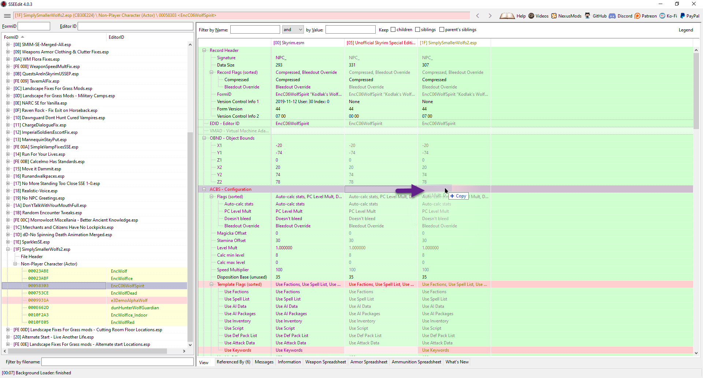

**TABLE OF CONTENTS**
- [Installation Instructions](#installation-instructions)
  - [Overview](#overview)
  - [General Instructions](#general-instructions)
  - [Special Instructions](#special-instructions)
- [01. Essential Mods](#01-essential-mods)
  - [1.1 Address Library for SKSE Plugins](#11-address-library-for-skse-plugins)
  - [1.2 SSE Engine Fixes](#12-sse-engine-fixes)
  - [1.3 .NET Script Framework (NSF)](#13-net-script-framework-nsf)
  - [1.4 SSE Display Tweaks](#14-sse-display-tweaks)
  - [1.5 Autorun Console Commands (ACC)](#15-autorun-console-commands-acc)
  - [1.6 Performance Optimized Textures for SSE](#16-performance-optimized-textures-for-sse)
  - [1.7 Unofficial High Definition Audio Project (optional)](#17-unofficial-high-definition-audio-project-optional)
  - [1.8 Unofficial Skyrim Special Edition Patch (USSEP)](#18-unofficial-skyrim-special-edition-patch-ussep)
  - [1.9 Alternate Start - Live Another Life (AS LAL)](#19-alternate-start---live-another-life-as-lal)
  - [1.10 Skyrim Particle Patch](#110-skyrim-particle-patch)
  - [1.11 Static Mesh Improvement Mod (SMIM)](#111-static-mesh-improvement-mod-smim)
- [02. Fixes](#02-fixes)
  - [2.1 Weapons, Armor, Clothing and Clutter Fixes (WACCF)](#21-weapons-armor-clothing-and-clutter-fixes-waccf)
  - [2.2 Wiseman303's Flora Fixes - Revamped](#22-wiseman303s-flora-fixes---revamped)
  - [2.3 Weapon Speed Effects Fix](#23-weapon-speed-effects-fix)
  - [2.4 Quests Are In Skyrim](#24-quests-are-in-skyrim)
  - [2.5 Tavern AI Fix (optional)](#25-tavern-ai-fix-optional)
  - [2.6 Skyrim Landscape and Water Fixes](#26-skyrim-landscape-and-water-fixes)
  - [2.7 Landscape Fixes for Grass Mods](#27-landscape-fixes-for-grass-mods)
  - [2.8 No Animals Report Crimes (NARC)](#28-no-animals-report-crimes-narc)
  - [2.9 Raven Rock - Fix Exit on Horseback (optional)](#29-raven-rock---fix-exit-on-horseback-optional)
  - [2.10 Dawnguard Don't Hunt Cured Vampires (optional)](#210-dawnguard-dont-hunt-cured-vampires-optional)
  - [2.11 Charge Dialogue Fix (optional)](#211-charge-dialogue-fix-optional)
  - [2.12 Rude Imperial Soldiers Escort Prisoner Fix (optional)](#212-rude-imperial-soldiers-escort-prisoner-fix-optional)
  - [2.13 Mannequins Stay Put (optional)](#213-mannequins-stay-put-optional)
  - [2.14 Eye Normal Map Fix (optional)](#214-eye-normal-map-fix-optional)
  - [2.15 Skyrim Ultimate Eyemeshes Ruhmastered](#215-skyrim-ultimate-eyemeshes-ruhmastered)
  - [2.16 Eyes AO Clipping Fix (optional)](#216-eyes-ao-clipping-fix-optional)
  - [2.17 ENB Brow Fix (optional)](#217-enb-brow-fix-optional)
  - [2.18 Double Sided Vertex Human Mouth Fix (optional)](#218-double-sided-vertex-human-mouth-fix-optional)
  - [2.19 WoodElf - MaleHair - Fix (optional)](#219-woodelf---malehair---fix-optional)
  - [2.20 Sound Hammering Sounds (optional)](#220-sound-hammering-sounds-optional)
  - [2.21 Dragon Stalking Fix (optional)](#221-dragon-stalking-fix-optional)
  - [2.22 Serana's Hood Fix (optional)](#222-seranas-hood-fix-optional)
  - [2.23 Bug Fixes](#223-bug-fixes)
  - [2.24 Actor Limit Fix](#224-actor-limit-fix)
- [03. Tweaks](#03-tweaks)
  - [3.1 Run For Your Lives](#31-run-for-your-lives)
  - [3.2 Dwemer Gates Don't Reset (optional)](#32-dwemer-gates-dont-reset-optional)
  - [3.3 Calcelmo Has Standards (optional)](#33-calcelmo-has-standards-optional)
  - [3.4 Move It Dammit (optional)](#34-move-it-dammit-optional)
  - [3.5 NPCs Run and Walk at Your Pace (optional)](#35-npcs-run-and-walk-at-your-pace-optional)
  - [3.6 No More Standing Too Close (optional)](#36-no-more-standing-too-close-optional)
  - [3.7 Realistic Conversations (optional)](#37-realistic-conversations-optional)
  - [3.8 No NPC Greetings (optional)](#38-no-npc-greetings-optional)
  - [3.9 Don't Talk With Your Mouth Full (optional)](#39-dont-talk-with-your-mouth-full-optional)
  - [3.10 Random Encounter Tweaks (optional)](#310-random-encounter-tweaks-optional)
  - [3.11 Morrowloot Miscellania - Better Ancient Knowledge (optional)](#311-morrowloot-miscellania---better-ancient-knowledge-optional)
  - [3.12 Merchants and Citizens Have No Lockpicks (optional)](#312-merchants-and-citizens-have-no-lockpicks-optional)
  - [3.13 No Spinning Death Animation (optional)](#313-no-spinning-death-animation-optional)
  - [3.14 Improved Weapon Impact Effects (optional)](#314-improved-weapon-impact-effects-optional)
  - [3.15 Simply Smaller Wolves (optional)](#315-simply-smaller-wolves-optional)
  - [3.16 Quiet Dog (optional)](#316-quiet-dog-optional)
  - [3.17 Skeletons Don't Breathe (optional)](#317-skeletons-dont-breathe-optional)
  - [3.18 Remove Sneak Attack Sound (optional)](#318-remove-sneak-attack-sound-optional)
  - [3.19 Bard Instrumentals Mostly - Sing Rarely (optional)](#319-bard-instrumentals-mostly---sing-rarely-optional)
  - [3.20 No Crime Teleport (optional)](#320-no-crime-teleport-optional)
  - [3.21 Better Dialogue Controls (optional)](#321-better-dialogue-controls-optional)
  - [3.22 Better MessageBox Controls (optional)](#322-better-messagebox-controls-optional)
  - [3.23 Better Stealing (optional)](#323-better-stealing-optional)
  - [3.24 Uninterrupted Invisibility (optional)](#324-uninterrupted-invisibility-optional)
  - [3.25 Uninterrupted Ethereal Form (optional)](#325-uninterrupted-ethereal-form-optional)
- [04. Interface](#04-interface)
  - [4.1 SkyUI](#41-skyui)
  - [4.2 Fix Note Icon for SkyUI (optional)](#42-fix-note-icon-for-skyui-optional)
  - [4.3 Remove Quicksave Button from SkyUI Systems Menu (optional)](#43-remove-quicksave-button-from-skyui-systems-menu-optional)
  - [4.4 Wider MCM Menu for SkyUI (optional)](#44-wider-mcm-menu-for-skyui-optional)
  - [4.5 Favorite Things - Extended Favorites Menu for SkyUI (optional)](#45-favorite-things---extended-favorites-menu-for-skyui-optional)
  - [4.6 Stay At The System Page (optional)](#46-stay-at-the-system-page-optional)
  - [4.7 RaceMenu](#47-racemenu)
  - [4.8 Immersive HUD - iHUD](#48-immersive-hud---ihud)
  - [4.9 SkyHUD](#49-skyhud)
  - [4.10 Undiscovered Means Unknown (optional)](#410-undiscovered-means-unknown-optional)
  - [4.11 moreHUD (optional)](#411-morehud-optional)
  - [4.12 moreHUD - Inventory Edition (optional)](#412-morehud---inventory-edition-optional)
  - [4.13 A Matter of Time - A Clock HUD Widget (optional)](#413-a-matter-of-time---a-clock-hud-widget-optional)
  - [4.14 A Matter of Time - Phoenix Preset (optional)](#414-a-matter-of-time---phoenix-preset-optional)
  - [4.15 Shouts in the Dragon Tongue (SIDT) (optional)](#415-shouts-in-the-dragon-tongue-sidt-optional)
  - [4.16 Extended UI (optional)](#416-extended-ui-optional)
  - [4.17 Skyrim SE Skill Interface Retexture (SSIRT) (optional)](#417-skyrim-se-skill-interface-retexture-ssirt-optional)
  - [4.18 No More Laser-Printed Book (optional)](#418-no-more-laser-printed-book-optional)
  - [4.19 Immersive Bookreading and Lockpicking (optional)](#419-immersive-bookreading-and-lockpicking-optional)
  - [4.20 JS Lockpicking UI (optional)](#420-js-lockpicking-ui-optional)
  - [4.21 A Quality World Map](#421-a-quality-world-map)
  - [4.22 Dynamic Snow for Map (optional)](#422-dynamic-snow-for-map-optional)
  - [4.23 Dawnguard Map Markers (optional)](#423-dawnguard-map-markers-optional)
  - [4.24 Smaller Vanilla Cursor (optional)](#424-smaller-vanilla-cursor-optional)
  - [4.25 ReCleaned Menu (optional)](#425-recleaned-menu-optional)
  - [4.26 Loading Screen Smoke Removed (optional)](#426-loading-screen-smoke-removed-optional)
  - [4.27 KenMOD - Time on Loading Screen (optional)](#427-kenmod---time-on-loading-screen-optional)

# Installation Instructions

## Overview

After completing the Setup, you are equipped with a correctly installed and configured instance of Mod Organizer 2 that is set up for the Skyrim Script Extender. It is now time to dive into the by far longest section in the guide - the mod installation.

- The mods themselves are split up into forty categories which correspond to the separators of the same names installed for MO2 in the Setup. **Each set of mods must be installed in the order they are listed in** and grouped below their respective separator.
- Instructions for which file(s) to download as well as any further steps are listed below the mod name. These detailed instructions are **mandatory** and must be followed.
- All listed mods are **required** and must be installed unless they are clearly flagged as **(optional)** in which case you may skip them. Whether or not a mod is optional is typically determined by interactions with other mods (patches and dependencies).
- Occasionally a mod will have further steps noted under **Additional Instructions** or **Porting Instructions** such as “Resave Example.esp in the Creation Kit”. You can find detailed instructions further down on this page.
- It may be faster to download all mods of one page first, then install them and finally go through all additional instructions.

**Do not attempt to launch Skyrim SE before you are instructed to**. During the installation you will have missing dependencies and unresolved conflicts fixed later by additional mods.

## General Instructions

### Downloading Mods

* Almost all mods are hosted on the Nexus.
* CTRL-clicking a mod’s name will take you immediately to its Nexus page.
* The files listed under **Download Instructions** are marked with the respective section you can find them in on the Nexus:
  * Main Files
  * Update Files
  * Optional Files
  * Miscellaneous Files
  * Old Files
* In the **Files** section on the mod page, download the file(s) by clicking "Mod Manager Download".
  * When a mod has special requirements, they are then listed in a pop-up window where you will have to click the **Download** button again.
  * Don’t worry about these requirements, they are included in the guide or otherwise taken care of.

### Installing Mods

* After downloading a mod, switch to the **Downloads** tab in the right pane of Mod Organizer 2 and double-click the file(s) to install.
* This may open a FOMOD installer if the mod includes one. In this case you need to follow the **FOMOD Instructions** listed in the guide.
* After installing a mod you may want to rename it in order to reflect the version you downloaded or options you selected in the FOMOD:
  * For retextures it is useful to add the texture resolution: **Embers HD 2k**.
  * If there are different versions, note down which one you downloaded: **Less Ugly Tundragrass - Redder Variant**.
* When installing more than one file from the same mod page, always click **Rename** when prompted and give the file a unique name to install it separately. **Do not select Merge or Replace**.

### FOMOD Instructions

Some mods come with a FOMOD Installer in which case instructions are provided. Occasionally the choices do not have to be strictly followed (particularly when they are related to texture resolution or variations) however there are some FOMODs that you have to install exactly as indicated in the instructions. Please do follow the provided instructions.

### Deleting Files

* When instructed to delete one or several files, double-click the mod in your mod order.
* Switch to the **Filetree** tab and find the files you need to remove.
* Simply right-click them and select **Remove** (or select them and hit DELETE on your keyboard).

### Manual Editing Instructions

Very rarely you will be instructed to edit a plugin directly in SSEEdit. If you never touched this program before, it may be somewhat  confusing at first. The edits you will be asked to make are quite simple and straight-forward however. Mods with such instructions are always optional and may be skipped.

## Special Instructions

### Convert Plugin

> "Resave Example.esp in the Creation Kit."

Plugins with Form Version 43 (typically downloaded from the Classic Skyrim Nexus) must be re-saved in the CK.

* Run the **Creation Kit** through Mod Organizer 2.
* Once it is loaded up, go to **File > Data**.
* Select the plugin you need to convert in the list and click **Set as Active File**.
* Click **OK** and wait for the Creation Kit to load up the plugin.
* Go to **File > Save**. There will be a small confirmation message (**Saving… done!**) at the bottom of the window.
* Close the Creation Kit.
* Afterwards, you can right-click the mod in MO2 and select **Mark converted/working**.

### Clean Plugin

> "Clean Example.esp with SSEEdit."

Very rarely a plugin may contain “dirty edits” or deleted records in  which case you need to run it through the QuickAutoClean version of  SSEEdit (just like we did with the official master files).

* Run **SSEEdit - QuickAutoClean** through Mod Organizer 2.
* Check only the plugin you were instructed to clean in the plugin list.
* Click **OK** and wait for the process to complete (`Quick Clean mode finished`).
* Close SSEEdit.

### Extract BSA

> "Unpack Example.bsa through Mod Organizer 2.

Occasionally you will be instructed to unpack an archive, either because it was packed with the 32bit CK, or because we need the files  loose to overwrite or selectively delete.

* Switch to the **Archives** tab in the right pane of Mod Organizer 2.
* Find the archive you need to unpack and right-click it (it will only show up if the mod is checked in the mod and load order).
* Navigate to `Mod Organizer 2\mods`, click on the mod folder the archive belongs to and click **Select Folder**.
* After unpacking the files, press F5 to refresh Mod Organizer 2.
* Double-click the mod the archive is part of in your mod order.
* Switch to the **Filetree** tab and right-click > delete the BSA.

Deleting the BSA after extracting it is extremely important. Your game may crash on launch otherwise.

### Optimise SLE Assets

> "Run the mod through Cathedral Assets Optimiser."

Skyrim LE meshes often need to be fixed and optimised by Cathedral Assets Optimizer before they can be used in SE. We will also use CAO on mods to optimise (compress) included textures sometimes. If a Classic Skyrim mod does not have instructions to run it through CAO this is because I already did so and found that no meshes or textures needed optimising.

* Run **Cathedral Assets Optimizer** (do not launch it through Mod Organizer 2).
* Select the **SSE - Optimise SLE Assets** profile from the drop-down menu.
* Click **Open Directory** and navigate to `Mod Organizer 2\mods`.
* Click on the folder of the mod you wish to optimise and hit **Select Folder**.
* Back in CAO, click **Run** and wait for the process to complete.
* Afterwards, you can right-click the mod in MO2 and select **Mark converted/working**.

### Fix Meshes

> “Run the mod through SSE NIF Optimizer.”

Very few mods in the guide need to be run through SSE NIF Optimizer instead of Cathedral Assets Optimizer to fix their meshes.

* Double-click **SSE NIF Optimizer.exe** which should be located inside Your Modding Folder.
* Click **Browse** and navigate to `Mod Organizer 2\mods`.
* Click on the folder of the mod you wish to optimise and hit **Select Folder**.
* Click **Optimise** and wait until the process is finished.
* Close **SSE NIF Optimizer**.

### Resize Textures

>"Downsize the textures with Cathedral Assets Optimizer."

At times (re)textures are only available in a size unreasonably large for regular gameplay, potentially impacting performance for those with low VRAM. In those cases we will utilise CAO to reduce the texture resolution by half.

* Run **Cathedral Assets Optimizer**.
* Select the **SSE - Downsize Textures** profile from the drop-down menu.
* Click **Open Directory** and navigate to `Mod Organizer 2\mods`.
* Click on the mod containing the textures and **Select folder**.
* Back in CAO, click **Run** and wait for the process to be completed.

# 01. Essential Mods

## 1.1 [Address Library for SKSE Plugins](https://www.nexusmods.com/skyrimspecialedition/mods/32444?tab=files)

### Download Instructions

- **Main File** - All in one

## 1.2 [SSE Engine Fixes](https://www.nexusmods.com/skyrimspecialedition/mods/17230?tab=files)

### Download Instructions

- **Main File** - (Part 1) Engine Fixes

### Preloader

- Download the following file manually:
  * **(Part 2) Engine Fixes - skse64 Preloader and TBB Lib**
- Open the downloaded archive.
- Extract the following files into your **root** folder:
  * **d3dx9_42.dll**
  * **tbb.dll**
  * **tbbmalloc.dll**
- Click **Yes** when asked to overwrite.

### Engine Fixes INI

* Double-click **SSE Engine Fixes** in your mod order.
* Switch to the **INI-Files** tab and select the **EngineFixes.ini**.
* Edit the following line:
  * `SleepWaitTime = true`
* Close the window and click **Yes** when asked to save your change.

## 1.3 [.NET Script Framework (NSF)](https://www.nexusmods.com/skyrimspecialedition/mods/21294?tab=files)

### Download Instructions

- **Main File** - NetScriptFramework SkyrimSE v13

## 1.4 [SSE Display Tweaks](https://www.nexusmods.com/skyrimspecialedition/mods/34705?tab=files)

### Download Instructions

- **Main File** - SSE Display Tweaks

## 1.5 [Autorun Console Commands (ACC)](https://www.nexusmods.com/skyrimspecialedition/mods/24919?tab=files)

### Download Instructions

- **Main File** - ACC - Autorun Console Commands

## 1.6 [Performance Optimized Textures for SSE](https://www.nexusmods.com/skyrimspecialedition/mods/21166?tab=files)

### Download Instructions

- **Main File** - performance textures max res 1024 min res 512 v8

## 1.7 [Unofficial High Definition Audio Project](https://www.nexusmods.com/skyrimspecialedition/mods/18115?tab=files) (optional)

### Download Instructions

- **Main File** - Music - HQ
- **Main File** - Voices EN - Part 1
- **Main File** - Voices EN - Part 2

## 1.8 [Unofficial Skyrim Special Edition Patch (USSEP)](https://www.nexusmods.com/skyrimspecialedition/mods/266?tab=files)

### Download Instructions

- **Main File** - Unofficial Skyrim Special Edition Patch

### Additional Instructions

- Delete the following file(s) and/or folder(s):
  * `Unofficial Skyrim Special Edition Patch.modgroups`

## 1.9 [Alternate Start - Live Another Life (AS LAL)](https://www.nexusmods.com/skyrimspecialedition/mods/272?tab=files)

### Download Instructions

- **Main File** - Alternate Start - Live Another Life

## 1.10 [Skyrim Particle Patch](http://enbseries.enbdev.com/forum/viewtopic.php?t=1499)

### Installation Instructions

- Find the **SPECIAL EDITION** section in the forum post linked above and click the **GOOGLE DRIVE** link (see picture).
- Download the archive from Google Drive and move it manually to `Your Modding Folder\ARCHIVE\MO2 Downloads`.
- Go to the **Downloads** tab and double-click the mod to install it as usual.
- I recommend renaming it simply to **Skyrim Particle Patch** after the installation.

### Additional Instructions

- Delete the following file(s) and/or folder(s):
  * `Particle Patch for ENB SSE.esp`

> The plugin is not needed. Its functionality was replaced by ENB Helper.

## 1.11 [Static Mesh Improvement Mod (SMIM)](https://www.nexusmods.com/skyrimspecialedition/mods/659/?tab=files)

### Download Instructions

- **Main File** - SMIM SE 2-08

### FOMOD Instructions

- **Main Installer Choice:** Skyrim 2016 Special Edition: Everything

### Additional Instructions

- Delete the following file(s) and/or folder(s):
  * `meshes\architecture\farmhouse\walkway\walkwaycwall01.nif`
  * `meshes\architecture\solitude\doors\sgatedoor.nif`

> The first mesh will be replaced either by the fixed version contained in Skyrim Landscape and Water Fixes or by Real Walls 3D.  Deleting the second mesh will allow you to use a different retexture for the gate.

# 02. Fixes

## 2.1 [Weapons, Armor, Clothing and Clutter Fixes (WACCF)](https://www.nexusmods.com/skyrimspecialedition/mods/18994?tab=files)

### Download Instructions

- **Main File** - Weapons Armor Clothing and Clutter Fixes

### Additional Instructions

- Delete the following file(s) and/or folder(s):
  * `WACCF_BashedPatchLvlListFix.esp`
  * `Weapons Armor Clothing & Clutter Fixes.modgroups`

## 2.2 [Wiseman303's Flora Fixes - Revamped](https://www.nexusmods.com/skyrimspecialedition/mods/28197?tab=files)

### Download Instructions

- **Main File** - WM’s Flora Fixes - Revamped
- **Optional File** - WM’s Flora Fixes - SMIM Patch

## 2.3 [Weapon Speed Effects Fix](https://www.nexusmods.com/skyrimspecialedition/mods/27677?tab=files)

### Download Instructions

- **Main File** - Weapon Speed Effects Fix

## 2.4 [Quests Are In Skyrim](https://www.nexusmods.com/skyrimspecialedition/mods/18416?tab=files)

### Download Instructions

- **Main File** - QuestsAreInSkyrim_USSEP_1_2_reupload

## 2.5 [Tavern AI Fix](https://www.nexusmods.com/skyrimspecialedition/mods/23107?tab=files) (optional)

### Download Instructions

- **Main File** - TavernAIFix

---

### Additional Instructions

The mod comes with two optional console commands to customise it.  Fortunately we have Autorun Console Commands to easily set and forget them. This is optional and you can add one or both of the commands (personally I only use the second one to finally stop innkeepers from showing me to my room).

* Double-click **Autorun Console Commands** in your mod order.
* In the **Textfiles** tab, select **Autorun.txt** and add one or both of the following lines:
  * `set TAIF_ServePlayerEveryTime to 1`
  * `set TAIF_ShowRoomNeverShow to 1`
* Close the window and click **Yes** when asked to save.

The commands will now be executed automatically when you start a new game or load your save.

## 2.6 [Skyrim Landscape and Water Fixes](https://www.nexusmods.com/skyrimspecialedition/mods/26138?tab=files)

### Download Instructions

- **Main File** - Skyrim Landscape and Water Fixes - FOMOD Installer

### FOMOD Instructions

- **Main Plugin:** ESM
- **Patches:** *select nothing*
- **Walkway Wall FIX:** Walkway Wall FIX SMIM

## 2.7 [Landscape Fixes for Grass Mods](https://www.nexusmods.com/skyrimspecialedition/mods/9005?tab=files)

### Download Instructions

- **Main File** - Landscape Fixes For Grass Mods
- **Optional File** - z Vanilla Military Camps
- **Optional File** - Patches for Arthmoor’s Town add-ons

----

### Download Instructions - Patches for Arthmoor's Towns

- Select options:
  * Patch for Alternate Start - Live Another Life
  * ~~Patch for Cutting Room Floor~~
  * Patch for Arthmoor’s Dragon Bridge
  * Patch for Arthmoor’s Shor’s Stone
  * Patch for Arthmoor’s Falkreath
  * Patch for Arthmoor’s Rorikstead
  * Patch for Arthmoor’s Ivarstead
  * Patch for Provincial Courier
  * ~~Patch for Oakwood~~

### Mod Order Instructions

- Place **Landscape Fixes for Grass Mods - Arthmoor’s Towns Patches** below the **PATCHES** separator.

## 2.8 [No Animals Report Crimes (NARC)](https://www.nexusmods.com/skyrimspecialedition/mods/17946?tab=files)

### Download Instructions

- **Main File** - NARC Remade 1.0.1 - Standard edition

### FOMOD Instructions

- **Select core file:**
  - NARC
- **Select patches:**
  - ~~Patch for Beyond Reach~~
  - ~~Patch for Beyond Skyrim - Bruma~~
  - ~~Patch for Blaze of Eventide~~
  - ~~Patch for Convenient Horses~~
  - ~~Patch for Darkend~~
  - Patch for The Forgotten City
  - ~~Patch for The Gray Cowl of Nocturnal~~
  - ~~Patch for Immersive Horses~~
  - ~~Patch for Skyrim Immersive Creatures~~

## 2.9 [Raven Rock - Fix Exit on Horseback](https://www.nexusmods.com/skyrimspecialedition/mods/14075?tab=files) (optional)

### Download Instructions

- **Main File** - Raven Rock - Fix Exit on Horseback SE

## 2.10 [Dawnguard Don't Hunt Cured Vampires](https://www.nexusmods.com/skyrimspecialedition/mods/5471?tab=files) (optional)

### Download Instructions

- **Main File** - Dawnguard Dont Hunt Cured Vampires 1_0

## 2.11 [Charge Dialogue Fix](https://www.nexusmods.com/skyrimspecialedition/mods/17716) (optional)

### Download Instructions

- **Main File** - Charge Dialogue Fix

## 2.12 [Rude Imperial Soldiers Escort Prisoner Fix](https://www.nexusmods.com/skyrimspecialedition/mods/894?tab=files) (optional)

### Download Instructions

- **Main File** - ImperialSoldiersEscortFix_v10

### Porting Instructions

- Resave **ImperialSoldiersEscortFix.esp** in the Creation Kit.

## 2.13 [Mannequins Stay Put](https://www.nexusmods.com/skyrimspecialedition/mods/6414?tab=files) (optional)

### Download Instructions

- **Main File** - Mannequin Stay Put

## 2.14 [Eye Normal Map Fix](https://www.nexusmods.com/skyrimspecialedition/mods/5445?tab=files) (optional)

### Download Instructions

- **Optional File** - Eye Normal Map Fix SSE BC7

## 2.15 [Skyrim Ultimate Eyemeshes Ruhmastered](https://www.nexusmods.com/skyrimspecialedition/mods/18147?tab=files)

### Download Instructions

- **Main File** - SUEMR SSE v3.0 Meshes
- **Main File** - SUEMR v3.0 Simple Vampire Fixes SSE
- **Optional File** - SUEMR Optional Red Vampire Eye Meshes SSE

### Additional Instructions

- Double-click **Skyrim Ultimate Eye Meshes Ruhmastered - Simple Vampire Fixes** in your mod order.
- Switch to the **Filetree** tab and rename the following file:
  * SimpleVampFixesSSE.**esp**

> This changes the plugin from ESL to ESP-Lite in order to allow us to manipulate its load order position.

## 2.16 [Eyes AO Clipping Fix](https://www.nexusmods.com/skyrimspecialedition/mods/25753?tab=files) (optional)

### Download Instructions

- **Optional File** - Eyes AO Clipping Fix - Ruhmastered

### Additional Instructions

* Delete the following file(s) and/or folders:
  * `meshes\actors\character\character assets\eyesmalevampire.nif`
  * `meshes\actors\character\character assets\eyesfemalevampire.nif`

> These meshes conflict with SUEMR - Vampire Eye Glow.

## 2.17 [ENB Brow Fix](https://www.nexusmods.com/skyrimspecialedition/mods/18783?tab=files) (optional)

### Download Instructions

- **Main File** - ENB Brow Fix SE 1.2

## 2.18 [Double Sided Vertex Human Mouth Fix](https://www.nexusmods.com/skyrimspecialedition/mods/25938?tab=files) (optional)

### Download Instructions

- **Main File** - Double Sided Human Mouth Fix SSE

## 2.19 [WoodElf - MaleHair - Fix](https://www.nexusmods.com/skyrimspecialedition/mods/9271?tab=files) (optional)

### Download Instructions

- **Main File** - WoodElf - MaleHair - Fix

## 2.20 [Sound Hammering Sounds](https://www.nexusmods.com/skyrimspecialedition/mods/5592?tab=files) (optional)

### Download Instructions

- **Main File** - Sound Hammering Sounds

## 2.21 [Dragon Stalking Fix](https://www.nexusmods.com/skyrimspecialedition/mods/14060?tab=files) (optional)

### Download Instructions

- **Main File** - Dragon Stalking Fix

### Additional Instructions

- Unpack **DragonStalkingFix.bsa** through Mod Organizer 2.
- Delete the following file(s) and/or folder(s):
  * `DragonStalkingFix.esp`
  * `DragonStalkingFix.bsa`

> The plugin is empty and only serves to load the archive which is now unpacked.

## 2.22 [Serana's Hood Fix](https://www.nexusmods.com/skyrimspecialedition/mods/20243?tab=files) (optional)

### Download Instructions

- **Main File** - Serana’s Hood Fix

### FOMOD Instructions

* **Choose Version:** Realistic

## 2.23 [Bug Fixes](https://www.nexusmods.com/skyrimspecialedition/mods/33261?tab=files)

### Download Instructions

- **Main File** - Bug Fixes SSE v2

## 2.24 [Actor Limit Fix](https://www.nexusmods.com/skyrimspecialedition/mods/32349?tab=files)

### Download Instructions

- **Main File** - ActorLimitPlugin v2

# 03. Tweaks

## 3.1 [Run For Your Lives](https://www.nexusmods.com/skyrimspecialedition/mods/2272?tab=files)

### Download Instructions

- **Main File** - Run For Your Lives

## 3.2 [Dwemer Gates Don't Reset](https://www.nexusmods.com/skyrimspecialedition/mods/26331?tab=files) (optional)

### Download Instructions

- **Main File** - Dwemer Gates Don't Reset

### FOMOD Instructions

- **Versions:** Dwemer Only USSEP

## 3.3 [Calcelmo Has Standards](https://www.nexusmods.com/skyrimspecialedition/mods/26503?tab=files) (optional)

### Download Instructions

- **Main File** - Calcelmo Has Standards SE

## 3.4 [Move It Dammit](https://www.nexusmods.com/skyrimspecialedition/mods/752?tab=files) (optional)

### Download Instructions

- **Main File** - Move it Dammit – for Skyrim Special Edition v1.1.0b (Installation Script)

### FOMOD Instructions

- **Custom:** Move it Dammit

## 3.5 [NPCs Run and Walk at Your Pace](https://www.nexusmods.com/skyrimspecialedition/mods/2482?tab=files) (optional)

### Download Instructions

- **Main File** - Run and Walk at your Pace

## 3.6 [No More Standing Too Close](https://www.nexusmods.com/skyrimspecialedition/mods/4784) (optional)

### Download Instructions

- **Main File** - No More Standing Too Close SSE

## 3.7 [Realistic Conversations](https://www.nexusmods.com/skyrimspecialedition/mods/1717?tab=files) (optional)

### Download Instructions

- **Main File** - Realistic Conversations

## 3.8 [No NPC Greetings](https://www.nexusmods.com/skyrimspecialedition/mods/1044?tab=files) (optional)

### Download Instructions

- **Main File** - No NPC Greetings (Special Edition) - NMM FOMOD Installer

### FOMOD Instructions

- **Select an Option:** Reduced Distance (Recommended)

## 3.9 [Don't Talk With Your Mouth Full](https://www.nexusmods.com/skyrimspecialedition/mods/17715?tab=files) (optional)

### Download Instructions

- **Main File** - Don’t Talk With Your Mouth Full

## 3.10 [Random Encounter Tweaks](https://www.nexusmods.com/skyrimspecialedition/mods/16804?tab=files) (optional)

### Download Instructions

- **Main File** - Random Encounter Tweaks

## 3.11 [Morrowloot Miscellania - Better Ancient Knowledge](https://www.nexusmods.com/skyrimspecialedition/mods/27094?tab=files) (optional)

### Download Instructions

- **Main File** - Morrowloot Miscellania – Better Ancient Knowledge

## 3.12 [Merchants and Citizens Have No Lockpicks](https://www.nexusmods.com/skyrimspecialedition/mods/2798?tab=files) (optional)

### Download Instructions

- **Main File** - Merchants and Citizens Have No Lockpicks SE

## 3.13 [No Spinning Death Animation](https://www.nexusmods.com/skyrimspecialedition/mods/1432?tab=files) (optional)

### Download Instructions

- **Main File** - No Spinning Death Animation MERGED

## 3.14 [Improved Weapon Impact Effects](https://www.nexusmods.com/skyrimspecialedition/mods/8936?tab=files) (optional)

### Download Instructions

- **Main File** - Sparkles

## 3.15 [Simply Smaller Wolves](https://www.nexusmods.com/skyrimspecialedition/mods/10935?tab=files) (optional)

### Download Instructions

- **Main File** - Simply Smaller Wolves

> The file is actually called Simply Bigger Wolves. Don’t be confused, this is a mistake on the part of the author.

### Additional Instructions

Simply Smaller Wolves conflicts with the USSEP. We will resolve these conflicts manually.

* Run **SSEEdit** through Mod Organizer 2.
* Click **OK** in the plugin selection window to load all your mods.
* Wait until SSEEdit returns `Background loader: finished`.
* Double-click **SimplySmallerWolfs2.esp** in the left pane to expand the plugin.
* Double-click **Non-Player Character (Actor)** and select the **EncC06WolfSpirit** record inside.
* Drag and drop all edits highlighted red from the **Unofficial Skyrim Special Edition Patch.esp** column into **SimplySmallerWolfs2.esp**.
* When asked, click **Yes I'm absolutely sure**.
* Once both conflicts are resolved, the record will be displayed in green.
* Close SSEEdit. Click **OK** to save your changes and quit.

## 3.16 [Quiet Dog](https://www.nexusmods.com/skyrimspecialedition/mods/6066?tab=files) (optional)

### Download Instructions

- **Main File** - Quiet Dog – Sit

## 3.17 [Skeletons Don't Breathe](https://www.nexusmods.com/skyrimspecialedition/mods/18542?tab=files) (optional)

### Download Instructions

- **Main File** - skeletons don’t breathe SSE loose files version

## 3.18 [Remove Sneak Attack Sound](https://www.nexusmods.com/skyrimspecialedition/mods/17496?tab=files) (optional)

### Download Instructions

- **Main File** - Remove Sneak Attack Sound - Loose

## 3.19 [Bard Instrumentals Mostly - Sing Rarely](https://www.nexusmods.com/skyrimspecialedition/mods/10927?tab=files) (optional)

### Download Instructions

- **Main File** - Bard Instrumentals Mostly – Sing Rarely

## 3.20 [No Crime Teleport](https://www.nexusmods.com/skyrimspecialedition/mods/13109?tab=files) (optional)

### Download Instructions

- **Main File** - No Crime Teleport

## 3.21 [Better Dialogue Controls](https://www.nexusmods.com/skyrimspecialedition/mods/1429?tab=files) (optional)

### Download Instructions

- **Main File** - Better Dialogue Controls v1_2

## 3.22 [Better MessageBox Controls](https://www.nexusmods.com/skyrimspecialedition/mods/1428?tab=files) (optional)

### Download Instructions

- **Main File** - Better MessageBox Controls v1_2

## 3.23 [Better Stealing](https://www.nexusmods.com/skyrimspecialedition/mods/32295?tab=files) (optional)

### Download Instructions

- **Main File** - BetterStealing v2

## 3.24 [Uninterrupted Invisibility](https://www.nexusmods.com/skyrimspecialedition/mods/21729?tab=files) (optional)

### Download Instructions

- **Main File** - Uninterrupted Invisibility v2

## 3.25 [Uninterrupted Ethereal Form](https://www.nexusmods.com/skyrimspecialedition/mods/21765?tab=files) (optional)

### Download Instructions

- **Main File** - Uninterrupted Ethereal Form v2

# 04. Interface

## 4.1 [SkyUI](https://www.nexusmods.com/skyrimspecialedition/mods/12604?tab=files)

### Download Instructions

- **Main File** - SkyUI_5_2_SE

### Additional Instructions

- Run SSEEdit through Mod Organizer 2.
- Click **OK** in the plugin selection window to load all plugins.
- Wait for your mods to be loaded up before you proceed.
- Right-click **SkyUI_SE.esp** in the left pane and select **Add Masters**.
- Check **Skyrim.esm** and click **OK**.
- Click **Yes, I’m sure** when the warning comes up.
- Close SSEEdit and click **OK** to save your changes.

> The plugin had no masters assigned to it which causes errors. Every plugin needs to have at least Skyrim.esm as a master.

## 4.2 [Fix Note Icon for SkyUI](https://www.nexusmods.com/skyrimspecialedition/mods/32561/?tab=files) (optional)

### Download Instructions

- **Main File** - FixNotesForSkyUI SKSE64 2.0.17

## 4.3 [Remove Quicksave Button from SkyUI Systems Menu](https://www.nexusmods.com/skyrimspecialedition/mods/28334?tab=files) (optional)

### Download Instructions

- **Optional File** - Remove QuickSave and Help Buttons (1)

> While optional, I highly recommend installing this mod as it also contains the [Flashing Savegame Fix](https://www.nexusmods.com/skyrimspecialedition/mods/20406) for SkyUI which solves a very annoying issue.

### About the mod

While quicksaving is not actually broken as the mod page claims ([more about that here](https://www.reddit.com/r/skyrimmods/comments/7bkazq/whats_the_real_deal_with_quicksavesautosaves/)), I personally like the re-ordering and decluttering of the Pause menu. It will look as follows:

- MCM
- Save
- Load
- Settings
- Controls
- Quit

## 4.4 [Wider MCM Menu for SkyUI](https://www.nexusmods.com/skyrimspecialedition/mods/22825?tab=files) (optional)

### Download Instructions

- **Main File** - Opt. 1 - Wider MCM Menu for SkyUI

> You can download any one of the main files. Check the GIFs and choose your preferred version.

## 4.5 [Favorite Things - Extended Favorites Menu for SkyUI](https://www.nexusmods.com/skyrimspecialedition/mods/27177?tab=files) (optional)

### Download Instructions

- **Main File** - Opt. 1 - Modified Vanilla Favorites

> You can download any one of the main files. Check the pictures and choose your preferred version.

## 4.6 [Stay At The System Page](https://www.nexusmods.com/skyrimspecialedition/mods/19832?tab=files) (optional)

### Download Instructions

- **Main File** - Stay At System Page

## 4.7 [RaceMenu](https://www.nexusmods.com/skyrimspecialedition/mods/19080?tab=files)

### Download Instructions

- **Main File** - RaceMenu Special Edition v0-4-12

### Additional Instructions

- Delete the following file(s) and/or folder(s):
  * `RaceMenuPlugin.esp`

## 4.8 [Immersive HUD - iHUD](https://www.nexusmods.com/skyrimspecialedition/mods/12440?tab=files)

### Download Instructions

- **Main File** - Immersive HUD – iHUD

## 4.9 [SkyHUD](https://www.nexusmods.com/skyrimspecialedition/mods/463?tab=files)

### Download Instructions

- **Main File** - SkyHUD v090B v4
- **Update Files** - Patch - SkyHUD v090B ==merge with the main file==

### FOMOD Instructions

* **Install:** Loose Files
* **Preset:** Vanilla Small
* **Optional:** Install iHUD compatibility patch

### Additional Instructions

**This is optional.**

* Double-click **SkyHUD** in your mod order.
* In the **Text Files** tab, select the **skyhud.txt**.
* Edit the following lines:
  * `bAltArrow=1`
  * `bAltCompass=1`
  * `bDotCrosshair=1`
* Close the window and confirm when asked to save.

> This will change the compass to a slimmer one and improve the arrow display. The crosshair will be turned into a simple dot.

## 4.10 [Undiscovered Means Unknown](https://www.nexusmods.com/skyrimspecialedition/mods/9762?tab=files) (optional)

### Download Instructions

- **Main File** - Undiscovered Means Unknown - Compass and Map Markers

### FOMOD Instructions

* **Main:**
  * Both the Compass and the Map
* **Do you wish for the player's location to be marked on the map?**
  * Yes
* **SkyUI**:
  * Yes
* **Have you installed a HUD-altering mod?**
  * SkyHUD
* **Have you installed the mod Customizeable UI Replacer?**
  * No
* **Font choice:**
  * Custom font
* **Which colored map marker mod have you installed?**
  * Default – Skyrim SE
* **Do you wish for enemies to be visible in the compass?**
  * Yes (*this can easily be disabled in SkyHUD in the future*)
* **Which icon do you wish to use for undiscovered locations?**
  * Nothing

## 4.11 [moreHUD](https://www.nexusmods.com/skyrimspecialedition/mods/12688?tab=files) (optional)

### Download Instructions

- **Main File** - moreHUD SE Light Master

### Additional Instructions

- Double-click **moreHUD** in your mod order.
- Switch to the **Filetree** tab.
- Rename the following file:
  * AHZmoreHUD.**esp**

> This is faster than ESL-ifying the ESP.

## 4.12 [moreHUD - Inventory Edition](https://www.nexusmods.com/skyrimspecialedition/mods/18619?tab=files) (optional)

### Download Instructions

- **Main File** - moreHUD Inventory Edition

### Additional Instructions

- Double-click **moreHUD - Inventory Edition** in your mod order.
- Switch to the **Filetree** tab.
- Rename the following file:
  * AHZmoreHUDInventory.**esp**

> This is faster than ESL-ifying the ESP.

## 4.13 [A Matter of Time - A Clock HUD Widget](https://www.nexusmods.com/skyrimspecialedition/mods/12937?tab=files) (optional)

### Download Instructions

- **Main File** - AMatterOfTime_v3_0_0_alpha_4

## 4.14 [A Matter of Time - Phoenix Preset](https://www.nexusmods.com/skyrimspecialedition/mods/26092?tab=files) (optional)

### Download Instructions

- **Main File** - A Matter of Time - Phoenix Preset

> **Mod Dependency:** Only install this mod if you installed A Matter of Time. Otherwise skip it.

### About the mod

This is my personal preset for AMOT. It uses the slim clock widget to match the slim compass from SkyHUD and has a small 24h clock with the ingame time centered below. You can change the clock to 12h through the MCM at any time.

Even if you have the preset installed, you can configure the AMOT settings to your liking. It will only be applied if you load it through the MCM specifically.

Preview below:

## 4.15 [Shouts in the Dragon Tongue (SIDT)](https://www.nexusmods.com/skyrimspecialedition/mods/5515?tab=files) (optional)

### Download Instructions

- **Main File** - SIDT - Words Only

## 4.16 [Extended UI](https://www.nexusmods.com/skyrim/mods/57873?tab=files) (optional)

### Download Instructions

- **Main File** - Extended UI

### Porting Instructions

- Resave **Extended UI.esp** in the Creation Kit.
- Unpack **Extended UI.bsa** through Mod Organizer 2.

> Don't forget to delete the BSA after unpacking it.

## 4.17 [Skyrim SE Skill Interface Retexture (SSIRT)](https://www.nexusmods.com/skyrimspecialedition/mods/1523?tab=files) (optional)

### Download Instructions

- **Main File** - SSIRT SE v4.1

### FOMOD Instructions

Below are my personal choices. Feel free to make your own!

- **Background:**
  - Background – Irradiant Stars – HDR Nebula
- **Perk Lines:**
  - Default
- **Perk Line Colour:**
  - Default
- **Constellations:**
  - HD Default
- **Perk Stars:**
  - Option 2
- **Dawnguard:**
  - HD Masser and Secunda and More Stars
- **Vampire Background:**
  - HDR Nebula

##  4.18 [No More Laser-Printed Book](https://www.nexusmods.com/skyrimspecialedition/mods/462?tab=files) (optional)

### Download Instructions

- **Main File** - No More Laser-Printed Book

## 4.19 [Immersive Bookreading and Lockpicking](https://www.nexusmods.com/skyrimspecialedition/mods/4541?tab=files) (optional)

### Download Instructions

- **Main File** - Immersive Bookreading
- **Main File** - Immersive Lockpicking

## 4.20 [JS Lockpicking UI](https://www.nexusmods.com/skyrimspecialedition/mods/22160?tab=files) (optional)

### Download Instructions

- **Main File** - 2k Textures

## 4.21 [A Quality World Map](https://www.nexusmods.com/skyrimspecialedition/mods/5804?tab=files)

### Download Instructions

- **Main File** - 8.4 A Quality World Map – Classic with All Roads

### Additional Instructions, Part 1

* Unpack **icepenguinworldmapclassic – textures.bsa** through Mod Organizer 2.
* Delete the following file(s) and/or folder(s):
  * `icepenguinworldmapclassic.esp`

> The BSA is deleted in order to allow A Quality World Map to overwrite some LOD files from Cathedral Landscapes. The plugin only contains one record which is completely overwritten by the AQWM+Luminosity lighting patch and it is no longer needed to load the BSA so it is redundant.

### Additional Instructions, Part 2

* Double-click **A Quality World Map** in your mod order.
* Switch to the **Filetree** tab.
* Rename the following file:
  * `icepenguinworldmapclassic.ini` >>> `maplightfix.ini`

> Since we just deleted the plugin, it can no longer load the INI file. By renaming it, the INI will now be loaded by the Luminosity map lighting patch (installed later on).

## 4.22 [Dynamic Snow for Map](https://www.nexusmods.com/skyrim/mods/29877?tab=files) (optional)

### Download Instructions

- **Main File** - Type 1

## 4.23 [Dawnguard Map Markers](https://www.nexusmods.com/skyrimspecialedition/mods/20931?tab=files) (optional)

### Download Instructions

- **Main File** - Dawnguard Map Markers

## 4.24 [Smaller Vanilla Cursor](https://www.nexusmods.com/skyrimspecialedition/mods/20617?tab=files) (optional)

### Download Instructions

- **Main File** - Smaller Vanilla Cursors

### FOMOD Instructions

* **Step 1:** Right

> If you are left-handed, feel free to select the "Left" option.

## 4.25 [ReCleaned Menu](https://www.nexusmods.com/skyrimspecialedition/mods/26680?tab=files) (optional)

### Download Instructions

- **Main File** - ReCleanedMenus

## 4.26 [Loading Screen Smoke Removed](https://www.nexusmods.com/skyrimspecialedition/mods/4634?tab=files) (optional)

### Download Instructions

- **Main File** - Loading Screen Smoke Removed v1.0

## 4.27 [KenMOD - Time on Loading Screen](https://www.nexusmods.com/skyrim/mods/98?tab=files) (optional)

### Download Instructions

- **Main File** - Time on loading v5

