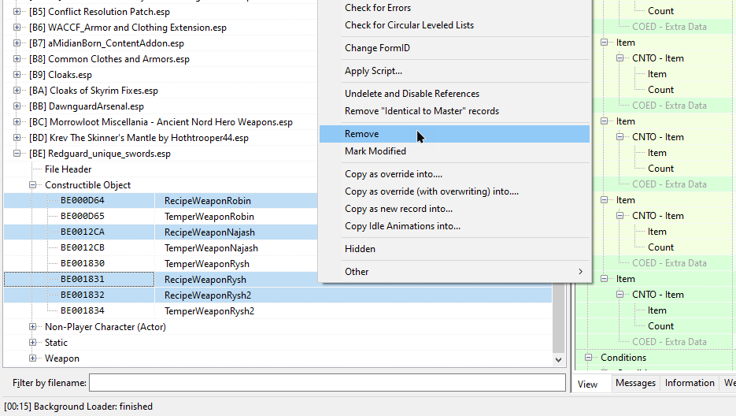

**TABLE OF CONTENTS**
- [01. Essential Mods](#01-essential-mods)
  - [1.1 Address Library for SKSE Plugins](#11-address-library-for-skse-plugins)
  - [1.2 SSE Engine Fixes](#12-sse-engine-fixes)
  - [1.3 .NET Script Framework (NSF)](#13-net-script-framework-nsf)
  - [1.4 SSE Display Tweaks](#14-sse-display-tweaks)
  - [1.5 Autorun Console Commands (ACC)](#15-autorun-console-commands-acc)
  - [1.6 Unofficial Performance Optimized Textures AKA (UPOT)](#16-unofficial-performance-optimized-textures-aka-upot)
  - [1.7 Unofficial High Definition Audio Project (optional)](#17-unofficial-high-definition-audio-project-optional)
  - [1.8 Unofficial Skyrim Special Edition Patch (USSEP)](#18-unofficial-skyrim-special-edition-patch-ussep)
  - [1.9 Alternate Start - Live Another Life (AS LAL)](#19-alternate-start---live-another-life-as-lal)
  - [1.10 Skyrim Particle Patch](#110-skyrim-particle-patch)
  - [1.11 Static Mesh Improvement Mod (SMIM)](#111-static-mesh-improvement-mod-smim)
- [02. Fixes](#02-fixes)
  - [2.1 Weapons, Armor, Clothing and Clutter Fixes (WACCF)](#21-weapons-armor-clothing-and-clutter-fixes-waccf)
  - [2.2 Wiseman303's Flora Fixes - Revamped](#22-wiseman303s-flora-fixes---revamped)
  - [2.3 Weapon Speed Effects Fix](#23-weapon-speed-effects-fix)
  - [2.4 Quests Are In Skyrim](#24-quests-are-in-skyrim)
  - [2.5 Tavern AI Fix (optional)](#25-tavern-ai-fix-optional)
  - [2.6 Skyrim Landscape and Water Fixes](#26-skyrim-landscape-and-water-fixes)
  - [2.7 Landscape Fixes for Grass Mods](#27-landscape-fixes-for-grass-mods)
  - [2.8 No Animals Report Crimes (NARC)](#28-no-animals-report-crimes-narc)
  - [2.9 Raven Rock - Fix Exit on Horseback (optional)](#29-raven-rock---fix-exit-on-horseback-optional)
  - [2.10 Dawnguard Don't Hunt Cured Vampires (optional)](#210-dawnguard-dont-hunt-cured-vampires-optional)
  - [2.11 Charge Dialogue Fix (optional)](#211-charge-dialogue-fix-optional)
  - [2.12 Rude Imperial Soldiers Escort Prisoner Fix (optional)](#212-rude-imperial-soldiers-escort-prisoner-fix-optional)
  - [2.13 Mannequins Stay Put (optional)](#213-mannequins-stay-put-optional)
  - [2.14 Eye Normal Map Fix (optional)](#214-eye-normal-map-fix-optional)
  - [2.15 Skyrim Ultimate Eyemeshes Ruhmastered](#215-skyrim-ultimate-eyemeshes-ruhmastered)
  - [2.16 Eyes AO Clipping Fix (optional)](#216-eyes-ao-clipping-fix-optional)
  - [2.17 ENB Brow Fix (optional)](#217-enb-brow-fix-optional)
  - [2.18 Double Sided Vertex Human Mouth Fix (optional)](#218-double-sided-vertex-human-mouth-fix-optional)
  - [2.19 WoodElf - MaleHair - Fix (optional)](#219-woodelf---malehair---fix-optional)
  - [2.20 Sound Hammering Sounds (optional)](#220-sound-hammering-sounds-optional)
  - [2.21 Dragon Stalking Fix (optional)](#221-dragon-stalking-fix-optional)
  - [2.22 Serana's Hood Fix (optional)](#222-seranas-hood-fix-optional)
  - [2.23 Bug Fixes](#223-bug-fixes)
  - [2.24 Actor Limit Fix](#224-actor-limit-fix)
- [03. Tweaks](#03-tweaks)
  - [3.1 Run For Your Lives](#31-run-for-your-lives)
  - [3.2 Dwemer Gates Don't Reset (optional)](#32-dwemer-gates-dont-reset-optional)
  - [3.3 Calcelmo Has Standards (optional)](#33-calcelmo-has-standards-optional)
  - [3.4 Move It Dammit (optional)](#34-move-it-dammit-optional)
  - [3.5 NPCs Run and Walk at Your Pace (optional)](#35-npcs-run-and-walk-at-your-pace-optional)
  - [3.6 No More Standing Too Close (optional)](#36-no-more-standing-too-close-optional)
  - [3.7 Realistic Conversations (optional)](#37-realistic-conversations-optional)
  - [3.8 No NPC Greetings (optional)](#38-no-npc-greetings-optional)
  - [3.9 Don't Talk With Your Mouth Full (optional)](#39-dont-talk-with-your-mouth-full-optional)
  - [3.10 Random Encounter Tweaks (optional)](#310-random-encounter-tweaks-optional)
  - [3.11 Morrowloot Miscellania - Better Ancient Knowledge (optional)](#311-morrowloot-miscellania---better-ancient-knowledge-optional)
  - [3.12 Merchants and Citizens Have No Lockpicks (optional)](#312-merchants-and-citizens-have-no-lockpicks-optional)
  - [3.13 No Spinning Death Animation (optional)](#313-no-spinning-death-animation-optional)
  - [3.14 Improved Weapon Impact Effects (optional)](#314-improved-weapon-impact-effects-optional)
  - [3.15 Simply Smaller Wolves (optional)](#315-simply-smaller-wolves-optional)
  - [3.16 Quiet Dog (optional)](#316-quiet-dog-optional)
  - [3.17 Skeletons Don't Breathe (optional)](#317-skeletons-dont-breathe-optional)
  - [3.18 Remove Sneak Attack Sound (optional)](#318-remove-sneak-attack-sound-optional)
  - [3.19 Bard Instrumentals Mostly - Sing Rarely (optional)](#319-bard-instrumentals-mostly---sing-rarely-optional)
  - [3.20 No Crime Teleport (optional)](#320-no-crime-teleport-optional)
  - [3.21 Better Dialogue Controls (optional)](#321-better-dialogue-controls-optional)
  - [3.22 Better MessageBox Controls (optional)](#322-better-messagebox-controls-optional)
  - [3.23 Better Stealing (optional)](#323-better-stealing-optional)
  - [3.24 Uninterrupted Invisibility (optional)](#324-uninterrupted-invisibility-optional)
  - [3.25 Uninterrupted Ethereal Form (optional)](#325-uninterrupted-ethereal-form-optional)
- [04. Interface](#04-interface)
  - [4.1 SkyUI](#41-skyui)
  - [4.2 Fix Note Icon for SkyUI (optional)](#42-fix-note-icon-for-skyui-optional)
  - [4.3 Remove Quicksave Button from SkyUI Systems Menu (optional)](#43-remove-quicksave-button-from-skyui-systems-menu-optional)
  - [4.4 Wider MCM Menu for SkyUI (optional)](#44-wider-mcm-menu-for-skyui-optional)
  - [4.5 Favorite Things - Extended Favorites Menu for SkyUI (optional)](#45-favorite-things---extended-favorites-menu-for-skyui-optional)
  - [4.6 Stay At The System Page (optional)](#46-stay-at-the-system-page-optional)
  - [4.7 RaceMenu](#47-racemenu)
  - [4.8 Immersive HUD - iHUD](#48-immersive-hud---ihud)
  - [4.9 SkyHUD](#49-skyhud)
  - [4.10 Undiscovered Means Unknown (optional)](#410-undiscovered-means-unknown-optional)
  - [4.11 moreHUD (optional)](#411-morehud-optional)
  - [4.12 moreHUD - Inventory Edition (optional)](#412-morehud---inventory-edition-optional)
  - [4.13 A Matter of Time - A Clock HUD Widget (optional)](#413-a-matter-of-time---a-clock-hud-widget-optional)
  - [4.14 A Matter of Time - Phoenix Preset (optional)](#414-a-matter-of-time---phoenix-preset-optional)
  - [4.15 Shouts in the Dragon Tongue (SIDT) (optional)](#415-shouts-in-the-dragon-tongue-sidt-optional)
  - [4.16 Extended UI (optional)](#416-extended-ui-optional)
  - [4.17 Skyrim SE Skill Interface Retexture (SSIRT) (optional)](#417-skyrim-se-skill-interface-retexture-ssirt-optional)
  - [4.18 No More Laser-Printed Book (optional)](#418-no-more-laser-printed-book-optional)
  - [4.19 Immersive Bookreading and Lockpicking (optional)](#419-immersive-bookreading-and-lockpicking-optional)
  - [4.20 JS Lockpicking UI (optional)](#420-js-lockpicking-ui-optional)
  - [4.21 A Quality World Map](#421-a-quality-world-map)
  - [4.22 Dynamic Snow for Map (optional)](#422-dynamic-snow-for-map-optional)
  - [4.23 Dawnguard Map Markers (optional)](#423-dawnguard-map-markers-optional)
  - [4.24 Smaller Vanilla Cursor (optional)](#424-smaller-vanilla-cursor-optional)
  - [4.25 ReCleaned Menu (optional)](#425-recleaned-menu-optional)
  - [4.26 Loading Screen Smoke Removed (optional)](#426-loading-screen-smoke-removed-optional)
  - [4.27 KenMOD - Time on Loading Screen (optional)](#427-kenmod---time-on-loading-screen-optional)
- [05. Main Visual Mods](#05-main-visual-mods)
  - [5.1 Skyrim Realistic Overhaul (SRO)](#51-skyrim-realistic-overhaul-sro)
  - [5.2 DynDOLOD Resources](#52-dyndolod-resources)
  - [5.3 HD LODs Textures](#53-hd-lods-textures)
  - [5.4 Noble Skyrim Mod HD-2K (NSM)](#54-noble-skyrim-mod-hd-2k-nsm)
  - [5.5 Ruins Clutter Improved (RCI)](#55-ruins-clutter-improved-rci)
  - [5.6 Ruins Clutter Improved - Fixes](#56-ruins-clutter-improved---fixes)
  - [5.7 Revamped Assets Skyrim](#57-revamped-assets-skyrim)
  - [5.8 High Poly Project (optional)](#58-high-poly-project-optional)
  - [5.9 aMidianBorn Book of Silence - Dragonborn DLC (optional)](#59-amidianborn-book-of-silence---dragonborn-dlc-optional)
  - [5.10 Caliente's Beautiful Bodies Enhancer (CBBE)](#510-calientes-beautiful-bodies-enhancer-cbbe)
- [06. Weather](#06-weather)
  - [6.1 Obsidian Weathers and Seasons](#61-obsidian-weathers-and-seasons)
  - [6.2 Obsidian Weathers and Seasons MCM Patch (optional)](#62-obsidian-weathers-and-seasons-mcm-patch-optional)
  - [6.3 Smooth Sky Mesh (optional)](#63-smooth-sky-mesh-optional)
  - [6.4 ETHEREAL CLOUDS (optional)](#64-ethereal-clouds-optional)
  - [6.5 Skyrim Textures Redone - Enhanced Night Sky (optional)](#65-skyrim-textures-redone---enhanced-night-sky-optional)
  - [6.6 Night Skies - Stars and Galaxies (optional)](#66-night-skies---stars-and-galaxies-optional)
  - [6.7 Skygazer Moons - Masser and Secunda (optional)](#67-skygazer-moons---masser-and-secunda-optional)
  - [6.8 Storm Lightning (optional)](#68-storm-lightning-optional)
  - [6.9 Yee - A New Snowflake Mod (optional)](#69-yee---a-new-snowflake-mod-optional)
  - [6.10 Wonders of Weather (optional)](#610-wonders-of-weather-optional)
  - [6.11 Wonders of Weather - Less Opaque Rain Splashes for ENB (optional)](#611-wonders-of-weather---less-opaque-rain-splashes-for-enb-optional)
- [07. Lighting](#07-lighting)
  - [7.1 Relighting Skyrim](#71-relighting-skyrim)
  - [7.2 Relighting Skyrim - No Player Homes](#72-relighting-skyrim---no-player-homes)
  - [7.3 Luminosity Lighting Overhaul](#73-luminosity-lighting-overhaul)
  - [7.4 Luminosity - A Quality World Map Patch](#74-luminosity---a-quality-world-map-patch)
  - [7.5 Interior Floating Fog Remover (optional)](#75-interior-floating-fog-remover-optional)
  - [7.6 Smoking Torches and Candles (STAC)](#76-smoking-torches-and-candles-stac)
  - [7.7 Embers HD](#77-embers-hd)
  - [7.8 Inferno - Fire Effects Redux](#78-inferno---fire-effects-redux)
  - [7.9 KD - Realistic Fireplaces](#79-kd---realistic-fireplaces)
  - [7.10 Charred Logs for KD - Realistic Fireplaces (optional)](#710-charred-logs-for-kd---realistic-fireplaces-optional)
- [08. Visual FX](#08-visual-fx)
  - [8.1 Frozen Electrocuted Combustion (FEC) (optional)](#81-frozen-electrocuted-combustion-fec-optional)
  - [8.2 Frozen Electrocuted Combustion - Extra Crispy Retexture (optional)](#82-frozen-electrocuted-combustion---extra-crispy-retexture-optional)
  - [8.3 Enhanced Blood Textures](#83-enhanced-blood-textures)
  - [8.4 GORECAP (optional)](#84-gorecap-optional)
  - [8.5 Deadly Spell Impacts](#85-deadly-spell-impacts)
  - [8.6 Arctic - Frost Effects Redux (optional)](#86-arctic---frost-effects-redux-optional)
  - [8.7 Refracting Ice Form Debris (optional)](#87-refracting-ice-form-debris-optional)
  - [8.8 Voltage (optional)](#88-voltage-optional)
  - [8.9 ElSopa HD - Dirt Blast (optional)](#89-elsopa-hd---dirt-blast-optional)
  - [8.10 Reduced Glow FX (optional)](#810-reduced-glow-fx-optional)
  - [8.11 Fire Halo Remover (optional)](#811-fire-halo-remover-optional)
  - [8.12 Subtle Wind FX (optional)](#812-subtle-wind-fx-optional)
  - [8.13 Glow Be Gone - Updated (optional)](#813-glow-be-gone---updated-optional)
- [09. Landscape](#09-landscape)
  - [9.1 Majestic Mountains](#91-majestic-mountains)
  - [9.2 Landscapes - Cathedral Concept](#92-landscapes---cathedral-concept)
  - [9.3 The Elder Scrolls - Veydosebrom (optional)](#93-the-elder-scrolls---veydosebrom-optional)
  - [9.4 Cathedral Landscapes - Veydosebrom Swamp Grass Addon (optional)](#94-cathedral-landscapes---veydosebrom-swamp-grass-addon-optional)
  - [9.5 Pfuscher's Rapid Rocks](#95-pfuschers-rapid-rocks)
  - [9.6 Majestic Mountains - Northside (optional)](#96-majestic-mountains---northside-optional)
  - [9.7 Realistic Water Two (RW2)](#97-realistic-water-two-rw2)
  - [9.8 Skyrim SE Improved Puddles (optional)](#98-skyrim-se-improved-puddles-optional)
  - [9.9 Better Dynamic Snow](#99-better-dynamic-snow)
  - [9.10 Better Dynamic Majestic Mountains](#910-better-dynamic-majestic-mountains)
  - [9.11 Skyrim 3D Icefloes (optional)](#911-skyrim-3d-icefloes-optional)
  - [9.12 Better Dynamic Ash](#912-better-dynamic-ash)
  - [9.13 Enhanced Landscapes - Dead Marsh](#913-enhanced-landscapes---dead-marsh)
  - [9.14 Enhanced Landscapes - Dead Marsh Fixes](#914-enhanced-landscapes---dead-marsh-fixes)
  - [9.15 Rorikstead Basalt Cliffs (optional)](#915-rorikstead-basalt-cliffs-optional)
  - [9.16 Rorikstead Basalt Cliffs Patches (optional)](#916-rorikstead-basalt-cliffs-patches-optional)
  - [9.17 Ashbound - Solstheim Enhanced](#917-ashbound---solstheim-enhanced)
  - [9.18 Point The Way](#918-point-the-way)
  - [9.19 Lanterns of Skyrim II](#919-lanterns-of-skyrim-ii)
  - [9.20 Manor Roads (optional)](#920-manor-roads-optional)
  - [9.21 Immersive Dawnguard Dayspring Pass (IDDP)](#921-immersive-dawnguard-dayspring-pass-iddp)
- [10. Flora](#10-flora)
  - [10.1 Enhanced Vanilla Trees (EVT)](#101-enhanced-vanilla-trees-evt)
  - [10.2 Enhanced Vanilla Trees – Vurts Light Snow Trees](#102-enhanced-vanilla-trees--vurts-light-snow-trees)
  - [10.3 Tree Bark in High Definition (optional)](#103-tree-bark-in-high-definition-optional)
  - [10.4 Enhanced Landscapes – Oaks Standalone](#104-enhanced-landscapes--oaks-standalone)
  - [10.5 Bent Pines II (optional)](#105-bent-pines-ii-optional)
  - [10.6 Sacred Trees (optional)](#106-sacred-trees-optional)
  - [10.7 Rudy HQ – Falling Leaves and Needles (optional)](#107-rudy-hq--falling-leaves-and-needles-optional)
  - [10.8 Cathedral Plants (optional)](#108-cathedral-plants-optional)
  - [10.9 Realistic HD Mushrooms Remastered (optional)](#109-realistic-hd-mushrooms-remastered-optional)
  - [10.10 Less Ugly Tundra Grass (optional)](#1010-less-ugly-tundra-grass-optional)
  - [10.11 Immersive Fallen Trees (optional)](#1011-immersive-fallen-trees-optional)
  - [10.12 Immersive Fallen Trees Patch (optional)](#1012-immersive-fallen-trees-patch-optional)
- [11. Architecture](#11-architecture)
  - [11.1 MD's Farmhouses (optional)](#111-mds-farmhouses-optional)
  - [11.2 The Streets of Whiterun HD (optional)](#112-the-streets-of-whiterun-hd-optional)
  - [11.3 Riften in High Definition (optional)](#113-riften-in-high-definition-optional)
  - [11.4 Marvelous Windhelm Gate (optional)](#114-marvelous-windhelm-gate-optional)
  - [11.5 Windhelm Enhanced – HD Metalwork (optional)](#115-windhelm-enhanced--hd-metalwork-optional)
  - [11.6 RUSTIC MONUMENTS AND TOMBSTONES (optional)](#116-rustic-monuments-and-tombstones-optional)
  - [11.7 HQ Solitude (optional)](#117-hq-solitude-optional)
  - [11.8 Pfuscher’s Manhole Texture (optional)](#118-pfuschers-manhole-texture-optional)
  - [11.9 Skyland – Winterhold (optional)](#119-skyland--winterhold-optional)
  - [11.10 Skyrim 3D Misc – Winterhold Gate (optional)](#1110-skyrim-3d-misc--winterhold-gate-optional)
  - [11.11 Skyrim Textures Redone – High Hrothgar (optional)](#1111-skyrim-textures-redone--high-hrothgar-optional)
  - [11.12 Skyrim 3D High Hrothgar Steps (optional)](#1112-skyrim-3d-high-hrothgar-steps-optional)
  - [11.13 Pilgrim’s Delight – High Hrothgar Shrine Retexture](#1113-pilgrims-delight--high-hrothgar-shrine-retexture)
  - [11.14 Skyrim Textures Redone – Skyhaven (optional)](#1114-skyrim-textures-redone--skyhaven-optional)
  - [11.15 Spice of Life – Orc Strongholds (optional)](#1115-spice-of-life--orc-strongholds-optional)
  - [11.16 Sovngarde HD (optional)](#1116-sovngarde-hd-optional)
  - [11.17 Dawnguard Fortress Improved (optional)](#1117-dawnguard-fortress-improved-optional)
  - [11.18 Castle Volkihar Reborn (optional)](#1118-castle-volkihar-reborn-optional)
  - [11.19 Soul Cairn HD (optional)](#1119-soul-cairn-hd-optional)
  - [11.20 Arri’s Snow Elf Ruins Retexture (optional)](#1120-arris-snow-elf-ruins-retexture-optional)
- [12. Misc Structures](#12-misc-structures)
  - [12.1 Fences of Skyrim (optional)](#121-fences-of-skyrim-optional)
  - [12.2 Skyrim Landscape Overhaul – Stone Walls (optional)](#122-skyrim-landscape-overhaul--stone-walls-optional)
  - [12.3 Skyrim 3D Signs (optional)](#123-skyrim-3d-signs-optional)
  - [12.4 SkyFix – HD Blacksmith Signs (optional)](#124-skyfix--hd-blacksmith-signs-optional)
  - [12.5 RUSTIC EAST EMPIRE COMPANY SIGNAGE (optional)](#125-rustic-east-empire-company-signage-optional)
  - [12.6 Ennead – Shadowmarks (optional)](#126-ennead--shadowmarks-optional)
  - [12.7 ElSopa HD – Glorious Dummies (optional)](#127-elsopa-hd--glorious-dummies-optional)
  - [12.8 Stunning Statues of Skyrim (optional)](#128-stunning-statues-of-skyrim-optional)
  - [12.9 LeanWolf’s Better-Shaped Talos Statue (optional)](#129-leanwolfs-better-shaped-talos-statue-optional)
  - [12.10 Astral Aspects – Standing Stones (optional)](#1210-astral-aspects--standing-stones-optional)
- [13. Vanilla Locations](#13-vanilla-locations)
  - [13.1 JK’s Cities – Lite](#131-jks-cities--lite)
  - [13.2 Arthmoor’s Dawnstar](#132-arthmoors-dawnstar)
  - [13.3 Arthmoor’s Falkreath](#133-arthmoors-falkreath)
  - [13.4 Arthmoor’s Dragon Bridge](#134-arthmoors-dragon-bridge)
  - [13.5 Arthmoor’s Ivarstead](#135-arthmoors-ivarstead)
  - [13.6 Arthmoor’s Rorikstead](#136-arthmoors-rorikstead)
  - [13.7 Arthmoor’s Kynesgrove](#137-arthmoors-kynesgrove)
  - [13.8 Arthmoor’s Karthwasten](#138-arthmoors-karthwasten)
  - [13.9 Arthmoor’s Darkwater Crossing](#139-arthmoors-darkwater-crossing)
  - [13.10 Arthmoor’s Shor’s Stone](#1310-arthmoors-shors-stone)
  - [13.11 Arthmoor’s Soljund’s Sinkhole](#1311-arthmoors-soljunds-sinkhole)
  - [13.12 Arthmoor’s Whistling Mine](#1312-arthmoors-whistling-mine)
  - [13.13 Obscure’s College of Winterhold](#1313-obscures-college-of-winterhold)
- [14. Interiors](#14-interiors)
  - [14.1 RUSTIC WINDOWS](#141-rustic-windows)
  - [14.2 Hall of the Dead - Stained Glass Windows (optional)](#142-hall-of-the-dead---stained-glass-windows-optional)
  - [14.3 Ennead – Banners (optional)](#143-ennead--banners-optional)
  - [14.4 PELTAPALOOZA (optional)](#144-peltapalooza-optional)
  - [14.5 RUGNAROK (optional)](#145-rugnarok-optional)
  - [14.6 Medieval Candlehorns and Sconces (optional)](#146-medieval-candlehorns-and-sconces-optional)
  - [14.7 Skyrim 3D Cooking (optional)](#147-skyrim-3d-cooking-optional)
  - [14.8 RUSTIC ALCHEMY AND ENCHANTING TABLES (optional)](#148-rustic-alchemy-and-enchanting-tables-optional)
  - [14.9 JS Shrines of the Divines (optional)](#149-js-shrines-of-the-divines-optional)
- [15. Dungeons](#15-dungeons)
  - [15.1 Underground – A Dungeon Texture Overhaul](#151-underground--a-dungeon-texture-overhaul)
  - [15.2 Rudy HQ – Nordic Ruins](#152-rudy-hq--nordic-ruins)
  - [15.3 Ice Cave Parallax Improved (optional)](#153-ice-cave-parallax-improved-optional)
  - [15.4 Gecko’s Dwarven Ruins Textures (optional)](#154-geckos-dwarven-ruins-textures-optional)
  - [15.7 RUSTIC WORD WALLS (optional)](#157-rustic-word-walls-optional)
  - [15.9 4K Nordic Murals (optional)](#159-4k-nordic-murals-optional)
  - [15.10 CC’s Enhanced Ore Veins (optional)](#1510-ccs-enhanced-ore-veins-optional)
  - [15.11 CC's Enhanced Ore Veins - Fixed Iron Ore Cubemap (optional)](#1511-ccs-enhanced-ore-veins---fixed-iron-ore-cubemap-optional)
  - [15.12 Metallurgy – Ingots and Ore HD (optional)](#1512-metallurgy--ingots-and-ore-hd-optional)
  - [15.13 Ancient Pottery (optional)](#1513-ancient-pottery-optional)
  - [15.14 ElSopa HD – Realistic Dark Elf Urns (optional)](#1514-elsopa-hd--realistic-dark-elf-urns-optional)
  - [15.15 Ancient Dwemer Metal (optional)](#1515-ancient-dwemer-metal-optional)
  - [15.16 HD Lava for Dawnguard (optional)](#1516-hd-lava-for-dawnguard-optional)
- [16. Clutter](#16-clutter)
  - [16.1 Forgotten Retex Project](#161-forgotten-retex-project)
  - [16.2 Aetherial Crown by Saerileth – Plugin Replacer](#162-aetherial-crown-by-saerileth--plugin-replacer)
  - [16.3 Skyrim 3D Misc (optional)](#163-skyrim-3d-misc-optional)
  - [16.4 RUSTIC CLUTTER COLLECTION (optional)](#164-rustic-clutter-collection-optional)
  - [16.5 Rudy HQ – Miscellaneous (optional)](#165-rudy-hq--miscellaneous-optional)
  - [16.6 Frankly HD Dragon Bones (optional)](#166-frankly-hd-dragon-bones-optional)
  - [16.7 Medieval Silverworks (optional)](#167-medieval-silverworks-optional)
  - [16.8 Book Covers Skyrim (BCS)](#168-book-covers-skyrim-bcs)
  - [16.9 Realistic Paper (optional)](#169-realistic-paper-optional)
  - [16.10 MAPS (optional)](#1610-maps-optional)
  - [16.11 Business Ledger HD Retexture (optional)](#1611-business-ledger-hd-retexture-optional)
  - [16.12 JS Dragon Claws (optional)](#1612-js-dragon-claws-optional)
  - [16.13 JS Dragon Claws – Patches (optional)](#1613-js-dragon-claws--patches-optional)
  - [16.14 RUSTIC SOULGEMS](#1614-rustic-soulgems)
  - [16.15 RUSTIC AZURAS STAR (optional)](#1615-rustic-azuras-star-optional)
  - [16.16 ElSopa HD – Meridia’s Beacon (optional)](#1616-elsopa-hd--meridias-beacon-optional)
  - [16.17 RUSTIC ELDERSCROLL (optional)](#1617-rustic-elderscroll-optional)
  - [16.18 RUSTIC ANIMATED POTIONS AND POISONS (optional)](#1618-rustic-animated-potions-and-poisons-optional)
  - [16.19 Rally's Werewolf Totems (optional)](#1619-rallys-werewolf-totems-optional)
  - [16.20 BLOODSTONE CHALICE REBORN (optional)](#1620-bloodstone-chalice-reborn-optional)
- [17. Food & Ingredients](#17-food--ingredients)
  - [17.1 High Quality Food and Ingredients SE (optional)](#171-high-quality-food-and-ingredients-se-optional)
  - [17.2 Medieval Spirits (optional)](#172-medieval-spirits-optional)
  - [17.3 Boiled Creme Treat Sweet Roll and Pie (optional)](#173-boiled-creme-treat-sweet-roll-and-pie-optional)
  - [17.4 Honey Pot (optional)](#174-honey-pot-optional)
  - [17.5 HD Sabre Cat Tooth (optional)](#175-hd-sabre-cat-tooth-optional)
  - [17.6 Falmer Ear and Hagraven Claw (optional)](#176-falmer-ear-and-hagraven-claw-optional)
  - [17.7 ElSopa HD – Briar Heart (optional)](#177-elsopa-hd--briar-heart-optional)
- [18. Clothes & Jewellery](#18-clothes--jewellery)
  - [18.1 RUSTIC CLOTHING](#181-rustic-clothing)
  - [18.2 Prince and the Pauper](#182-prince-and-the-pauper)
  - [18.3 Gemling Queen Jewelry (optional)](#183-gemling-queen-jewelry-optional)
  - [18.4 JS Circlet Replacer (optional)](#184-js-circlet-replacer-optional)
  - [18.5 The Divine Amulets Retexture (optional)](#185-the-divine-amulets-retexture-optional)
  - [18.6 Better Looking Amulets (optional)](#186-better-looking-amulets-optional)
  - [18.7 ElSopa HD – Akatosh Amulet (optional)](#187-elsopa-hd--akatosh-amulet-optional)
  - [18.8 ElSopa HD – Bonehawk Amulet (optional)](#188-elsopa-hd--bonehawk-amulet-optional)
  - [18.9 JS Barenziah (optional)](#189-js-barenziah-optional)
- [19. Weapons & Armour](#19-weapons--armour)
  - [19.1 RUSTIC ARMOR AND WEAPONS (RAW) (optional)](#191-rustic-armor-and-weapons-raw-optional)
  - [19.2 Practical Female Armors (optional)](#192-practical-female-armors-optional)
  - [19.3 Warmth – Light Armor Replacer (optional)](#193-warmth--light-armor-replacer-optional)
  - [19.4 aMidianBorn of Silence – Armors](#194-amidianborn-of-silence--armors)
  - [19.5 aMidianBorn Blade Armor SSE Patch](#195-amidianborn-blade-armor-sse-patch)
  - [19.6 aMidianBorn Book of Silence – Weapons](#196-amidianborn-book-of-silence--weapons)
  - [19.7 Frankly HD Silver Sword](#197-frankly-hd-silver-sword)
  - [19.8 LeanWolf’s Better-Shaped Weapons](#198-leanwolfs-better-shaped-weapons)
  - [19.9 Open Face Guard Helmets (optional)](#199-open-face-guard-helmets-optional)
  - [19.10 Open Face Guard Helmets – Plugin Replacer (optional)](#1910-open-face-guard-helmets--plugin-replacer-optional)
  - [19.11 Frankly HD Stormcloaks and City Guards (optional)](#1911-frankly-hd-stormcloaks-and-city-guards-optional)
  - [19.12 aMidianBorn Stormcloak Officer Armour (optional)](#1912-amidianborn-stormcloak-officer-armour-optional)
  - [19.13 Frankly HD Imperial Armor and Weapons](#1913-frankly-hd-imperial-armor-and-weapons)
  - [19.14 Frankly HD Dawnguard Armor and Weapons (optional)](#1914-frankly-hd-dawnguard-armor-and-weapons-optional)
  - [19.15 Iron Things (optional)](#1915-iron-things-optional)
  - [19.16 Elven Weapons for Silence (optional)](#1916-elven-weapons-for-silence-optional)
  - [19.17 CC’s HD Dwemer Weapons and Armor (optional)](#1917-ccs-hd-dwemer-weapons-and-armor-optional)
  - [19.18 Frankly HD Thieves Guild Armor (optional)](#1918-frankly-hd-thieves-guild-armor-optional)
  - [19.19 Frankly HD Shrouded Armor (optional)](#1919-frankly-hd-shrouded-armor-optional)
  - [19.20 Falmer Weapons for aMidianBorn Book of Silence (optional)](#1920-falmer-weapons-for-amidianborn-book-of-silence-optional)
  - [19.21 Outlandish Stalhrim (optional)](#1921-outlandish-stalhrim-optional)
  - [19.22 Outlandish Chitin Armour (optional)](#1922-outlandish-chitin-armour-optional)
  - [19.23 Ebony Weapons 2017 Retexture (optional)](#1923-ebony-weapons-2017-retexture-optional)
  - [19.24 Frankly HD Dragonbone and Dragonscale (optional)](#1924-frankly-hd-dragonbone-and-dragonscale-optional)
  - [19.25 Sunhallowed and Bloodcursed Arrows – HD Retexture](#1925-sunhallowed-and-bloodcursed-arrows--hd-retexture)
  - [19.26 Dragon Priest Weapons Improved (optional)](#1926-dragon-priest-weapons-improved-optional)
- [20. Unique Artifacts](#20-unique-artifacts)
  - [20.1 aMidianBorn Book of Silence – Unique Items](#201-amidianborn-book-of-silence--unique-items)
  - [20.2 Unique Uniques](#202-unique-uniques)
  - [20.3 Unique Uniques – Plugin Replacer](#203-unique-uniques--plugin-replacer)
  - [20.4 Frankly HD Nightingale Armor and Weapons (optional)](#204-frankly-hd-nightingale-armor-and-weapons-optional)
  - [20.5 Better Shrouded Armor – Ancient Replacer Only](#205-better-shrouded-armor--ancient-replacer-only)
  - [20.6 Better Shrouded Armor - Ancient Replacer Only - Plugin Replacer](#206-better-shrouded-armor---ancient-replacer-only---plugin-replacer)
  - [20.7 Frankly HD Miraak](#207-frankly-hd-miraak)
  - [20.8 Masks of the Dovah Sonaak (optional)](#208-masks-of-the-dovah-sonaak-optional)
  - [20.9 Remiros’ Dawnbreaker HD (optional)](#209-remiros-dawnbreaker-hd-optional)
  - [20.10 Remiros’ Wabbajack HD (optional)](#2010-remiros-wabbajack-hd-optional)
  - [20.11 Spellbreaker Oblivionized Retexture in HD (optional)](#2011-spellbreaker-oblivionized-retexture-in-hd-optional)
  - [20.12 Remiros’ Ancient Falmer Armor HD (optional)](#2012-remiros-ancient-falmer-armor-hd-optional)
  - [20.13 Harkon’s Sword – HD Retexture (optional)](#2013-harkons-sword--hd-retexture-optional)
  - [20.14 Unique Zephyr (optional)](#2014-unique-zephyr-optional)
  - [20.15 Auriel’s Bow – HD Retexture (optional)](#2015-auriels-bow--hd-retexture-optional)
  - [20.16 Auriel’s Shield – HD Retexture (optional)](#2016-auriels-shield--hd-retexture-optional)
  - [20.17 Ghosu – Auriel’s Quiver Replacer (optional)](#2017-ghosu--auriels-quiver-replacer-optional)
  - [20.18 Ghosu’s Auriel’s Quiver Retexture (optional)](#2018-ghosus-auriels-quiver-retexture-optional)
  - [20.19 Bloodskaal Blade Redone (optional)](#2019-bloodskaal-blade-redone-optional)
- [21. Creatures](#21-creatures)
  - [21.1 Bellyache’s Animal and Creature Pack (optional)](#211-bellyaches-animal-and-creature-pack-optional)
  - [21.2 aMidianBorn Book of Silence – Creatures (optional)](#212-amidianborn-book-of-silence--creatures-optional)
  - [21.3 OH GOD BEES – HD Textures (optional)](#213-oh-god-bees--hd-textures-optional)
  - [21.4 HD Rabbit by Pfuscher (optional)](#214-hd-rabbit-by-pfuscher-optional)
  - [21.5 Better Than Nando’s (optional)](#215-better-than-nandos-optional)
  - [21.6 Goat HD by Pfuscher (optional)](#216-goat-hd-by-pfuscher-optional)
  - [21.7 Highland Cow HD by Pfuscher (optional)](#217-highland-cow-hd-by-pfuscher-optional)
  - [21.8 HD Skeever by Pfuscher (optional)](#218-hd-skeever-by-pfuscher-optional)
  - [21.9 True Wolves of Skyrim (optional)](#219-true-wolves-of-skyrim-optional)
  - [21.10 SABRECAT (optional)](#2110-sabrecat-optional)
  - [21.11 Horker by Pfuscher (optional)](#2111-horker-by-pfuscher-optional)
  - [21.12 RUSTIC FROSTBITE SPIDER (optional)](#2112-rustic-frostbite-spider-optional)
  - [21.13 HD Reworked Horses (optional)](#2113-hd-reworked-horses-optional)
  - [21.14 Dawnguard Rewritten – Arvak (optional)](#2114-dawnguard-rewritten--arvak-optional)
  - [21.15 ElSopa HD – Bristleback (optional)](#2115-elsopa-hd--bristleback-optional)
  - [21.16 ElSopa HD – Strider and Netches (optional)](#2116-elsopa-hd--strider-and-netches-optional)
  - [21.17 TROLL (optional)](#2117-troll-optional)
  - [21.18 HAGRAVEN (optional)](#2118-hagraven-optional)
  - [21.19 HD Reworked Mammoths (optional)](#2119-hd-reworked-mammoths-optional)
  - [21.20 GIANT (optional)](#2120-giant-optional)
  - [21.21 RUSTIC SPRIGGAN (optional)](#2121-rustic-spriggan-optional)
  - [21.22 WISPMOTHER (optional)](#2122-wispmother-optional)
  - [21.23 CC’s HD Dwemer Automatons – Remastered (optional)](#2123-ccs-hd-dwemer-automatons--remastered-optional)
  - [21.24 Vampire Lord Retexture (optional)](#2124-vampire-lord-retexture-optional)
  - [21.25 RUSTIC DEATH HOUND AND GARGOYLE (optional)](#2125-rustic-death-hound-and-gargoyle-optional)
- [22. Daedra & Dragons](#22-daedra--dragons)
  - [22.1 RUSTIC DAEDRA (optional)](#221-rustic-daedra-optional)
  - [22.2 Unique Barbas Retexture (optional)](#222-unique-barbas-retexture-optional)
  - [22.3 Bellyache’s HD Dragon Replacer Pack (optional)](#223-bellyaches-hd-dragon-replacer-pack-optional)
  - [22.4 Splendor – Dragon Variants (optional)](#224-splendor--dragon-variants-optional)
  - [22.5 Odahviing Enhanced (optional)](#225-odahviing-enhanced-optional)
  - [22.6 The Decayed Dragon – Durnehviir Retex (optional)](#226-the-decayed-dragon--durnehviir-retex-optional)
  - [22.7 HD Serpentine Dragon and Mesh Fix (optional)](#227-hd-serpentine-dragon-and-mesh-fix-optional)
- [23. NPC Overhauls](#23-npc-overhauls)
  - [23.1 Vanilla NPCs Ruhmastered](#231-vanilla-npcs-ruhmastered)
  - [23.2 Windsong Immersive Character Overhaul (WICO)](#232-windsong-immersive-character-overhaul-wico)
  - [23.3 Windsong Immersive Character Overhaul – Stripped BSA](#233-windsong-immersive-character-overhaul--stripped-bsa)
  - [23.4 Windsong Immersive Character Overhaul – USSEP and CRF Patches](#234-windsong-immersive-character-overhaul--ussep-and-crf-patches)
  - [23.5 Ethereal Elven Overhaul](#235-ethereal-elven-overhaul)
  - [23.6 Ethereal Elven Overhaul – SSE Patch](#236-ethereal-elven-overhaul--sse-patch)
  - [23.7 TK Children](#237-tk-children)
  - [23.8 Simple Children](#238-simple-children)
- [24. Appearance](#24-appearance)
  - [24.1 Bijin Skin for CBBE (optional)](#241-bijin-skin-for-cbbe-optional)
  - [24.2 Skysight Skins (optional)](#242-skysight-skins-optional)
  - [24.3 High Poly Male Meshes - Vanilla plus Seamless Head SSE (optional)](#243-high-poly-male-meshes---vanilla-plus-seamless-head-sse-optional)
  - [24.4 Forgotten Argonian Roots (FAR) (optional)](#244-forgotten-argonian-roots-far-optional)
  - [24.5 Forgotten Argonian Roots – FOMOD (optional)](#245-forgotten-argonian-roots--fomod-optional)
  - [24.6 Coverkhajiit (optional)](#246-coverkhajiit-optional)
  - [24.7 Vanilla Makeup HD (optional)](#247-vanilla-makeup-hd-optional)
  - [24.8 Painterly – A High Res Vanilla Warpaint Retexture (optional)](#248-painterly--a-high-res-vanilla-warpaint-retexture-optional)
  - [24.9 Northborn Scars (optional)](#249-northborn-scars-optional)
  - [24.10 Natural Eyes (optional)](#2410-natural-eyes-optional)
  - [24.11 Khajiit Wild Eyes (optional)](#2411-khajiit-wild-eyes-optional)
  - [24.12 Bed Head – A Vanilla Hair Replacement (optional)](#2412-bed-head--a-vanilla-hair-replacement-optional)
  - [24.13 Argonian Improvements – Horns (optional)](#2413-argonian-improvements--horns-optional)
  - [24.14 Just Fangs from BVFE (optional)](#2414-just-fangs-from-bvfe-optional)
  - [24.15 Hvergelmir’s Aesthetics – Brows (optional)](#2415-hvergelmirs-aesthetics--brows-optional)
  - [24.16 Hvergelmir’s Aesthetics – Beards (optional)](#2416-hvergelmirs-aesthetics--beards-optional)
  - [24.17 Immersive Mouth and Teeth (optional)](#2417-immersive-mouth-and-teeth-optional)
  - [24.18 Immersive Mouth and Teeth for Orcs (optional)](#2418-immersive-mouth-and-teeth-for-orcs-optional)
- [25. Gameplay Overhauls](#25-gameplay-overhauls)
  - [25.1 Mysticism – A Magic Overhaul](#251-mysticism--a-magic-overhaul)
  - [25.2 Adamant - A Perk Overhaul](#252-adamant---a-perk-overhaul)
  - [25.3 Complete Crafting Overhaul Remastered (CCOR)](#253-complete-crafting-overhaul-remastered-ccor)
  - [25.4 Morningstar – Minimalistic Races of Skyrim (optional)](#254-morningstar--minimalistic-races-of-skyrim-optional)
  - [25.5 Subtle But Classless (optional)](#255-subtle-but-classless-optional)
  - [25.6 Subtle But Classless – USSEP and EEO Patch (optional)](#256-subtle-but-classless--ussep-and-eeo-patch-optional)
  - [25.7 Growl – Werebeasts of Skyrim](#257-growl--werebeasts-of-skyrim)
  - [25.8 Sacrosanct – Vampires of Skyrim](#258-sacrosanct--vampires-of-skyrim)
  - [25.9 Carriage and Ferry Travel Overhaul (CFTO)](#259-carriage-and-ferry-travel-overhaul-cfto)
  - [25.10 CFTO – Winterhold Carriage](#2510-cfto--winterhold-carriage)
  - [25.11 Night Eye Overhaul (NEO)](#2511-night-eye-overhaul-neo)
  - [25.12 Night Eye Overhaul – Plugin Replacer](#2512-night-eye-overhaul--plugin-replacer)
- [26. Non-Player Characters](#26-non-player-characters)
  - [26.1 AI Overhaul](#261-ai-overhaul)
  - [26.2 AI Overhaul - Windsong Immersive Character Overhaul Patch](#262-ai-overhaul---windsong-immersive-character-overhaul-patch)
  - [26.3 AI Overhaul - Ethereal Elven Overhaul Patch](#263-ai-overhaul---ethereal-elven-overhaul-patch)
  - [26.4 Relationship Dialogue Overhaul (RDO)](#264-relationship-dialogue-overhaul-rdo)
  - [26.5 Relationship Dialogue Overhaul – MCM Patch](#265-relationship-dialogue-overhaul--mcm-patch)
  - [26.6 Guard Dialogue Overhaul (GDO)](#266-guard-dialogue-overhaul-gdo)
  - [26.7 Misc Dialogue Edits](#267-misc-dialogue-edits)
  - [26.8 More Dialogue Options](#268-more-dialogue-options)
  - [26.9 Thugs Not Assassins](#269-thugs-not-assassins)
  - [26.10 Nether’s Follower Framework (NFF)](#2610-nethers-follower-framework-nff)
  - [26.11 Adopt Aventus Aretino](#2611-adopt-aventus-aretino)
- [27. Improved Vanilla Quests](#27-improved-vanilla-quests)
  - [27.1 Timing Is Everything](#271-timing-is-everything)
  - [27.2 Even Better Quest Objectives (EBQO)](#272-even-better-quest-objectives-ebqo)
  - [27.3 Miscellaneous Quests … As Miscellaneous Quests (MQM)](#273-miscellaneous-quests--as-miscellaneous-quests-mqm)
  - [27.4 A Lovely Letter – Alternate Route (optional)](#274-a-lovely-letter--alternate-route-optional)
  - [27.5 Save the Icerunner - Lights Out Alternate Routes](#275-save-the-icerunner---lights-out-alternate-routes)
  - [27.6 Finding Derkeethus](#276-finding-derkeethus)
  - [27.7 Finding Helgi and Laelette – A Laid To Rest Overhaul](#277-finding-helgi-and-laelette--a-laid-to-rest-overhaul)
  - [27.8 Finding Susanna Alive – A Blood on the Ice Trigger Revision (optional)](#278-finding-susanna-alive--a-blood-on-the-ice-trigger-revision-optional)
  - [27.9 Gildergreen Regrown (optional)](#279-gildergreen-regrown-optional)
  - [27.10 Improved Companions – Questline Tweaks (optional)](#2710-improved-companions--questline-tweaks-optional)
  - [27.11 More Radiant Quests for the Companions](#2711-more-radiant-quests-for-the-companions)
  - [27.12 No Thieves Guild Grind (optional)](#2712-no-thieves-guild-grind-optional)
  - [27.13 Improved College Entry – Questline Tweaks](#2713-improved-college-entry--questline-tweaks)
  - [27.14 Misc College of Winterhold Tweaks](#2714-misc-college-of-winterhold-tweaks)
  - [27.15 Finding Velehk Sain](#2715-finding-velehk-sain)
  - [27.16 The Paarthurnax Dilemma](#2716-the-paarthurnax-dilemma)
  - [27.17 Castle Volkihar Rebuilt](#2717-castle-volkihar-rebuilt)
- [28. Combat](#28-combat)
  - [28.1 Wildcat – Combat of Skyrim](#281-wildcat--combat-of-skyrim)
  - [28.2 Encounter Zones Unlocked (optional)](#282-encounter-zones-unlocked-optional)
  - [28.3 Arena - An Encounter Zone Overhaul (optional)](#283-arena---an-encounter-zone-overhaul-optional)
  - [28.4 Mortal Enemies (optional)](#284-mortal-enemies-optional)
  - [28.5 Athletik Combat – Realistic Movement and Dodging (optional)](#285-athletik-combat--realistic-movement-and-dodging-optional)
  - [28.6 Realistic Melee Range (optional)](#286-realistic-melee-range-optional)
  - [28.7 No BS Projectile Dodge (optional)](#287-no-bs-projectile-dodge-optional)
  - [28.8 Realistic AI Detection (optional)](#288-realistic-ai-detection-optional)
  - [28.9 Simply Stronger Dragons (optional)](#289-simply-stronger-dragons-optional)
  - [28.10 Improved Traps](#2810-improved-traps)
  - [28.11 Disarming Traps Is Dangerous (optional)](#2811-disarming-traps-is-dangerous-optional)
  - [28.12 VioLens – A Killmove Mod (optional)](#2812-violens--a-killmove-mod-optional)
- [29. Balancing](#29-balancing)
  - [29.1 Containers and Leveled Lists Fixes – Complete Loot Overhaul](#291-containers-and-leveled-lists-fixes--complete-loot-overhaul)
  - [29.2 Lock Related Loot](#292-lock-related-loot)
  - [29.3 Morrowloot Miscellania – Item Distribution](#293-morrowloot-miscellania--item-distribution)
  - [29.4 Economy Overhaul and Speechcraft Improvements](#294-economy-overhaul-and-speechcraft-improvements)
  - [29.5 Trade and Barter](#295-trade-and-barter)
  - [29.6 Genuinely Intelligent Soul Traps (GIST)](#296-genuinely-intelligent-soul-traps-gist)
  - [29.7 Skyrim Alchemy Fixed](#297-skyrim-alchemy-fixed)
  - [29.8 Enchanting Adjustments and Price Bug Fix](#298-enchanting-adjustments-and-price-bug-fix)
  - [29.9 More Expensive Transmute for Mysticism (optional)](#299-more-expensive-transmute-for-mysticism-optional)
  - [29.10 Reliquary of Myth - Artifact Overhaul](#2910-reliquary-of-myth---artifact-overhaul)
  - [29.11 Zim's Immersive Artifacts](#2911-zims-immersive-artifacts)
  - [29.12 Unique Items Tweaks - Improved Less Known Artifacts](#2912-unique-items-tweaks---improved-less-known-artifacts)
- [30. Immersion](#30-immersion)
  - [30.1 Dragon Remains (optional)](#301-dragon-remains-optional)
  - [30.2 Talkative Dragons (optional)](#302-talkative-dragons-optional)
  - [30.3 Talkative Dragons – Audio Replacer (optional)](#303-talkative-dragons--audio-replacer-optional)
  - [30.4 Durnehviir Resurrected (optional)](#304-durnehviir-resurrected-optional)
  - [30.5 Improved Shadowmarks (optional)](#305-improved-shadowmarks-optional)
  - [30.6 Keeper Carcette Survives](#306-keeper-carcette-survives)
  - [30.7 Windhelm Segregation – Stay at New Gnisis Cornerclub (optional)](#307-windhelm-segregation--stay-at-new-gnisis-cornerclub-optional)
  - [30.8 Alik’r Warriors Aren’t Welcome (optional)](#308-alikr-warriors-arent-welcome-optional)
  - [30.9 Delphine’s Map Reveals Dragon Mounds (optional)](#309-delphines-map-reveals-dragon-mounds-optional)
  - [30.10 Bring Meeko to Lod (optional)](#3010-bring-meeko-to-lod-optional)
  - [30.11 Serana’s Blood Tomb Curse (optional)](#3011-seranas-blood-tomb-curse-optional)
  - [30.12 Karstaag – The Frost King Reborn (optional)](#3012-karstaag--the-frost-king-reborn-optional)
- [31. Quality of Life Improvements](#31-quality-of-life-improvements)
  - [31.1 The Choice Is Yours (TCIY)](#311-the-choice-is-yours-tciy)
  - [31.2 Whose Quest Is It Anyway (optional)](#312-whose-quest-is-it-anyway-optional)
  - [31.3 Hide Those Futile Quests (optional)](#313-hide-those-futile-quests-optional)
  - [31.4 Bounty Preview (optional)](#314-bounty-preview-optional)
  - [31.5 Stackable Stones of Barenziah](#315-stackable-stones-of-barenziah)
  - [31.6 Remember Lockpick Angle – Updated (optional)](#316-remember-lockpick-angle--updated-optional)
  - [31.7 No Lockpick Activate – Updated (optional)](#317-no-lockpick-activate--updated-optional)
  - [31.8 Yes I’m Sure (optional)](#318-yes-im-sure-optional)
  - [31.9 More Informative Console](#319-more-informative-console)
  - [31.10 Copy and Paste in Console (optional)](#3110-copy-and-paste-in-console-optional)
  - [31.11 Keyboard Shortcuts Fix (optional)](#3111-keyboard-shortcuts-fix-optional)
  - [31.12 Classic Sprinting Redone (optional)](#3112-classic-sprinting-redone-optional)
  - [31.13 Better Jumping (optional)](#3113-better-jumping-optional)
- [32. New Quests & Locations](#32-new-quests--locations)
  - [32.1 The Forgotten City](#321-the-forgotten-city)
  - [32.2 The Forgotten City – No Audio Books (optional)](#322-the-forgotten-city--no-audio-books-optional)
  - [32.3 The Tools of Kagrenac](#323-the-tools-of-kagrenac)
  - [32.4 It Beats For Her (optional)](#324-it-beats-for-her-optional)
  - [32.5 Provincial Courier Service](#325-provincial-courier-service)
  - [32.6 Unique Border Gates](#326-unique-border-gates)
  - [32.7 Solstheim Lighthouse (optional)](#327-solstheim-lighthouse-optional)
  - [32.8 Solstheim – Skaal Fishing Camp (optional)](#328-solstheim--skaal-fishing-camp-optional)
- [33. New NPCs & Companions](#33-new-npcs--companions)
  - [33.1 DIVERSE SKYRIM](#331-diverse-skyrim)
  - [33.2 DIVERSE SKYRIM – Ethereal Elven Overhaul Patch](#332-diverse-skyrim--ethereal-elven-overhaul-patch)
  - [33.3 Interesting NPCs (3DNPC)](#333-interesting-npcs-3dnpc)
  - [33.4 Interesting NPCs - Zora Fair-Child Voice Enhanced (optional](#334-interesting-npcs---zora-fair-child-voice-enhanced-optional)
  - [33.5 Cuyima Interesting NPCs (optional)](#335-cuyima-interesting-npcs-optional)
  - [33.6 Immersive College NPCs](#336-immersive-college-npcs)
  - [33.7 Inigo](#337-inigo)
  - [33.8 Morrowloot Ultimate - INIGO Patch](#338-morrowloot-ultimate---inigo-patch)
  - [33.9 Inigo Whistle Key (optional)](#339-inigo-whistle-key-optional)
  - [33.10 Lucien – Fully Voiced Follower](#3310-lucien--fully-voiced-follower)
  - [33.11 Pandorable’s Lucien Replacer (optional)](#3311-pandorables-lucien-replacer-optional)
- [34. New Encounters & Creatures](#34-new-encounters--creatures)
  - [34.1 Immersive Patrols (optional)](#341-immersive-patrols-optional)
  - [34.2 Immersive Patrols Simplified (optional)](#342-immersive-patrols-simplified-optional)
  - [34.3 Diverse Dragon Collection (DDC) (optional)](#343-diverse-dragon-collection-ddc-optional)
  - [34.4 Diverse Werewolves Collection (DWC)](#344-diverse-werewolves-collection-dwc)
  - [34.5 More Werewolves (optional)](#345-more-werewolves-optional)
  - [34.6 Falkreath Hauntings (optional)](#346-falkreath-hauntings-optional)
  - [34.7 Dwemer Spectres (optional)](#347-dwemer-spectres-optional)
  - [34.8 Dwemer Spectres – EBT No Bleeding and Other Fixes (optional)](#348-dwemer-spectres--ebt-no-bleeding-and-other-fixes-optional)
  - [34.9 Beast Skeletons (optional)](#349-beast-skeletons-optional)
  - [34.10 Beast Skeletons - Plugin Replacer (optional)](#3410-beast-skeletons---plugin-replacer-optional)
  - [34.11 Cannibal Draugr on Solstheim (optional)](#3411-cannibal-draugr-on-solstheim-optional)
  - [34.12 The Blood Horker (optional)](#3412-the-blood-horker-optional)
  - [34.13 Cliff Racers of Solstheim (optional)](#3413-cliff-racers-of-solstheim-optional)
- [35. New Items & Equipment](#35-new-items--equipment)
  - [35.1 Armor and Clothing Extension (ACE)](#351-armor-and-clothing-extension-ace)
  - [35.2 Armor and Clothing Extension – MCM Fix](#352-armor-and-clothing-extension--mcm-fix)
  - [35.3 Weapons Armor Clothing and Clutter Fixes – CBBE Patch](#353-weapons-armor-clothing-and-clutter-fixes--cbbe-patch)
  - [35.4 aMidianBorn Content Addon](#354-amidianborn-content-addon)
  - [35.5 aMidianBorn Content Addon – Plugin Replacer](#355-amidianborn-content-addon--plugin-replacer)
  - [35.6 Practical Female Armors - AMB Content Addon](#356-practical-female-armors---amb-content-addon)
  - [35.7 Common Clothes and Armors](#357-common-clothes-and-armors)
  - [35.8 Common Clothes and Armors – CBBE Patch](#358-common-clothes-and-armors--cbbe-patch)
  - [35.9 Cloaks of Skyrim](#359-cloaks-of-skyrim)
  - [35.10 Cloaks of Skyrim – MLU-Friendly Fixes](#3510-cloaks-of-skyrim--mlu-friendly-fixes)
  - [35.11 Cloaks of the Nords (optional)](#3511-cloaks-of-the-nords-optional)
  - [35.12 Rally’s Five Cities Cloaks (optional)](#3512-rallys-five-cities-cloaks-optional)
  - [35.13 Morrowloot Miscellania – Ancient Nordic Hero Weapons (optional)](#3513-morrowloot-miscellania--ancient-nordic-hero-weapons-optional)
  - [35.14 Armor of Yngol](#3514-armor-of-yngol)
  - [35.15 Unique Scimitars](#3515-unique-scimitars)
  - [35.16 Kthonia’s Unique Weapon Pack – Dragonborn Weapons (optional)](#3516-kthonias-unique-weapon-pack--dragonborn-weapons-optional)
- [36. New Mechanics & Features](#36-new-mechanics--features)
  - [36.1 Simply Knock (optional)](#361-simply-knock-optional)
  - [36.2 Simply Knock SKSE64 DLL (optional)](#362-simply-knock-skse64-dll-optional)
  - [36.3 Quick Light (optional)](#363-quick-light-optional)
  - [36.4 ENB Light – Quick Light Patch (optional)](#364-enb-light--quick-light-patch-optional)
  - [36.5 Trua – Minimalistic Faiths of Skyrim (optional)](#365-trua--minimalistic-faiths-of-skyrim-optional)
  - [36.6 Choose Your Own Arch-Mage](#366-choose-your-own-arch-mage)
- [37. Sounds & Music](#37-sounds--music)
  - [37.1 Audio Overhaul for Skyrim (AOS)](#371-audio-overhaul-for-skyrim-aos)
  - [37.2 Improved Horse Step Sounds (optional)](#372-improved-horse-step-sounds-optional)
  - [37.3 Heart of the Beast – Werewolf Sound and Texture Overhaul (optional)](#373-heart-of-the-beast--werewolf-sound-and-texture-overhaul-optional)
  - [37.4 Realistic Husky Sounds (optional)](#374-realistic-husky-sounds-optional)
  - [37.5 OMINOUS Dragon Soul Absorb Music (optional)](#375-ominous-dragon-soul-absorb-music-optional)
  - [37.6 Soultrap Sound Edit – Calm Wind (optional)](#376-soultrap-sound-edit--calm-wind-optional)
  - [37.7 Lower Sounding Thieves Guild Door (optional)](#377-lower-sounding-thieves-guild-door-optional)
- [38. ENB Particle Lights](#38-enb-particle-lights)
  - [38.1 ENB Light](#381-enb-light)
  - [38.2 ENB Particle Lights – Dwemer Lanterns (optional)](#382-enb-particle-lights--dwemer-lanterns-optional)
  - [38.3 Rudy HQ – More Lights for ENB – Soul Gems (optional)](#383-rudy-hq--more-lights-for-enb--soul-gems-optional)
  - [38.4 Rudy HQ – More Lights for ENB – Deathbells and Nirnroots (optional)](#384-rudy-hq--more-lights-for-enb--deathbells-and-nirnroots-optional)
  - [38.5 Rudy HQ – More Lights for ENB – Moths (optional)](#385-rudy-hq--more-lights-for-enb--moths-optional)
  - [38.6 Rudy HQ – More Lights for ENB – Chaurus Eggs and Sacs (optional)](#386-rudy-hq--more-lights-for-enb--chaurus-eggs-and-sacs-optional)
  - [38.7 Rudy HQ – More Lights for ENB – Bthardamz (optional)](#387-rudy-hq--more-lights-for-enb--bthardamz-optional)
- [39 // SKELETON & ANIMATIONS](#39--skeleton--animations)
  - [39.1 Fores New Idles in Skyrim (FNIS)](#391-fores-new-idles-in-skyrim-fnis)
  - [39.2 XP32 Maximum Skeleton Special Extended (XPMSSE)](#392-xp32-maximum-skeleton-special-extended-xpmsse)
  - [39.3 XPMSSE Fixes - Automated Patcher](#393-xpmsse-fixes---automated-patcher)
  - [39.4 All Geared Up Derivative (AllGUD)](#394-all-geared-up-derivative-allgud)
  - [39.5 No Heavy Muscular Walk and Idle (optional)](#395-no-heavy-muscular-walk-and-idle-optional)
  - [39.6 3rd Person Dual Wielding Fix (optional)](#396-3rd-person-dual-wielding-fix-optional)
  - [39.7 D13 Faster GET UP STAND UP Animation (optional)](#397-d13-faster-get-up-stand-up-animation-optional)
  - [39.8 Dragon Animations Replacer (optional)](#398-dragon-animations-replacer-optional)
  - [39.9 Immersive Dragons (optional)](#399-immersive-dragons-optional)
  - [39.10 Supreme Vampire Lord (optional)](#3910-supreme-vampire-lord-optional)
  - [39.11 Werewolf Claws Affect Spider Webs (optional)](#3911-werewolf-claws-affect-spider-webs-optional)
- [40. Utilities](#40-utilities)
  - [40.1 Private Profile Redirector (optional)](#401-private-profile-redirector-optional)
  - [40.2 PapyrusUtil](#402-papyrusutil)
  - [40.3 JContainers](#403-jcontainers)
  - [40.4 Papyrus Extender](#404-papyrus-extender)
  - [40.5 FileAccess Interface for Skyrim SE Scripts (FISSES)](#405-fileaccess-interface-for-skyrim-se-scripts-fisses)
  - [40.6 FISSES ESL-ified Patch](#406-fisses-esl-ified-patch)
  - [40.7 Scaleform Translation Plus Plus](#407-scaleform-translation-plus-plus)
  - [40.8 UIExtensions](#408-uiextensions)
  - [40.9 ConsoleUtils](#409-consoleutils)
  - [40.10 ENB Helper](#4010-enb-helper)
  - [40.11 Fuz Ro D-oh – Silent Voice](#4011-fuz-ro-d-oh--silent-voice)
  - [40.12 Console Commands Extender (optional)](#4012-console-commands-extender-optional)

# 01. Essential Mods

## 1.1 [Address Library for SKSE Plugins](https://www.nexusmods.com/skyrimspecialedition/mods/32444?tab=files)

### Download Instructions

- **Main File** - All in one

## 1.2 [SSE Engine Fixes](https://www.nexusmods.com/skyrimspecialedition/mods/17230?tab=files)

### Download Instructions

- **Main File** - (Part 1) Engine Fixes

### Preloader

- Download the following file manually:
  * **(Part 2) Engine Fixes - skse64 Preloader and TBB Lib**
- Open the downloaded archive.
- Extract the following files into your **root** folder:
  * **d3dx9_42.dll**
  * **tbb.dll**
  * **tbbmalloc.dll**
- Click **Yes** when asked to overwrite.

### Engine Fixes INI

* Double-click **SSE Engine Fixes** in your mod order.
* Switch to the **INI-Files** tab and select the **EngineFixes.ini**.
* Edit the following line:
  * `SleepWaitTime = true`
* Close the window and click **Yes** when asked to save your change.

## 1.3 [.NET Script Framework (NSF)](https://www.nexusmods.com/skyrimspecialedition/mods/21294?tab=files)

### Download Instructions

- **Main File** - NetScriptFramework SkyrimSE v13

## 1.4 [SSE Display Tweaks](https://www.nexusmods.com/skyrimspecialedition/mods/34705?tab=files)

### Download Instructions

- **Main File** - SSE Display Tweaks

## 1.5 [Autorun Console Commands (ACC)](https://www.nexusmods.com/skyrimspecialedition/mods/24919?tab=files)

### Download Instructions

- **Main File** - ACC - Autorun Console Commands

## 1.6 [Unofficial Performance Optimized Textures AKA (UPOT)](https://www.nexusmods.com/skyrimspecialedition/mods/21166?tab=files)

### Download Instructions

- **Main File** - v9 fixed 1024 max 512 min

## 1.7 [Unofficial High Definition Audio Project](https://www.nexusmods.com/skyrimspecialedition/mods/18115?tab=files) (optional)

### Download Instructions

- **Main File** - Music - HQ
- **Main File** - Voices EN - Part 1
- **Main File** - Voices EN - Part 2

## 1.8 [Unofficial Skyrim Special Edition Patch (USSEP)](https://www.nexusmods.com/skyrimspecialedition/mods/266?tab=files)

### Download Instructions

- **Main File** - Unofficial Skyrim Special Edition Patch

### Additional Instructions

- Delete the following file(s) and/or folder(s):
  * `Unofficial Skyrim Special Edition Patch.modgroups`

## 1.9 [Alternate Start - Live Another Life (AS LAL)](https://www.nexusmods.com/skyrimspecialedition/mods/272?tab=files)

### Download Instructions

- **Main File** - Alternate Start - Live Another Life

## 1.10 [Skyrim Particle Patch](http://enbseries.enbdev.com/forum/viewtopic.php?t=1499)

### Installation Instructions

- Find the **SPECIAL EDITION** section in the forum post linked above and click the **GOOGLE DRIVE** link (see picture).
- Download the archive from Google Drive and move it manually to `Your Modding Folder\ARCHIVE\MO2 Downloads`.
- Go to the **Downloads** tab and double-click the mod to install it as usual.
- I recommend renaming it simply to **Skyrim Particle Patch** after the installation.

### Additional Instructions

- Delete the following file(s) and/or folder(s):
  * `Particle Patch for ENB SSE.esp`

> The plugin is not needed. Its functionality was replaced by ENB Helper.

## 1.11 [Static Mesh Improvement Mod (SMIM)](https://www.nexusmods.com/skyrimspecialedition/mods/659/?tab=files)

### Download Instructions

- **Main File** - SMIM SE 2-08

### FOMOD Instructions

- **Main Installer Choice:** Skyrim 2016 Special Edition: Everything

### Additional Instructions

- Delete the following file(s) and/or folder(s):
  * `meshes\architecture\farmhouse\walkway\walkwaycwall01.nif`
  * `meshes\architecture\solitude\doors\sgatedoor.nif`

> The first mesh will be replaced either by the fixed version contained in Skyrim Landscape and Water Fixes or by Real Walls 3D.  Deleting the second mesh will allow you to use a different retexture for the gate.

# 02. Fixes

## 2.1 [Weapons, Armor, Clothing and Clutter Fixes (WACCF)](https://www.nexusmods.com/skyrimspecialedition/mods/18994?tab=files)

### Download Instructions

- **Main File** - Weapons Armor Clothing and Clutter Fixes

### Additional Instructions

- Delete the following file(s) and/or folder(s):
  * `WACCF_BashedPatchLvlListFix.esp`
  * `Weapons Armor Clothing & Clutter Fixes.modgroups`

## 2.2 [Wiseman303's Flora Fixes - Revamped](https://www.nexusmods.com/skyrimspecialedition/mods/28197?tab=files)

### Download Instructions

- **Main File** - WM’s Flora Fixes - Revamped
- **Optional File** - WM’s Flora Fixes - SMIM Patch

## 2.3 [Weapon Speed Effects Fix](https://www.nexusmods.com/skyrimspecialedition/mods/27677?tab=files)

### Download Instructions

- **Main File** - Weapon Speed Effects Fix

## 2.4 [Quests Are In Skyrim](https://www.nexusmods.com/skyrimspecialedition/mods/18416?tab=files)

### Download Instructions

- **Main File** - QuestsAreInSkyrim_USSEP_1_2_reupload

## 2.5 [Tavern AI Fix](https://www.nexusmods.com/skyrimspecialedition/mods/23107?tab=files) (optional)

### Download Instructions

- **Main File** - TavernAIFix

---

### Additional Instructions

The mod comes with two optional console commands to customise it.  Fortunately we have Autorun Console Commands to easily set and forget them. This is optional and you can add one or both of the commands (personally I only use the second one to finally stop innkeepers from showing me to my room).

* Double-click **Autorun Console Commands** in your mod order.
* In the **Textfiles** tab, select **Autorun.txt** and add one or both of the following lines:
  * `set TAIF_ServePlayerEveryTime to 1`
  * `set TAIF_ShowRoomNeverShow to 1`
* Close the window and click **Yes** when asked to save.

The commands will now be executed automatically when you start a new game or load your save.

## 2.6 [Skyrim Landscape and Water Fixes](https://www.nexusmods.com/skyrimspecialedition/mods/26138?tab=files)

### Download Instructions

- **Main File** - Skyrim Landscape and Water Fixes - FOMOD Installer

### FOMOD Instructions

- **Main Plugin:** ESM
- **Patches:** *select nothing*
- **Walkway Wall FIX:** Walkway Wall FIX SMIM
- **Optional:** Missing Lights Fix

## 2.7 [Landscape Fixes for Grass Mods](https://www.nexusmods.com/skyrimspecialedition/mods/9005?tab=files)

### Download Instructions

- **Main File** - Landscape Fixes For Grass Mods
- **Optional File** - z Vanilla Military Camps
- **Optional File** - Patches for Arthmoor’s Town add-ons

### Download Instructions - Patches for Arthmoor's Towns

- **Select options:**
  * Patch for Alternate Start - Live Another Life
  * ~~Patch for Cutting Room Floor~~
  * Patch for Arthmoor’s Dragon Bridge
  * Patch for Arthmoor’s Shor’s Stone
  * Patch for Arthmoor’s Falkreath
  * Patch for Arthmoor’s Rorikstead
  * Patch for Arthmoor’s Ivarstead
  * Patch for Provincial Courier
  * ~~Patch for Oakwood~~

### Mod Order Instructions

- Place **Landscape Fixes for Grass Mods - Arthmoor’s Towns Patches** below the **PATCHES** separator.

## 2.8 [No Animals Report Crimes (NARC)](https://www.nexusmods.com/skyrimspecialedition/mods/17946?tab=files)

### Download Instructions

- **Main File** - NARC Remade 1.0.2

### FOMOD Instructions

- **Select core file:**
  - NARC
- **Select patches:**
  - ~~Patch for Beyond Reach~~
  - ~~Patch for Beyond Skyrim - Bruma~~
  - ~~Patch for Blaze of Eventide~~
  - ~~Patch for Convenient Horses~~
  - ~~Patch for Darkend~~
  - Patch for The Forgotten City
  - ~~Patch for The Gray Cowl of Nocturnal~~
  - ~~Patch for Immersive Horses~~
  - ~~Patch for Skyrim Immersive Creatures~~

## 2.9 [Raven Rock - Fix Exit on Horseback](https://www.nexusmods.com/skyrimspecialedition/mods/14075?tab=files) (optional)

### Download Instructions

- **Main File** - Raven Rock - Fix Exit on Horseback SE

## 2.10 [Dawnguard Don't Hunt Cured Vampires](https://www.nexusmods.com/skyrimspecialedition/mods/5471?tab=files) (optional)

### Download Instructions

- **Main File** - Dawnguard Dont Hunt Cured Vampires 1_0

## 2.11 [Charge Dialogue Fix](https://www.nexusmods.com/skyrimspecialedition/mods/17716) (optional)

### Download Instructions

- **Main File** - Charge Dialogue Fix

## 2.12 [Rude Imperial Soldiers Escort Prisoner Fix](https://www.nexusmods.com/skyrimspecialedition/mods/894?tab=files) (optional)

### Download Instructions

- **Main File** - ImperialSoldiersEscortFix_v10

### Porting Instructions

- Resave **ImperialSoldiersEscortFix.esp** in the Creation Kit.

## 2.13 [Mannequins Stay Put](https://www.nexusmods.com/skyrimspecialedition/mods/6414?tab=files) (optional)

### Download Instructions

- **Main File** - Mannequin Stay Put

## 2.14 [Eye Normal Map Fix](https://www.nexusmods.com/skyrimspecialedition/mods/5445?tab=files) (optional)

### Download Instructions

- **Optional File** - Eye Normal Map Fix SSE BC7

## 2.15 [Skyrim Ultimate Eyemeshes Ruhmastered](https://www.nexusmods.com/skyrimspecialedition/mods/18147?tab=files)

### Download Instructions

- **Main File** - SUEMR SSE v3.0 Meshes
- **Main File** - SUEMR v3.0 Simple Vampire Fixes SSE
- **Optional File** - SUEMR Optional Red Vampire Eye Meshes SSE

### Additional Instructions

- Double-click **Skyrim Ultimate Eye Meshes Ruhmastered - Simple Vampire Fixes** in your mod order.
- Switch to the **Filetree** tab and rename the following file:
  * SimpleVampFixesSSE.**esp**

> This changes the plugin from ESL to ESP-Lite in order to allow us to manipulate its load order position.

## 2.16 [Eyes AO Clipping Fix](https://www.nexusmods.com/skyrimspecialedition/mods/25753?tab=files) (optional)

### Download Instructions

- **Optional File** - Eyes AO Clipping Fix - Ruhmastered

### Additional Instructions

* Delete the following file(s) and/or folders:
  * `meshes\actors\character\character assets\eyesmalevampire.nif`
  * `meshes\actors\character\character assets\eyesfemalevampire.nif`

> These meshes conflict with SUEMR - Vampire Eye Glow.

## 2.17 [ENB Brow Fix](https://www.nexusmods.com/skyrimspecialedition/mods/18783?tab=files) (optional)

### Download Instructions

- **Main File** - ENB Brow Fix SE 1.2

## 2.18 [Double Sided Vertex Human Mouth Fix](https://www.nexusmods.com/skyrimspecialedition/mods/25938?tab=files) (optional)

### Download Instructions

- **Main File** - Double Sided Human Mouth Fix SSE

## 2.19 [WoodElf - MaleHair - Fix](https://www.nexusmods.com/skyrimspecialedition/mods/9271?tab=files) (optional)

### Download Instructions

- **Main File** - WoodElf - MaleHair - Fix

## 2.20 [Sound Hammering Sounds](https://www.nexusmods.com/skyrimspecialedition/mods/5592?tab=files) (optional)

### Download Instructions

- **Main File** - Sound Hammering Sounds

## 2.21 [Dragon Stalking Fix](https://www.nexusmods.com/skyrimspecialedition/mods/14060?tab=files) (optional)

### Download Instructions

- **Main File** - Dragon Stalking Fix

### Additional Instructions

- Unpack **DragonStalkingFix.bsa** through Mod Organizer 2.
- Delete the following file(s) and/or folder(s):
  * `DragonStalkingFix.esp`
  * `DragonStalkingFix.bsa`

> The plugin is empty and only serves to load the archive which is now unpacked.

## 2.22 [Serana's Hood Fix](https://www.nexusmods.com/skyrimspecialedition/mods/20243?tab=files) (optional)

### Download Instructions

- **Main File** - Serana’s Hood Fix

### FOMOD Instructions

* **Choose Version:** Realistic

## 2.23 [Bug Fixes](https://www.nexusmods.com/skyrimspecialedition/mods/33261?tab=files)

### Download Instructions

- **Main File** - Bug Fixes SSE v2

## 2.24 [Actor Limit Fix](https://www.nexusmods.com/skyrimspecialedition/mods/32349?tab=files)

### Download Instructions

- **Main File** - ActorLimitPlugin v2

# 03. Tweaks

## 3.1 [Run For Your Lives](https://www.nexusmods.com/skyrimspecialedition/mods/2272?tab=files)

### Download Instructions

- **Main File** - Run For Your Lives

## 3.2 [Dwemer Gates Don't Reset](https://www.nexusmods.com/skyrimspecialedition/mods/26331?tab=files) (optional)

### Download Instructions

- **Main File** - Dwemer Gates Don't Reset

### FOMOD Instructions

- **Versions:** Dwemer Only USSEP

## 3.3 [Calcelmo Has Standards](https://www.nexusmods.com/skyrimspecialedition/mods/26503?tab=files) (optional)

### Download Instructions

- **Main File** - Calcelmo Has Standards SE

## 3.4 [Move It Dammit](https://www.nexusmods.com/skyrimspecialedition/mods/752?tab=files) (optional)

### Download Instructions

- **Main File** - Move it Dammit - for Skyrim Special Edition v1.1.0b (Installation Script)

### FOMOD Instructions

- **Custom:** Move it Dammit

## 3.5 [NPCs Run and Walk at Your Pace](https://www.nexusmods.com/skyrimspecialedition/mods/2482?tab=files) (optional)

### Download Instructions

- **Main File** - Run and Walk at your Pace

## 3.6 [No More Standing Too Close](https://www.nexusmods.com/skyrimspecialedition/mods/4784) (optional)

### Download Instructions

- **Main File** - No More Standing Too Close SSE

## 3.7 [Realistic Conversations](https://www.nexusmods.com/skyrimspecialedition/mods/1717?tab=files) (optional)

### Download Instructions

- **Main File** - Realistic Conversations

## 3.8 [No NPC Greetings](https://www.nexusmods.com/skyrimspecialedition/mods/1044?tab=files) (optional)

### Download Instructions

- **Main File** - No NPC Greetings (Special Edition) - NMM FOMOD Installer

### FOMOD Instructions

- **Select an Option:** Reduced Distance (Recommended)

## 3.9 [Don't Talk With Your Mouth Full](https://www.nexusmods.com/skyrimspecialedition/mods/17715?tab=files) (optional)

### Download Instructions

- **Main File** - Don’t Talk With Your Mouth Full

## 3.10 [Random Encounter Tweaks](https://www.nexusmods.com/skyrimspecialedition/mods/16804?tab=files) (optional)

### Download Instructions

- **Main File** - Random Encounter Tweaks

## 3.11 [Morrowloot Miscellania - Better Ancient Knowledge](https://www.nexusmods.com/skyrimspecialedition/mods/27094?tab=files) (optional)

### Download Instructions

- **Main File** - Morrowloot Miscellania - Better Ancient Knowledge

## 3.12 [Merchants and Citizens Have No Lockpicks](https://www.nexusmods.com/skyrimspecialedition/mods/2798?tab=files) (optional)

### Download Instructions

- **Main File** - Merchants and Citizens Have No Lockpicks SE

## 3.13 [No Spinning Death Animation](https://www.nexusmods.com/skyrimspecialedition/mods/1432?tab=files) (optional)

### Download Instructions

- **Main File** - No Spinning Death Animation MERGED

## 3.14 [Improved Weapon Impact Effects](https://www.nexusmods.com/skyrimspecialedition/mods/8936?tab=files) (optional)

### Download Instructions

- **Main File** - Sparkles

## 3.15 [Simply Smaller Wolves](https://www.nexusmods.com/skyrimspecialedition/mods/10935?tab=files) (optional)

### Download Instructions

- **Main File** - Simply Smaller Wolves

> The file is actually called Simply Bigger Wolves. Don’t be confused, this is a mistake on the part of the author.

### Additional Instructions

Simply Smaller Wolves conflicts with the USSEP. We will resolve these conflicts manually.

* Run **SSEEdit** through Mod Organizer 2.
* Click **OK** in the plugin selection window to load all your mods.
* Wait until SSEEdit returns `Background loader: finished`.
* Double-click **SimplySmallerWolfs2.esp** in the left pane to expand the plugin.
* Double-click **Non-Player Character (Actor)** and select the **EncC06WolfSpirit** record inside.
* Drag and drop all edits highlighted red from the **Unofficial Skyrim Special Edition Patch.esp** column into **SimplySmallerWolfs2.esp**.
* When asked, click **Yes I'm absolutely sure**.
* Once both conflicts are resolved, the record will be displayed in green.
* Close SSEEdit. Click **OK** to save your changes and quit.

## 3.16 [Quiet Dog](https://www.nexusmods.com/skyrimspecialedition/mods/6066?tab=files) (optional)

### Download Instructions

- **Main File** - Quiet Dog - Sit

## 3.17 [Skeletons Don't Breathe](https://www.nexusmods.com/skyrimspecialedition/mods/18542?tab=files) (optional)

### Download Instructions

- **Main File** - skeletons don’t breathe SSE loose files version

## 3.18 [Remove Sneak Attack Sound](https://www.nexusmods.com/skyrimspecialedition/mods/17496?tab=files) (optional)

### Download Instructions

- **Main File** - Remove Sneak Attack Sound - Loose

## 3.19 [Bard Instrumentals Mostly - Sing Rarely](https://www.nexusmods.com/skyrimspecialedition/mods/10927?tab=files) (optional)

### Download Instructions

- **Main File** - Bard Instrumentals Mostly - Sing Rarely

## 3.20 [No Crime Teleport](https://www.nexusmods.com/skyrimspecialedition/mods/13109?tab=files) (optional)

### Download Instructions

- **Main File** - No Crime Teleport

## 3.21 [Better Dialogue Controls](https://www.nexusmods.com/skyrimspecialedition/mods/1429?tab=files) (optional)

### Download Instructions

- **Main File** - Better Dialogue Controls v1_2

## 3.22 [Better MessageBox Controls](https://www.nexusmods.com/skyrimspecialedition/mods/1428?tab=files) (optional)

### Download Instructions

- **Main File** - Better MessageBox Controls v1_2

## 3.23 [Better Stealing](https://www.nexusmods.com/skyrimspecialedition/mods/32295?tab=files) (optional)

### Download Instructions

- **Main File** - BetterStealing v2

## 3.24 [Uninterrupted Invisibility](https://www.nexusmods.com/skyrimspecialedition/mods/21729?tab=files) (optional)

### Download Instructions

- **Main File** - Uninterrupted Invisibility v2

## 3.25 [Uninterrupted Ethereal Form](https://www.nexusmods.com/skyrimspecialedition/mods/21765?tab=files) (optional)

### Download Instructions

- **Main File** - Uninterrupted Ethereal Form v2

# 04. Interface

## 4.1 [SkyUI](https://www.nexusmods.com/skyrimspecialedition/mods/12604?tab=files)

### Download Instructions

- **Main File** - SkyUI_5_2_SE

### Additional Instructions

- Run SSEEdit through Mod Organizer 2.
- Click **OK** in the plugin selection window to load all plugins.
- Wait for your mods to be loaded up before you proceed.
- Right-click **SkyUI_SE.esp** in the left pane and select **Add Masters**.
- Check **Skyrim.esm** and click **OK**.
- Click **Yes, I’m sure** when the warning comes up.
- Close SSEEdit and click **OK** to save your changes.

> The plugin had no masters assigned to it which causes errors. Every plugin needs to have at least Skyrim.esm as a master.

## 4.2 [Fix Note Icon for SkyUI](https://www.nexusmods.com/skyrimspecialedition/mods/32561/?tab=files) (optional)

### Download Instructions

- **Main File** - FixNotesForSkyUI SKSE64 2.0.17

## 4.3 [Remove Quicksave Button from SkyUI Systems Menu](https://www.nexusmods.com/skyrimspecialedition/mods/28334?tab=files) (optional)

### Download Instructions

- **Optional File** - Remove QuickSave and Help Buttons (1)

> While optional, I highly recommend installing this mod as it also contains the [Flashing Savegame Fix](https://www.nexusmods.com/skyrimspecialedition/mods/20406) for SkyUI which solves a very annoying issue.

### About the mod

While quicksaving is not actually broken as the mod page claims ([more about that here](https://www.reddit.com/r/skyrimmods/comments/7bkazq/whats_the_real_deal_with_quicksavesautosaves/)), I personally like the re-ordering and decluttering of the Pause menu. It will look as follows:

- MCM
- Save
- Load
- Settings
- Controls
- Quit

## 4.4 [Wider MCM Menu for SkyUI](https://www.nexusmods.com/skyrimspecialedition/mods/22825?tab=files) (optional)

### Download Instructions

- **Main File** - Opt. 1 - Wider MCM Menu for SkyUI

> You can download any one of the main files. Check the GIFs and choose your preferred version.

## 4.5 [Favorite Things - Extended Favorites Menu for SkyUI](https://www.nexusmods.com/skyrimspecialedition/mods/27177?tab=files) (optional)

### Download Instructions

- **Main File** - Opt. 1 - Modified Vanilla Favorites

> You can download any one of the main files. Check the pictures and choose your preferred version.

## 4.6 [Stay At The System Page](https://www.nexusmods.com/skyrimspecialedition/mods/19832?tab=files) (optional)

### Download Instructions

- **Main File** - Stay At System Page

## 4.7 [RaceMenu](https://www.nexusmods.com/skyrimspecialedition/mods/19080?tab=files)

### Download Instructions

- **Main File** - RaceMenu Special Edition v0-4-12

### Additional Instructions

- Delete the following file(s) and/or folder(s):
  * `RaceMenuPlugin.esp`

## 4.8 [Immersive HUD - iHUD](https://www.nexusmods.com/skyrimspecialedition/mods/12440?tab=files)

### Download Instructions

- **Main File** - Immersive HUD - iHUD

## 4.9 [SkyHUD](https://www.nexusmods.com/skyrimspecialedition/mods/463?tab=files)

### Download Instructions

- **Main File** - SkyHUD v090B v4
- **Update Files** - Patch - SkyHUD v090B ==merge with the main file==

### FOMOD Instructions

* **Install:** Loose Files
* **Preset:** Vanilla Small
* **Optional:** Install iHUD compatibility patch

### Additional Instructions

**This is optional.**

* Double-click **SkyHUD** in your mod order.
* In the **Text Files** tab, select the **skyhud.txt**.
* Edit the following lines:
  * `bAltArrow=1`
  * `bAltCompass=1`
  * `bDotCrosshair=1`
* Close the window and confirm when asked to save.

> This will change the compass to a slimmer one and improve the arrow display. The crosshair will be turned into a simple dot.

## 4.10 [Undiscovered Means Unknown](https://www.nexusmods.com/skyrimspecialedition/mods/9762?tab=files) (optional)

### Download Instructions

- **Main File** - Undiscovered Means Unknown - Compass and Map Markers

### FOMOD Instructions

* **Main:**
  * Only the Compass
* **Do you wish for the player's location to be marked on the map?**
  * Yes
* **Have you installed SkyUI?**
  * Yes
* **Have you installed a HUD-altering mod?**
  * SkyHUD
* **Have you installed the mod Customizeable UI Replacer?**
  * No
* **Font choice:**
  * Custom font
* **Which colored map marker mod have you installed?**
  * Default - Skyrim SE
* **Do you wish for enemies to be visible in the compass?**
  * Yes *(this can easily be disabled in SkyHUD in the future)*
* **Which icon do you wish to use for undiscovered locations?**
  * Nothing (an Invisible Icon)

## 4.11 [moreHUD](https://www.nexusmods.com/skyrimspecialedition/mods/12688?tab=files) (optional)

### Download Instructions

- **Main File** - moreHUD SE Light Master

### Additional Instructions

- Double-click **moreHUD** in your mod order.
- Switch to the **Filetree** tab.
- Rename the following file:
  * AHZmoreHUD.**esp**

> This is faster than ESL-ifying the ESP.

## 4.12 [moreHUD - Inventory Edition](https://www.nexusmods.com/skyrimspecialedition/mods/18619?tab=files) (optional)

### Download Instructions

- **Main File** - moreHUD Inventory Edition

### Additional Instructions

- Double-click **moreHUD - Inventory Edition** in your mod order.
- Switch to the **Filetree** tab.
- Rename the following file:
  * AHZmoreHUDInventory.**esp**

> This is faster than ESL-ifying the ESP.

## 4.13 [A Matter of Time - A Clock HUD Widget](https://www.nexusmods.com/skyrimspecialedition/mods/12937?tab=files) (optional)

### Download Instructions

- **Main File** - AMatterOfTime_v3_0_0_alpha_4

## 4.14 [A Matter of Time - Phoenix Preset](https://www.nexusmods.com/skyrimspecialedition/mods/26092?tab=files) (optional)

### Download Instructions

- **Main File** - A Matter of Time - Phoenix Preset

> **Mod Dependency:** Only install this mod if you installed A Matter of Time. Otherwise skip it.

### About the mod

This is my personal preset for AMOT. It uses the slim clock widget to match the slim compass from SkyHUD and has a small 24h clock with the ingame time centered below. You can change the clock to 12h through the MCM at any time.

Even if you have the preset installed, you can configure the AMOT settings to your liking. It will only be applied if you load it through the MCM specifically.

Preview below:

## 4.15 [Shouts in the Dragon Tongue (SIDT)](https://www.nexusmods.com/skyrimspecialedition/mods/5515?tab=files) (optional)

### Download Instructions

- **Main File** - SIDT - Words Only

## 4.16 [Extended UI](https://www.nexusmods.com/skyrim/mods/57873?tab=files) (optional)

### Download Instructions

- **Main File** - Extended UI

### Porting Instructions

- Resave **Extended UI.esp** in the Creation Kit.
- Unpack **Extended UI.bsa** through Mod Organizer 2.

> Don't forget to delete the BSA after unpacking it.

## 4.17 [Skyrim SE Skill Interface Retexture (SSIRT)](https://www.nexusmods.com/skyrimspecialedition/mods/1523?tab=files) (optional)

### Download Instructions

- **Main File** - SSIRT SE v4.1

### FOMOD Instructions

Below are my personal choices. Feel free to make your own!

- **Background:**
  - Background - Irradiant Stars - HDR Nebula
- **Perk Lines:**
  - Default
- **Perk Line Colour:**
  - Default
- **Constellations:**
  - HD Default
- **Perk Stars:**
  - Option 2
- **Dawnguard:**
  - HD Masser and Secunda and More Stars
- **Vampire Background:**
  - HDR Nebula

##  4.18 [No More Laser-Printed Book](https://www.nexusmods.com/skyrimspecialedition/mods/462?tab=files) (optional)

### Download Instructions

- **Main File** - No More Laser-Printed Book

## 4.19 [Immersive Bookreading and Lockpicking](https://www.nexusmods.com/skyrimspecialedition/mods/4541?tab=files) (optional)

### Download Instructions

- **Main File** - Immersive Bookreading
- **Main File** - Immersive Lockpicking

## 4.20 [JS Lockpicking UI](https://www.nexusmods.com/skyrimspecialedition/mods/22160?tab=files) (optional)

### Download Instructions

- **Main File** - 2k Textures

## 4.21 [A Quality World Map](https://www.nexusmods.com/skyrimspecialedition/mods/5804?tab=files)

### Download Instructions

- **Main File** - 8.4 A Quality World Map - Classic with All Roads

### Additional Instructions, Part 1

* Unpack **icepenguinworldmapclassic - textures.bsa** through Mod Organizer 2.
* Delete the following file(s) and/or folder(s):
  * `icepenguinworldmapclassic.esp`

> The BSA is deleted in order to allow A Quality World Map to overwrite some LOD files from Cathedral Landscapes. The plugin only contains one record which is completely overwritten by the AQWM+Luminosity lighting patch and it is no longer needed to load the BSA so it is redundant.

### Additional Instructions, Part 2

* Double-click **A Quality World Map** in your mod order.
* Switch to the **Filetree** tab.
* Rename the following file:
  * `icepenguinworldmapclassic.ini` >>> `maplightfix.ini`

> Since we just deleted the plugin, it can no longer load the INI file. By renaming it, the INI will now be loaded by the Luminosity map lighting patch (installed later on).

## 4.22 [Dynamic Snow for Map](https://www.nexusmods.com/skyrim/mods/29877?tab=files) (optional)

### Download Instructions

- **Main File** - Type 1

## 4.23 [Dawnguard Map Markers](https://www.nexusmods.com/skyrimspecialedition/mods/20931?tab=files) (optional)

### Download Instructions

- **Main File** - Dawnguard Map Markers

## 4.24 [Smaller Vanilla Cursor](https://www.nexusmods.com/skyrimspecialedition/mods/20617?tab=files) (optional)

### Download Instructions

- **Main File** - Smaller Vanilla Cursors

### FOMOD Instructions

* **Step 1:** Right

> If you are left-handed, feel free to select the "Left" option.

## 4.25 [ReCleaned Menu](https://www.nexusmods.com/skyrimspecialedition/mods/26680?tab=files) (optional)

### Download Instructions

- **Main File** - ReCleanedMenus

## 4.26 [Loading Screen Smoke Removed](https://www.nexusmods.com/skyrimspecialedition/mods/4634?tab=files) (optional)

### Download Instructions

- **Main File** - Loading Screen Smoke Removed v1.0

## 4.27 [KenMOD - Time on Loading Screen](https://www.nexusmods.com/skyrim/mods/98?tab=files) (optional)

### Download Instructions

- **Main File** - Time on loading v5

# 05. Main Visual Mods

## 5.1 [Skyrim Realistic Overhaul (SRO)](https://www.moddb.com/mods/skyrim-realistic-overhaul)

### Download Instructions

- **Main File** - This mod has already been installed.

## 5.2 [DynDOLOD Resources](https://www.nexusmods.com/skyrimspecialedition/mods/32382?tab=files)

### Download Instructions

- **Main File** - DynDOLOD Resources SE

### FOMOD Instructions

- **Visual Options:**
  * Whiterun Exterior
  * Solitude Exterior
  * High Hrothgar Window Glow
  * DLC2 Vvardenfell 3D Plume
- **Performance Options:**
  * ~~Low-Res LOD Textures~~
- **Misc Options:**
  * Desync Birds of Prey
  * ~~Holy Cow~~

## 5.3 [HD LODs Textures](https://www.nexusmods.com/skyrimspecialedition/mods/3333?tab=files)

### Download Instructions

- **Main File** - HD Lods Textures SE 1K V9.3 - DynDOLOD ONLY VERSION

## 5.4 [Noble Skyrim Mod HD-2K (NSM)](https://www.nexusmods.com/skyrimspecialedition/mods/21423?tab=files)

### Download Instructions

- **Main File** - A. Noble Skyrim - FULL PACK_2K
- **Update File** - NSM - SMIM Patch

## 5.5 [Ruins Clutter Improved (RCI)](https://www.nexusmods.com/skyrimspecialedition/mods/5870/?tab=files)

### Download Instructions

* **Main Files** - Ruins_Clutter_Improved_SE_NMM_v3-1
* **Update Files** - Falmer Temple Chandelier ==merge with the main file==

### FOMOD Instructions

* **Options:**
  * Custom
* **Custom:**
  * High Resolution Candles
  * HD Catacomb Candles
  * HD Enchanting Stations
  * HD Spider Eggs
  * HD Pots
  * Improved Ruins Doors
  * ~~Improved Dragonclaws~~
  * ~~Subliminal Traps~~
  * ~~Lantern~~

## 5.6 [Ruins Clutter Improved - Fixes](https://www.nexusmods.com/skyrimspecialedition/mods/21031?tab=files)

### Download Instructions

* **Main File** - Ruins Clutter Improved - Fixes 1.1

## 5.7 [Revamped Assets Skyrim](https://www.nexusmods.com/skyrim/mods/75380?tab=files)

### Download Instructions

- **Main File** - Revamped Assets Skyrim - High (FOMOD Package)

### FOMOD Instructions

- **Installation:**
  * Custom Install
- **Architecture:**
  * ~~Install All~~
- **Armor:**
  * ~~Install All~~
  * Mystic Tuning Gloves
- **Clothes:**
  * ~~Install All~~
  * ~~Clavicus Vile Mask~~
- **Clutter:**
  * ~~Install All~~
  * Clutter General
  * Bones
  * Dead Animals
  * Display Cases
  * ~~Firewood~~
  * Pelagius Hipbone
  * ~~Silver~~
  * ~~Sovngarde~~
  * ~~Statues~~
  * Weapon Rack
- **Furniture:**
  * Install All
- **Traps:**
  * Install All
- **Display Cases:**
  * Light

### Porting Instructions

* Run the mod through Cathedral Assets Optimizer (**Optimise SLE Assets**).

## 5.8 [High Poly Project](https://www.nexusmods.com/skyrimspecialedition/mods/12029?tab=files) (optional)

### Download Instructions

- **Main File** - High Poly Project

### FOMOD Instructions

- **Installation Type:**
  - ~~Install Everything~~
  - Custom Installation
- **Page 1:**
  - Hearthfire Breads
  - Vanilla Breads
  - ~~Farmhouse Stonewalls~~
  - ~~Solitude Ropes~~
  - Tents
  - ~~Whiterun Clutter~~
  - Windhelm Throne
  - Bones
  - Burnt Corpses
  - ~~Candles~~
- **Page 2:**
  - Common Clutter
  - Dragon Parts
  - ~~Food~~
  - Hagraven
  - Hay
  - Horker Tusk
  - Ingredients
  - ~~Shrines~~
  - ~~Silverware~~
  - Smelter Coal
- **Page 3:**
  - ~~Statues~~
  - ~~Wine Bottles~~
  - ~~Dungeons~~
  - ~~Funiture~~
  - ~~Plants~~
  - ~~Riften 3D Leaves~~
- **No Snow Under the Roof Patch:**
  - ~~Statues~~

## 5.9 [aMidianBorn Book of Silence - Dragonborn DLC](https://www.nexusmods.com/skyrim/mods/24909/?tab=files) (optional)

### Download Instructions

- **Main File** - aMidianBorn book of silence_DRAGONBORN DLC

> There is no need to download and install the Bonemold Hotfix since it is included in the aMidianBorn Content Addon which will be installed later on.

### FOMOD Instructions

* **Options:**
  * Custom
* **Custom:**
  * Nordic Carved Armor: None
  * Bonemold Armor
  * Acolyte Masks
  * Dragon Priest Acolytes
  * Hulking Draugr
  * Ash Spawn
  * Ash Guardian

> We are not installing any retexture for the Nordic Carved Armor because the aMidianBorn Content Addon will add all three varieties.

### Additional Instructions

* Double-click **aMidianBorn - Dragonborn** in your mod order.
* Switch to the **Filetree** tab.
* Find the following folder:
  * `textures\actors\dlc02\ash`
* Rename the **ash** folder to **ashman**.
* The resulting folder structure should be:
  * `textures\actors\dlc02\ashman`

## 5.10 [Caliente's Beautiful Bodies Enhancer (CBBE)](https://www.nexusmods.com/skyrimspecialedition/mods/198?tab=files)

### Download Instructions

- **Main File** - Caliente's Beautiful Bodies Enhancer - v1.5.6

### FOMOD Instructions

* **Body Shape:**
  * Vanilla Shape
* **Underwear Options:**
  * NeverNude
* **Outfit Options:**
  * Vanilla Outfits
* **Face Options:**
  * Face Pack
  * ~~Dirt to Beauty Marks~~
* **Eyebrow Options:**
  * None
* **Miscellaneous:**
  * ~~Pubic Hair~~
* **SKEE (RaceMenu):**
  * ~~RaceMenu Morphs (BodyMorph)~~
* **Morph Files:**
  * ~~Morph Files (Body)~~
  * ~~Morph Files (Outfits)~~

# 06. Weather

## 6.1 [Obsidian Weathers and Seasons](https://www.nexusmods.com/skyrimspecialedition/mods/12125?tab=files)

### Download Instructions

* **Main File** - Obsidian Weathers - 1.07

## 6.2 [Obsidian Weathers and Seasons MCM Patch](https://www.nexusmods.com/skyrimspecialedition/mods/20209?tab=files) (optional)

### Download Instructions

* **Main File** - Obsidian Weathers and Seasons MCM ESP-ESL

## 6.3 [Smooth Sky Mesh](https://www.nexusmods.com/skyrimspecialedition/mods/18350?tab=files) (optional)

### Download Instructions

* **Main File** - Smooth Sky Mesh 0_262

## 6.4 [ETHEREAL CLOUDS](https://www.nexusmods.com/skyrimspecialedition/mods/2393?tab=files) (optional)

### Download Instructions

* **Main File** - ETHEREAL CLOUDS - Special Edition - 2K

## 6.5 [Skyrim Textures Redone - Enhanced Night Sky](https://www.nexusmods.com/skyrimspecialedition/mods/5561?tab=files) (optional)

### Download Instructions

* **Main File** - Download and install the main file.

### FOMOD Instructions

* **Stars:**
  * 2K Stars
* **Stars Type:**
  * 2k only small stars
* **Moons:**
  * 2K Moons
* **Nebula:**
  * 4K Nebula
* **Aurora:**
  * 4K Aurora
* **Constellations:**
  * 2K Constellations

## 6.6 [Night Skies - Stars and Galaxies](https://www.nexusmods.com/skyrimspecialedition/mods/20301?tab=files) (optional)

### Download Instructions

* **Main File** - Night Skies - Milky Realism (4K) - CP 1.01

## 6.7 [Skygazer Moons - Masser and Secunda ](https://www.nexusmods.com/skyrimspecialedition/mods/32057?tab=files)(optional)

### Download Instructions

* **Main File** - Skygazer Moons SSE 2K - GLOW

## 6.8 [Storm Lightning](https://www.nexusmods.com/skyrimspecialedition/mods/29243?tab=files) (optional)

### Download Instructions

* **Main File** - Storm Lightning for SSE and VR - Fomod Installer

### FOMOD Instructions

* **Select Game** - Skyrim Special Edition
* **Select SSE Version -** 1.5.97
* **Select Plugin:** ESL Flagged

The next couple settings are depend on your choice of ENB as well as personal preferences. I selected the “Halo Dimmer” options and will add my personal recommendations here after more testing.

## 6.9 [Yee - A New Snowflake Mod](https://www.nexusmods.com/skyrimspecialedition/mods/21559?tab=files) (optional)

**DOWNLOAD INSTRUCTIONS**

* **Main File** - Ultra Realistic Snowfall

> Ignore the warning about the mod being outdated. It still works perfectly with Obsidian Weathers.

## 6.10 [Wonders of Weather](https://www.nexusmods.com/skyrimspecialedition/mods/13044?tab=files) (optional)

### Download Instructions

* **Main File** - Wonders of Weather v1_10

### FOMOD Instructions

* Change nothing, just click **Install**.

##  6.11 [Wonders of Weather - Less Opaque Rain Splashes for ENB](https://www.nexusmods.com/skyrimspecialedition/mods/32062?tab=files) (optional)

### Download Instructions

* **Main File** - Wonders Of Weather - Less opaque rain splashes for ENB

### FOMOD Instructions

- **Select Transpareny:** 95% (Personal Choice)

# 07. Lighting

## 7.1 [Relighting Skyrim](https://www.nexusmods.com/skyrimspecialedition/mods/8586?tab=files)

### Download Instructions

* **Main Files** - Relighting Skyrim SSE v1.1.0

## 7.2 [Relighting Skyrim - No Player Homes](https://www.nexusmods.com/skyrimspecialedition/mods/26538?tab=files)

### Download Instructions

* **Main Files** - Relighting Skyrim SSE - No Player Homes

## 7.3 [Luminosity Lighting Overhaul](https://www.nexusmods.com/skyrimspecialedition/mods/16830?tab=files)

### Download Instructions

* **Main Files** - Luminosity - Lightweight Lighting

## 7.4 [Luminosity - A Quality World Map Patch](https://www.nexusmods.com/skyrimspecialedition/mods/30162?tab=files)

### Download Instructions

* **Main Files** - A Quality Worldmap - Luminosity Compatibility Patch

### Mod Order Instructions

* Place the mod below the **PATCHES** separator

## 7.5 [Interior Floating Fog Remover](https://www.nexusmods.com/skyrimspecialedition/mods/4298?tab=files) (optional)

### Download Instructions

* **Main Files** - No Floating Fog

## 7.6 [Smoking Torches and Candles (STAC)](https://www.nexusmods.com/skyrimspecialedition/mods/8607?tab=files)

### Download Instructions

* **Main Files** - Smoking Torches and Candles

### FOMOD Instructions

* **Main Component:**
  * Smoking Torches (Classic)
* **Smoking Candles:**
  * Max Quality
* **Plugin Selection:**
  * ESPFE
  * ~~ESP~~
  * ~~ESL~~

## 7.7 [Embers HD](https://www.nexusmods.com/skyrimspecialedition/mods/14368?tab=files)

### Download Instructions

* **Main Files** - Embers HD

### FOMOD Instructions

* **Main Component:**
  * Embers HD 2K
* **Embers HD Fireplaces:**
  * Fireplaces Add-On
* **Add-On Component:**
  * Forges Add-On
  * Lava Crater Add-On
* **Compatibility Patches:**
  * ~~Campfire Patch~~
  * ~~Realistic HD Blacksmith Patch~~
  * ~~Realistic Lighting Overhaul Patch~~
  * ~~Smoking Torches Patch~~

### Additional Instructions

* Delete the following file(s) and/or folder(s):
  * `meshes\furniture\workbenches\`
  * `meshes\furniture\alchemyworkbench.nif`
  * `meshes\furniture\alchemyworkstation.nif`

## 7.8 [Inferno - Fire Effects Redux](https://www.nexusmods.com/skyrimspecialedition/mods/29316?tab=files)

### Download Instructions

* **Main Files** - Inferno - Fire Effects Redux - AIO

### FOMOD Instructions

* **Inferno Textures Resolution:**
  * Lite
* **Glow Options:**
  * Brighter
* **Color Options:**
  * Freesia
* **Flame Tile:**
  * New
* **Flame Size:**
  * Regular
* **Optional Patches:**
  * KD - Realistic Fireplaces + Ember HD
* **Optional Patches:**
  * Smoking Torches and Candles
* **Optional Plugin:**
  * Flame Meshes Patch (ESL-Tagged)

## 7.9 [KD - Realistic Fireplaces](https://www.nexusmods.com/skyrimspecialedition/mods/28877?tab=files)

### Download Instructions

* **Main Files** - KD - Realistic Fireplaces SE - V3

### FOMOD Instructions

* **Necessary Information:**
  * I have read it all!
* **Cut Wire:**
  * Yellow wire
* **Installation core setting:**
  * ESP Version(Highly Recommended)
* **Texture Resolution Options:**
  * KD - Realistic Fireplaces 2K
* **Realistic Pulsating Glow Options:**
  * KD - Fire Glow (Recommended)
* **Implement Complex Particle Lights for ENB?:**
  * Yes (Highly recommended if you are using ENB)
* **Intensity of Complex Particle Lights:**
  * Sweet Spot(Recommended)
* **Compatibility Patches:**
  * Embers HD Patch
* **Embers HD Patch:**
  * I trust Kenan’s taste.(Recommended)

## 7.10 [Charred Logs for KD - Realistic Fireplaces](https://www.nexusmods.com/skyrimspecialedition/mods/29376?tab=files) (optional)

### Download Instructions

* **Optional Files** - KD - Realistic Fireplaces - Charred Logs 2K

# 08. Visual FX

## 8.1 [Frozen Electrocuted Combustion (FEC)](https://www.nexusmods.com/skyrimspecialedition/mods/3532?tab=files) (optional)

### Download Instructions

- **Main File** - Frozen Electrocuted Combustion - 3.3

## 8.2 [Frozen Electrocuted Combustion - Extra Crispy Retexture](https://www.nexusmods.com/skyrimspecialedition/mods/25127?tab=files) (optional)

### Download Instructions

- **Main File** - Frozen Electrocuted Combustion - Extra Crispy Retexture

> **Mod Dependency:** Only install this mod if you installed **Frozen Electrocuted Combustion**. Otherwise skip it.

## 8.3 [Enhanced Blood Textures](https://www.nexusmods.com/skyrimspecialedition/mods/2357?tab=files)

### Download Instructions

* **Main File** - Enhanced Blood Textures SE

### FOMOD Instructions

- **Compatibility Patch:**
  - ~~Immersive Creatures~~
- **Effects Distance:**
  - Medium
- **Blood Size:**
  -  None
- **Wounds:** 
  - Reduced Wound Size (Optional)
- **Textures:**
  -  Reduced Res / Default Color
- **Blurry Screen Blood:**
  - ~~EBT Blurry Screen Blood (Optional)~~
- **Alternate Textures:**
  -  Reduced Res / Default Color

## 8.4 [GORECAP](https://www.nexusmods.com/skyrimspecialedition/mods/16440?tab=files) (optional)

### Download Instructions

* **Main Files** - GORECAP

## 8.5 [Deadly Spell Impacts](https://www.nexusmods.com/skyrimspecialedition/mods/12939?tab=files)

### Download Instructions

* **Main Files** - Deadly Spell Impacts v1_70

### FOMOD Instructions

* **Options:**
  * Custom
* **Custom:**
  * One Fire Impact (Default)
* **Fire:**
  * Alternate 1
* **Frost:**
  * Default
* **Lightning:**
  * Alternate 1

## 8.6 [Arctic - Frost Effects Redux](https://www.nexusmods.com/skyrimspecialedition/mods/29817?tab=files) (optional)

### Download Instructions

* **Main Files** - Arctic - Frost Effects Redux - AIO

### FOMOD Instructions

* **Resolution Options:** Lite
* **Color Options:** Realistic Hue
* **Icicles Size:** x.5
* **Icicles Style:** Transparent
* **Optional Plugin:** Frost Meshes Patch (ESL-Tagged)

## 8.7 [Refracting Ice Form Debris](https://www.nexusmods.com/skyrimspecialedition/mods/18384?tab=files) (optional)

### Download Instructions

* **Main Files** - Refracting Ice Form Debris - SSE - 1.1

## 8.8 [Voltage](https://www.nexusmods.com/skyrimspecialedition/mods/15565?tab=files) (optional)

### Download Instructions

* **Optional Files** - Voltage 2K

## 8.9 [ElSopa HD - Dirt Blast](https://www.nexusmods.com/skyrimspecialedition/mods/22342?tab=files) (optional)

### Download Instructions

* **Main Files** - 1K ElSopa HD - Dirt Blast

## 8.10 [Reduced Glow FX](https://www.nexusmods.com/skyrimspecialedition/mods/20691?tab=files) (optional)

### Download Instructions

* **Main Files** - Reduced Glow FX SE

## 8.11 [Fire Halo Remover ](https://www.nexusmods.com/skyrimspecialedition/mods/28381?tab=files)(optional)

### Download Instructions

* **Main Files** - Fire Halo Remover

## 8.12 [Subtle Wind FX](https://www.nexusmods.com/skyrimspecialedition/mods/24395?tab=files) (optional)

### Download Instructions

* **Main Files** - Subtle Wind FX

## 8.13 [Glow Be Gone - Updated](https://www.nexusmods.com/skyrimspecialedition/mods/34148?tab=files) (optional)

### Download Instructions

* **Main Files** - GlowBeGoneSSE-Updated

# 09. Landscape

## 9.1 [Majestic Mountains](https://www.nexusmods.com/skyrimspecialedition/mods/11052?tab=files)

### Download Instructions

* **Main Files:** 1. Majestic Mountains Main File
* **Optional Files:** Lod Pack for DynDoLod (all versions)

### FOMOD Instructions - Main File

* **Snow Mountain Type:**
  * Snow Mountain New version ESL
* **Optionals:**
  * Moss Rocks ESL Version
  * ~~Moss Rocks ESP Version~~
* **Sun Direction:**
  * None

### FOMOD Instructions - LOD Pack

* **Lod Textures:**
  * Main

## 9.2 [Landscapes - Cathedral Concept](https://www.nexusmods.com/skyrimspecialedition/mods/21954?tab=files)

### Download Instructions

* **Main Files:** Landscapes - Cathedral Concept

### FOMOD Instructions

* **Select Install:** Full Install, Brown Tundra
* **Select Roads:** REALly Blended Roads

### Additional Instructions

* Delete the following file(s) and/or folder(s):
  * `textures\landscape\coastbeach01.dds`
  * `textures\landscape\coastbeach01_n.dds`
  * `textures\landscape\coastbeach02.dds`
  * `textures\landscape\coastbeach02_n.dds`
  * `textures\landscape\coastbeachgrass01.dds`
  * `textures\landscape\coastbeachgrass01_n.dds`
  * `textures\landscape\coastoceanfloor01.dds`
  * `textures\landscape\coastoceanfloor01_n.dds`
  * `textures\plants\`

> Cath Landscapes' **coast textures** unfortunately have extremely bad tiling.
> **Plants** will be covered by another mod later on.

### INI Tweak

* Double-click **Landscapes - Cathedral Concept** in your mod order.
* Switch to the **INI-Files** tab and select the **Cathedral Landscapes.ini**.
* Edit the following line:
  * `iMinGrassSize=40`
* Close the window and confirm when asked to save.

> A lower value means higher grass density and potentially decreased FPS.  You may want to experiment with it a little to find your sweet spot.

## 9.3 [The Elder Scrolls - Veydosebrom](https://www.nexusmods.com/skyrimspecialedition/mods/26293?tab=files) (optional)

### Download Instructions

* **Main Files:** The Elder Scrolls - Veydosebrom

### FOMOD Instructions

* **Veydosebrom - Grasses and Groundcover:**
  * Packed
* **Choose your season:**
  * Vanilla Season
* **Choose your INI:**
  * None
* **Choose your landscape:**
  * Vanilla Landscape
* **Choose your quality:**
  * 1k Quality
* **BSA Archive:**
  * 1k Full

### About the mod

While Cathedral Landscape features incredibly performance friendly grasses, the type growing in the Morthal swamp area is famously ugly. Unfortunately, no other grass overhaul really features silver-white swamp grass. Veydosebrom's grass is somewhat desatured and looks great except it won't blend as well as Cath grass in the distance. Users will have to decide for themselves whether they consider much better looking grass overall worth the more noticeable grass fade-in.

I uploaded a comparison slider [here](https://imgsli.com/MTQ2OTc).

Be aware that Vey is not built for performance like Cath Landscapes so especially people playing on weaker machines may notice a drop in the swamp area (which is already notoriously performance intense).

## 9.4 [Cathedral Landscapes - Veydosebrom Swamp Grass Addon](https://www.nexusmods.com/skyrimspecialedition/mods/26092?tab=files) (optional)

### Download Instructions

* **Main Files:** Cathedral Landscapes - Veydosebrom Swamp Grass Addon

> **Mod Dependency:** Only install this mod if you installed **The Elder Scrolls - Veydosebrom**. Otherwise skip it.

## 9.5 [Pfuscher's Rapid Rocks](https://www.nexusmods.com/skyrimspecialedition/mods/26532?tab=files)

### Download Instructions

* **Main Files:** Dark grey Rapid Rocks
* **Main Files:** Update for both versions ==merge with the main file==

## 9.6 [Majestic Mountains - Northside](https://www.nexusmods.com/skyrimspecialedition/mods/27981?tab=files) (optional)

### Download Instructions

* **Main Files:** Majestic Mountains - Northside

### FOMOD Instructions

* **Mountain Textures:**
  * Main Northside
* **Normal Maps:**
  * Main Rocky
* **Wet Rocks:**
  * Tweaked Wet Rock Meshes
  * Tweaked Rapid Rocks Textures

## 9.7 [Realistic Water Two (RW2)](https://www.nexusmods.com/skyrimspecialedition/mods/2182?tab=files)

### Download Instructions

* **Main Files:** Realistic Water Two v2.2.2

### FOMOD Instructions

* Change nothing. Click **Next** and **Install**.

> On the second page (Mod Patches) the patch for Landscape Fixes for Grass Mods will automatically be ticked. This is intended.

### Additional Instructions

* Delete the following file(s) and/or folder(s):
  * `meshes\effects\fxrapidsrocks01.nif`

> The mesh is overwriting Pfuscher's new one included with Rapid Rocks.

## 9.8 [Skyrim SE Improved Puddles](https://www.nexusmods.com/skyrimspecialedition/mods/1462?tab=files) (optional)

### Download Instructions

* **Main Files:** Skyrim SE Improved Puddles FOMOD v1-4 for ENB users

### FOMOD Instructions

* **Textures:** 2048×2048 Resolution

## 9.9 [Better Dynamic Snow](https://www.nexusmods.com/skyrimspecialedition/mods/9121?tab=files)

### Download Instructions

* **Main Files:** Better Dynamic Snow SE v2.11.0

### FOMOD Instructions

* **Meshes:**
  * SMIM
* **Optional Addons:**
  * Snowy Farmhouses
* **Patches:**
  * ~~No Snow Under the Roof~~
  * ~~Majestic Mountains~~

> We are not selecting the Majestic Mountains patch as the next mod has a more comprehensive solution to those two mods' incompatibilities.

## 9.10 [Better Dynamic Majestic Mountains](https://www.nexusmods.com/skyrimspecialedition/mods/20102?tab=files)

### Download Instructions

* **Main Files:** Better Dynamic Majestic Mountains - v8

## 9.11 [Skyrim 3D Icefloes](https://www.nexusmods.com/skyrimspecialedition/mods/20101?tab=files) (optional)

### Download Instructions

* **Main Files:** Skyrim 3D Icefloes

## 9.12 [Better Dynamic Ash](https://www.nexusmods.com/skyrimspecialedition/mods/14644?tab=files)

### Download Instructions

* **Main Files:** Better Dynamic Ash SE

## 9.13 [Enhanced Landscapes - Dead Marsh](https://www.nexusmods.com/skyrimspecialedition/mods/18162?tab=files)

### Download Instructions

* **Main Files:** Main File v1.65

### FOMOD Instructions

* **Optional Files:** Dead Marsh

### Additional Instructions

* Delete the following file(s) and/or folder(s):
  * `DynDOLOD\`
  * `Enhanced Landscapes.esp`
  * `Enhanced Landscapes - Dead Marsh.esp`

Rename the mod to “**Enhanced Landscapes - Dead Marsh**” to indicate that only that module is installed.

## 9.14 [Enhanced Landscapes - Dead Marsh Fixes](https://www.nexusmods.com/skyrimspecialedition/mods/9951?tab=files)

### Download Instructions

* **Main Files:** Enhanced Landscapes - Dead Marsh Fixes

## 9.15 [Rorikstead Basalt Cliffs](https://www.nexusmods.com/skyrimspecialedition/mods/25718?tab=files) (optional)

### Download Instructions

* **Main Files:** Rorikstead Basalt Cliffs

## 9.16 [Rorikstead Basalt Cliffs Patches ](https://www.nexusmods.com/skyrimspecialedition/mods/31981?tab=files)(optional)

### Download Instructions

* **Main Files:** Rorikstead Basalt Cliffs Patches

> Install this mod if you installed Rorikstead Basalt Cliffs. Otherwise skip it.

### FOMOD Instructions

* **Patches:** Rorikstead Basalt Cliffs + Alternate Start - Live Another Life + Landscape Fixes for Grass Mods

### Mod Order

* Place the mod below the **PATCHES** separator.

## 9.17 [Ashbound - Solstheim Enhanced](https://www.nexusmods.com/skyrimspecialedition/mods/14663?tab=files)

### Download Instructions

* **Main Files:** Ashbound 1.1

## 9.18 [Point The Way](https://www.nexusmods.com/skyrimspecialedition/mods/352?tab=files)

### Download Instructions

* **Main Files:** Point The Way

## 9.19 [Lanterns of Skyrim II](https://www.nexusmods.com/skyrimspecialedition/mods/30817?tab=files)

### Download Instructions

* **Main Files:** Lanterns Of Skyrim II - FOMOD

### FOMOD Instructions

* **Addons:**
  * ~~LoS II - Lantern Workers Addon~~
  * ~~LoS II - Tamriel Master Lights (No Cities) Addon~~
  * ~~LoS II - Tamriel Master Lights (Cities version) Addon~~
* **Main Patches:**
  * LoS II - SMIM patch
  * ~~LoS II TML - Guards Armor Replacer patch~~
* **Patches (A):**
  * ~~LoS II - Beginner’s Shack in Riverwood patch~~
  * ~~LoS II - Blackthorn Manor patch~~
  * ~~LoS II - Bruma patch~~
  * ~~LoS II - Camp Argentum patch~~
  * ~~LoS II - Camp Varglya patch~~
  * ~~LoS II - City Entrances Overhaul - Windhelm patch~~
  * ~~LoS II - Convenient Bridges -Beta- patch~~
  * ~~LoS II - Eli’s Breezehome patch~~
  * ~~LoS II - Enhanced Solitude SSE patch~~
  * ~~LoS II - JK’s Skyrim patch~~
  * ~~LoS II - Northern Marsh Bridges patch~~
  * ~~LoS II - Old Hroldan Ruins SE patch~~
  * ~~LoS II - Overstead SE patch~~
  * ~~LoS II - Solitude Expansion patch~~
* **Patches (B):**
  * ~~LoS II - Expanded Towns and Cities (SSE) patch~~
  * ~~LoS II - Hunters Cabin of Riverwood SE patch~~
  * ~~LoS II - Legacy of the Dragonborn V5 patch~~
  * ~~LoS II - Run of the Mill Inn patch~~
  * ~~LoS II - Settlements Expanded patch~~
  * ~~LoS II - Solitude Docks patch~~
  * ~~LoS II - Umbra Island SSE patch~~
  * ~~LoS II - Weathered Road Signs patch~~
* **Patches (C):**
  * LoS II - Darkwater Crossing patch
  * LoS II - Dragon Bridge patch
  * LoS II - Falkreath patch
  * ~~LoS II - Helarchen Creek patch~~
  * LoS II - Ivarstead patch
  * LoS II - Karthwasten patch
  * LoS II - Kynesgrove patch
  * ~~LoS II - Oakwood patch~~
  * LoS II - Provincial Courier Service patch
  * LoS II - Shor’s Stone patch
  * LoS II - Soljund’s Sinkhole patch
  * ~~LoS II - Telengard patch~~
  * ~~LoS II - The Fall of Granite Hill patch~~
  * LoS II - Whistling Mine patch

## 9.20 [Manor Roads](https://www.nexusmods.com/skyrimspecialedition/mods/24715?tab=files) (optional)

### Download Instructions

* **Main Files:** Manor Roads

## 9.21 [Immersive Dawnguard Dayspring Pass (IDDP)](https://www.nexusmods.com/skyrimspecialedition/mods/4126?tab=files)

### Download Instructions

* **Main Files:** Immersive Dawnguard Dayspring Pass (IDDP)

# 10. Flora

## 10.1 [Enhanced Vanilla Trees (EVT)](https://www.nexusmods.com/skyrimspecialedition/mods/11008?tab=files)

### Download Instructions

* **Main File** – Enhanced Vanilla Trees SE v1.9.0

------

==**FOMOD INSTRUCTIONS**==

* **Mesh Options:**
  * Enhanced Darker Meshes
* **Tree Options:**
  * Lush Trees (small)
* **Clutter:**
  * Enhanced Tree Clutter (recommended)
  * ~~Firewood Textures~~
* **SFO Branch Textures:**
  * SFO Branch Textures - Version 4
* **Alternative Trees:**
  * ~~Realistic Aspen Trees~~
  * SFO Snowy Pine Trees

## 10.2 [Enhanced Vanilla Trees – Vurts Light Snow Trees](https://www.nexusmods.com/skyrim/mods/76086?tab=files)

### Download Instructions

* **Optional File** – Light Snow Trees Replacer (for Vurts snow tree option users)

### FOMOD Instructions

* Resave **EVT_LightSnowTrees_Replacer (For Vurts).esp** in the Creation Kit.

## 10.3 [Tree Bark in High Definition](https://www.nexusmods.com/skyrimspecialedition/mods/20336?tab=files) (optional)

### Download Instructions

* **Main File** - Tree Bark in High Definition

> While tree bark retextures are generally incompatible with the new meshes from EVT, this retexture, even though it wasn't made for EVT, looks perfectly fine. There are no textures cut off, or stretching.

### Additional Instructions

* Delete the following file(s) and/or folder(s):
  * `textures\landscape\trees\treeaspenbarkcomp.dds`
  * `textures\landscape\trees\treeaspenbarkcomp_n.dds`

> I prefer the aspen bark textures from Enhanced Vanilla Trees.

## 10.4 [Enhanced Landscapes – Oaks Standalone](https://www.nexusmods.com/skyrimspecialedition/mods/27367?tab=files)

### Download Instructions

* **Main File** – ELOS Oaks mixed greens

## 10.5 [Bent Pines II](https://www.nexusmods.com/skyrimspecialedition/mods/8306?tab=files) (optional)

### Download Instructions

* **Main File** – Bent Pines II

## 10.6 [Sacred Trees](https://www.nexusmods.com/skyrimspecialedition/mods/26214?tab=files) (optional)

### Download Instructions

* **Main File** – Sacred Trees

## 10.7 [Rudy HQ – Falling Leaves and Needles](https://www.nexusmods.com/skyrimspecialedition/mods/25939?tab=files) (optional)

### Download Instructions

* **Main File** - Rudy HQ - Falling Leaves and Needles for ENB SE

## 10.8 [Cathedral Plants](https://www.nexusmods.com/skyrimspecialedition/mods/26104?tab=files) (optional)

### Download Instructions

* **Main File** – Cathedral - Plants

## 10.9 [Realistic HD Mushrooms Remastered](https://www.nexusmods.com/skyrimspecialedition/mods/21996?tab=files) (optional)

### Download Instructions

* **Main File** – Realistic HD Mushrooms Remastered

## 10.10 [Less Ugly Tundra Grass](https://www.nexusmods.com/skyrimspecialedition/mods/26740?tab=files) (optional)

### Download Instructions

* **Main File** – Less Ugly Tundragrass – Redder Variant

> I am recommending the "Redder Variant" because we are not using any green Whiterun tundra mods.

## 10.11 [Immersive Fallen Trees](https://www.nexusmods.com/skyrimspecialedition/mods/8767?tab=files) (optional)

### Download Instructions

* **Main File** – Immersive Fallen Trees SSE

## 10.12 [Immersive Fallen Trees Patch](https://www.nexusmods.com/skyrimspecialedition/mods/27834?tab=files) (optional)

### Download Instructions

* **Main File** – Immersive Fallen Trees Patch

> Install this mod if you installed Immersive Fallen Trees. Otherwise skip it.

# 11. Architecture

## 11.1 [MD's Farmhouses](https://www.nexusmods.com/skyrimspecialedition/mods/32160?tab=files) (optional)

### Download Instructions

* **Main File** – MD's Farmhouses - 2K

## 11.2 [The Streets of Whiterun HD](https://www.nexusmods.com/skyrimspecialedition/mods/20396?tab=files) (optional)

### Download Instructions

* **Main Files** – The Streets of Whiterun in HD – 2k Mossier

## 11.3 [Riften in High Definition](https://www.nexusmods.com/skyrimspecialedition/mods/20296?tab=files) (optional)

### Download Instructions

* **Main Files** – Riften in High Definition 2K

## 11.4 [Marvelous Windhelm Gate](https://www.nexusmods.com/skyrimspecialedition/mods/24349?tab=files) (optional)

### Download Instructions

* **Main Files** – Marvelous Windhelm Gate SE 4K

## 11.5 [Windhelm Enhanced – HD Metalwork](https://www.nexusmods.com/skyrim/mods/74830?tab=files) (optional)

### Download Instructions

* **Optional Files** – Windhelm Enhanced Metalwork 2k

### Porting Instructions

* Run the mod through Cathedral Assets Optimizer (**Optimsise SLE Assets**).

## 11.6 [RUSTIC MONUMENTS AND TOMBSTONES](https://www.nexusmods.com/skyrim/mods/68884/?tab=files) (optional)

### Download Instructions

* **Main Files** – RUSTIC MONUMENTS and TOMBSTONES V2.6

### FOMOD Instructions

* **Monument Textures:** 2k
* **Tomb Textures:** 4k
* **Meshes:** SMIM

## 11.7 [HQ Solitude](https://www.nexusmods.com/skyrimspecialedition/mods/23937?tab=files) (optional)

### Download Instructions

* **Main File** – HQ Solitude – 2K
* **Optional File** - 4K Blue Palace Floor

### Additional Instructions

* Delete the following files:
  * `textures\architecture\solitude\sdoorgate01.dds`
  * `textures\architecture\solitude\sdoorgate01_n.dds`

 > The gate retexture included with **Noble Skyrim** looks much better.

## 11.8 [Pfuscher’s Manhole Texture](https://www.nexusmods.com/skyrimspecialedition/mods/19799?tab=files) (optional)

### Download Instructions

* **Main Files** – Super duper manhole

## 11.9 [Skyland – Winterhold](https://www.nexusmods.com/skyrimspecialedition/mods/22757?tab=files) (optional)

### Download Instructions

* **Main Files** – Skyland – Winterhold

## 11.10 [Skyrim 3D Misc – Winterhold Gate](https://www.nexusmods.com/skyrimspecialedition/mods/20829?tab=files) (optional)

### Download Instructions

* **Main Files** – Skyrim 3D Misc – Winterhold Gate

## 11.11 [Skyrim Textures Redone – High Hrothgar](https://www.nexusmods.com/skyrimspecialedition/mods/13621?tab=files) (optional)

### Download Instructions

* **Main Files** – STR – High Hrothgar 2K

## 11.12 [Skyrim 3D High Hrothgar Steps](https://www.nexusmods.com/skyrimspecialedition/mods/19905?tab=files) (optional)

### Download Instructions

* **Main Files** – Skyrim 3D High Hrothgar Steps

## 11.13 [Pilgrim’s Delight – High Hrothgar Shrine Retexture](https://www.nexusmods.com/skyrimspecialedition/mods/3273?tab=files)

### Download Instructions

* **Main Files** – Pilgrim’s Delight

## 11.14 [Skyrim Textures Redone – Skyhaven](https://www.nexusmods.com/skyrimspecialedition/mods/10375?tab=files) (optional)

### Download Instructions

* **Main Files** – STR – SkyHaven 2K

## 11.15 [Spice of Life – Orc Strongholds](https://www.nexusmods.com/skyrimspecialedition/mods/22178?tab=files) (optional)

### Download Instructions

* **Main Files** – Spice of Life – Orc Longhouses

### FOMOD Instructions

* **Core Files:**
  * 2k Textures
* **Optional Extras:**
  * LODs 512

## 11.16 [Sovngarde HD](https://www.nexusmods.com/skyrimspecialedition/mods/15891?tab=files) (optional)

### Download Instructions

* **Main File** – Sovngarde HD 2K

## 11.17 [Dawnguard Fortress Improved](https://www.nexusmods.com/skyrimspecialedition/mods/9221?tab=files) (optional)

### Download Instructions

* **Main File** – Dawnguard Fortress Improved SE v1.0

## 11.18 [Castle Volkihar Reborn](https://www.nexusmods.com/skyrimspecialedition/mods/10729?tab=files) (optional)

### Download Instructions

* **Main File** – CC’s Castle Volkihar Reborn – 2K – 2.0

## 11.19 [Soul Cairn HD](https://www.nexusmods.com/skyrimspecialedition/mods/15481?tab=files) (optional)

### Download Instructions

* **Main File** – Soul Cairn HD 2K

## 11.20 [Arri’s Snow Elf Ruins Retexture](https://www.nexusmods.com/skyrimspecialedition/mods/7292?tab=files) (optional)

### Download Instructions

* **Main File** – SSE 2K Textures

# 12. Misc Structures

## 12.1 [Fences of Skyrim](https://www.nexusmods.com/skyrimspecialedition/mods/5664?tab=files) (optional)

### Download Instructions

* **Optional Files** – Fences of Skyrim – Weathered Edition 2K

## 12.2 [Skyrim Landscape Overhaul – Stone Walls](https://www.nexusmods.com/skyrim/mods/76359?tab=files) (optional)

### Download Instructions

* **Main Files** – Skyrim Landscape Overhaul – Stone Walls (All-In-One FOMOD Installer)

### FOMOD Instructions

* **Optionals:**
  * New Ivy
  * ~~ENHANCED LANDSCAPES PATCH~~
  * ~~New Farm Walls Plugin (and Meshes)~~
  * New Terrace Stone Walls
* **Stone Wall Textures:**
  * Texture Variant 2 – Med
* **New Ivy Textures:**
  * Low
* **New Terrace Textures:**
  * Med

### Porting Instructions

* Run the mod through Cathedral Assets Optimizer (**SSE – Optimise SLE Assets**).

### About the mod

While it is optional, I do highly recommend this mod. If you skip it, the new mesh and, more importantly, the new textures from High Poly Project will be used ingame for the stone walls, and they don't look quite as good.

## 12.3 [Skyrim 3D Signs](https://www.nexusmods.com/skyrimspecialedition/mods/21338?tab=files) (optional)

### Download Instructions

* **Main Files** – Skyrim 3D Signs

## 12.4 [SkyFix – HD Blacksmith Signs](https://www.nexusmods.com/skyrimspecialedition/mods/10606?tab=files) (optional)

### Download Instructions

* **Main Files** – SkyFix SE – HD Blacksmith Signs 1.0

## 12.5 [RUSTIC EAST EMPIRE COMPANY SIGNAGE](https://www.nexusmods.com/skyrim/mods/68196?tab=files) (optional)

### Download Instructions

* **Main Files** – RUSTIC EAST EMPIRE COMPANY SIGNAGE – Dark Version

## 12.6 [Ennead – Shadowmarks](https://www.nexusmods.com/skyrimspecialedition/mods/9264?tab=files) (optional)

### Download Instructions

* **Main Files** – Sekmet Shadowmarks 1K

## 12.7 [ElSopa HD – Glorious Dummies](https://www.nexusmods.com/skyrimspecialedition/mods/20865?tab=files) (optional)

### Download Instructions

* **Optional Files** – Desaturated Glorious Dummies

### FOMOD Instructions

* **Resolution:** 2K

## 12.8 [Stunning Statues of Skyrim](https://www.nexusmods.com/skyrimspecialedition/mods/3375?tab=files) (optional)

### Download Instructions

* **Main Files** – SSoS – Installer Fix

### FOMOD Instructions

* **Choose your statues:**
  * Bella Dibella
  * Neat Nocturnal
  * Astonich Azura
  * ~~Terrific Talos~~
  * Ysterical Ysgramor
  * Melancholic Meridia
  * Madness Malacath
  * Wakened Winterhold
  * Clever Clavicus
  * Bucolic Boethiah
  * Necrotic Namira
  * Magnetic Mara
  * Malefic Mehrunes
  * Vehement Vaermina
  * ~~Spicy Skyforge~~
  * Fancy Falmer
  * ~~Sweet Sovngarde~~
* **Bella Dibella:**
  * HD Meshe
  * Dibella 2k
* **Neat Nocturnal:**
  * HD Meshe
  * Nocturnal 2k
* **Astonich Azura:**
  * HD Meshe
  * Azura 2k
* **Ysterical Ysgramor:**
  * HD Meshe
  * Ysgramor 2k
* **Melancholic Meridia:**
  * HD Meshe
  * Meridia white 4k
* **Madness Malacath:**
  * HD Meshe No Glow (for stone texture)
  * Malacath Stone 2k
* **Wakened Winterhold:**
  * HD Meshe
  * Winterhold 4k
* **Clever Clavicus:**
  * HD Meshe Default Mask
  * Clavicus 2k
* **Bucolic Boethiah:**
  * HD Meshe
  * Boethiah 4k
* **Necrotic Namira:**
  * HD Meshe
  * Namira 2k
* **Magnetic Mara:**
  * HD Meshe
  * Mara 2k
* **Malefic Mehrunes:**
  * HD Meshes
  * Mehrunes Green 2k
* **Vehement Vaermina:**
  * HD Meshe
  * Vaermina 4k
* **Fancy Falmer:**
  * HD Meshe
  * Falmer Rusty Copper 4k

## 12.9 [LeanWolf’s Better-Shaped Talos Statue](https://www.nexusmods.com/skyrimspecialedition/mods/4752?tab=files) (optional)

### Download Instructions

* **Main Files** – LeanWolf’s Better-Shaped Talos with Greatsword SE

### FOMOD Instructions

* **Talos Statue:** High-Poly Statue
* **Weapon:** Nord Hero Greatsword
* **Patches:** ~~No Snow Under the Roof~~

## 12.10 [Astral Aspects – Standing Stones](https://www.nexusmods.com/skyrimspecialedition/mods/18098?tab=files) (optional)

### Download Instructions

* **Main Files** – Astral Aspect – 2K – 1.4

# 13. Vanilla Locations

## 13.1 [JK’s Cities – Lite](https://www.nexusmods.com/skyrim/mods/71018?tab=files)

### Download Instructions

* **Main Files** – JKs Cities – Lite and SuperLite – Installer – 1.3

### FOMOD Instructions

* **Main:** LITE – Merged
* **Optional:** None
* **JKs Lite - Towns:** ~~Towns - BETA - READ DESCRIPTION ON THE LEFT~~

### Porting Instructions

* Resave **JKs LITE – Cities.esp** in the Creation Kit.

## 13.2 [Arthmoor’s Dawnstar](https://www.nexusmods.com/skyrimspecialedition/mods/13607?tab=files)

### Download Instructions

* **Main File** – Dawnstar

## 13.3 [Arthmoor’s Falkreath](https://www.nexusmods.com/skyrimspecialedition/mods/21266?tab=files)

### Download Instructions

* **Main Files** – Falkreath

## 13.4 [Arthmoor’s Dragon Bridge](https://www.nexusmods.com/skyrimspecialedition/mods/8683?tab=files)

### Download Instructions

* **Main Files** – Dragon Bridge

## 13.5 [Arthmoor’s Ivarstead](https://www.nexusmods.com/skyrimspecialedition/mods/349?tab=files)

### Download Instructions

* **Main Files** – Ivarstead

## 13.6 [Arthmoor’s Rorikstead](https://www.nexusmods.com/skyrimspecialedition/mods/16881?tab=files)

### Download Instructions

* **Main Files** – Rorikstead

## 13.7 [Arthmoor’s Kynesgrove](https://www.nexusmods.com/skyrimspecialedition/mods/351?tab=files)

### Download Instructions

* **Main Files** – Kynesgrove

## 13.8 [Arthmoor’s Karthwasten](https://www.nexusmods.com/skyrimspecialedition/mods/350?tab=files)

### Download Instructions

* **Main Files** – Karthwasten

## 13.9 [Arthmoor’s Darkwater Crossing](https://www.nexusmods.com/skyrimspecialedition/mods/326?tab=files)

### Download Instructions

* **Main Files** – Darkwater Crossing

## 13.10 [Arthmoor’s Shor’s Stone](https://www.nexusmods.com/skyrimspecialedition/mods/354?tab=files)

### Download Instructions

* **Main Files** – Shor’s Stone

## 13.11 [Arthmoor’s Soljund’s Sinkhole](https://www.nexusmods.com/skyrimspecialedition/mods/358?tab=files)

### Download Instructions

* **Main Files** – Soljund’s Sinkhole

## 13.12 [Arthmoor’s Whistling Mine](https://www.nexusmods.com/skyrimspecialedition/mods/367?tab=files)

### Download Instructions

* **Main Files** – Whistling Mine

## 13.13 [Obscure’s College of Winterhold](https://www.nexusmods.com/skyrimspecialedition/mods/20514?tab=files)

### Download Instructions

* **Main Files** – Obscure’s College of Winterhold

### FOMOD Instructions

* **Immersive College NPCs:**
  - Immersive College NPCs Integration
* **Optional Lighting Adjustments:**
  - Recommended Interiors
* **Music Options:**
  - New Music Plus Vanilla Music
* **Other Files:**
  - ~~Hall of Diligence FPS Help~~
* **Recommendations:**
  - Mannequins Stay Put Detected --- `this will be greyed out if you skipped Mannequins Stay Put`
* **iNeed:**
  * ~~iNeed - Food Water and Sleep~~
  * ~~iNeed - Extended~~
* **Lighting:**
  - ~~Enhanced Lights and FX~~
  - ~~ELFX - Exteriors~~
  - Relighting Skyrim
  - ~~Lanterns of Skyrim II - Tamriel Master Lights~~
* **The Lost Library:**
  - Book Covers Skyrim
  - ~~Book Covers Skyrim - Lost Library~~
  - ~~Legacy of the Dragonborn~~
* **Map Markers:**
  * ~~Atlas Map Markers (port by SlaterMan)~~
  * ~~Atlas Map Markers (port by kryptopyr)~~
  * ~~Map Markers Complete~~
* **Morrowloot:**
  - Morrowloot Miscellania - Item Distribution
* **Quest Mods:**
  - Quests are in Skyrim
* **Sound Mods:**
  - Audio Overhaul
  - ~~Sounds of Skyrim Complete (SE port by Arthmoor)~~
  - ~~Sounds of Skyrim Complete (SE port by tonycubed2)~~
* **Various Mods:**
  - ~~Arcanum - A New Age of Magic~~
  - ~~Artifacts - The Tournament of the Ten Bloods~~
  - ~~BadGremlin's Collection~~
  - Better Dynamic Snow
  - ~~Better Spell Learning~~
  - ~~Black Mage Armor~~
  - ~~Blacksmith Forge Water Fix~~
  - ~~College Modifications~~
  - ~~Cutting Room Floor~~
  - ~~Dynamic Firewood Stacks~~
  - ~~Enlightened College of Winterhold~~
  - ~~Equippable Spell Tomes~~
  - ~~Female Mannequins~~
  - ~~Flora Respawn Fix~~
  - ~~Humans, Mer, and Beastfolk~~
  - ~~Immersive Laundry~~
  - Interesting NPCs
  - ~~Konahrik's Accountrements~~
  - ~~Lootable Wood Piles~~
  - ~~M'rissi's Tails of Troubles~~
  - ~~Mystic Condenser~~
  - Mysticism - A Magic Overhaul
  - ~~Scrollwriting in Skyrim~~
  - ~~Skyrim 3D Trees and Plants~~
  - ~~Snazzy Furniture and Clutter Overhaul~~
  - ~~Spell Crafting in Skyrim~~
  - ~~Spell Research~~
  - ~~Tamrielic Culture~~
  - ~~The Midden - Expanded (Lite)~~
  - The Tools of Kagrenac
  - ~~Viewable Faction Ranks~~
  - WACCF - Armor and Clothing Extension
  - Weapons Armor Clothing and Clutter Fixes 2.0+
* **Readme:**
  * Readme
* **Winterhold City:**
  * ~~Realistic Winterhold~~
  * ~~The Great Cities - Minor Cities and Towns~~
  * ~~The Great City of Winterhold~~
  * ~~The People of Skyrim 2 Full~~
  * ~~The People of Skyrim 2 Partial~~
  * ~~Winterhold Restored 2.x~~
  * ~~Winterhold Restored 2.x - JK's Skyrim Patch Patch~~
* **Arch-Mage's Quarters:**
  * None
* **Asset Patches:**
  - ~~Rudy HQ Misc. for Superior Silverware~~
  - ~~Improved Eyes Complete - Only Default~~
* **Solitude Temple Frescoes:**
  - ~~Solitude Temple Frescoes 2019~~
  - ~~Solitude Temple Frescoes 2019 - ESL Flagged~~
  - ~~Solitude Temple Frescoes 2019 (No Lanters) - ESL Flagged~~

# 14. Interiors

## 14.1 [RUSTIC WINDOWS](https://www.nexusmods.com/skyrimspecialedition/mods/1937?tab=files)

### Download Instructions

* **Main Files** – RUSTIC WINDOWS – Special Edition – 2K

## 14.2 [Hall of the Dead - Stained Glass Windows](https://www.nexusmods.com/skyrimspecialedition/mods/30066?tab=files) (optional)

### Download Instructions

* **Main Files** – WiZkiD - Hall of the Dead Stained Glass Windows

## 14.3 [Ennead – Banners](https://www.nexusmods.com/skyrimspecialedition/mods/10564?tab=files) (optional)

### Download Instructions

* **Main Files** – Ennead – Banners 2K
* **Miscellaneous Files** – Ennead Banners – 2K Riften Silver

## 14.4 [PELTAPALOOZA](https://www.nexusmods.com/skyrimspecialedition/mods/5442?tab=files) (optional)

### Download Instructions

* **Main Files** – PELTAPALOOZA Special Edition – FULL

## 14.5 [RUGNAROK](https://www.nexusmods.com/skyrimspecialedition/mods/5436?tab=files) (optional)

### Download Instructions

* **Main Files** – RUGNAROK – Special Edition – 2K

## 14.6 [Medieval Candlehorns and Sconces](https://www.nexusmods.com/skyrimspecialedition/mods/24324?tab=files) (optional)

### Download Instructions

* **Main Files** – Download and install the main file.

### FOMOD Instructions

* **Smoke Effect:** Smoke Effect (STAC Compatible)
* **Lantern:** Version_1

## 14.7 [Skyrim 3D Cooking](https://www.nexusmods.com/skyrimspecialedition/mods/23007?tab=files) (optional)

### Download Instructions

* **Main Files** – Skyrim 3D Cooking

## 14.8 [RUSTIC ALCHEMY AND ENCHANTING TABLES](https://www.nexusmods.com/skyrim/mods/62328?tab=files) (optional)

### Download Instructions

* **Optional Files** – Retex of Revamped Alchemy Lab HD – 2K

## 14.9 [JS Shrines of the Divines](https://www.nexusmods.com/skyrimspecialedition/mods/33394?tab=files) (optional)

### Download Instructions

* **Main Files** – JS Shrines of the Divines SE – 2K

# 15. Dungeons

## 15.1 [Underground – A Dungeon Texture Overhaul](https://www.nexusmods.com/skyrimspecialedition/mods/14365?tab=files)

### Download Instructions

* **Main Files** – Underground FOMOD

> There is no need to download the Whiterun Tower Fix because regenerating DynDOLOD later on will correct the issue.

### FOMOD Instructions

* **Main Options:**
  * Custom installation
* **Options:**
  * 00 Caves
  * 01 Mines
  * 02 Nordic
  * ~~03 Dwemer~~
  * 04 Imperial
  * 05 Riften
  * 06 Apocrypha

### Additional Instructions

- Delete the following file(s) and/or folder(s):
  - `textures\dlc02\dungeons\apocrypha\apocryphabanner01.dds`
  - `textures\dlc02\dungeons\apocrypha\apocryphabanner01_g.dds`
  - `textures\dlc02\dungeons\apocrypha\apocryphabanner01_n.dds`
  - `textures\dungeons\imperial\impwooddoorsingle01.dds`
  - `textures\dungeons\imperial\impwooddoorsingle01_n.dds`
  - `textures\dungeons\riften\ratwaywood01.dds`
  - `textures\dungeons\riften\ratwaywood01_n.dds`

## 15.2 [Rudy HQ – Nordic Ruins](https://www.nexusmods.com/skyrimspecialedition/mods/19365?tab=files)

### Download Instructions

* **Main File** - Rudy HQ - Nordic Ruins SE version
* **Optional File** - Chests addon
* **Optional File** - Ruin Levers addon SE version

### Additional Instructions

- Delete the following file(s) and/or folder(s):
  - `meshes\clutter\ruins\ruinscandlesconceoff01.nif`
  - `meshes\clutter\ruins\ruinscandlesconceon01.nif`
  - `meshes\clutter\ruins\ruinscandlesconceon02.nif`
  - `meshes\clutter\ruins\ruinsfloorcandlelampmidoff.nif`
  - `meshes\clutter\ruins\ruinsfloorcandlelampmidoff02.nif`
  - `meshes\clutter\ruins\ruinsfloorcandlelampmidon.nif`
  - `meshes\clutter\ruins\ruinsfloorcandlelampmidon02.nif`
  - `meshes\clutter\ruins\ruinsfloorcandlelampsmoff.nif`
  - `meshes\clutter\ruins\ruinsfloorcandlelampsmoff02.nif`
  - `meshes\clutter\ruins\ruinsfloorcandlelampsmon.nif`
  - `meshes\clutter\ruins\ruinsfloorcandlelampsmon02.nif`
  - `textures\effects\`

## 15.3 [Ice Cave Parallax Improved](https://www.nexusmods.com/skyrimspecialedition/mods/24987?tab=files) (optional)

### Download Instructions

* **Main File** – Ice Cave Parallax Improved 1.4.1

## 15.4 [Gecko’s Dwarven Ruins Textures](https://www.nexusmods.com/skyrimspecialedition/mods/10738?tab=files) (optional)

### Download Instructions

* **Main File** – Gecko’s Dwarven Ruins Textures

## 15.7 [RUSTIC WORD WALLS](https://www.nexusmods.com/skyrim/mods/68561?tab=files) (optional)

### Download Instructions

* **Main File** – RUSTIC WORD WALLS 2K

## 15.9 [4K Nordic Murals ](https://www.nexusmods.com/skyrimspecialedition/mods/32379?tab=files)(optional)

### Download Instructions

* **Main File** – 4K Nordic Murals

## 15.10 [CC’s Enhanced Ore Veins](https://www.nexusmods.com/skyrimspecialedition/mods/1306?tab=files) (optional)

### Download Instructions

* **Main File** – Enhanced Ore Veins – 2K – 7.2

### FOMOD Instructions

* **Stone Color:** Grey
* **Type:** Normal
* **Mined Ores:** Keep Old Ones
* **Ingots:** No new ingots
* **Patches:** Hearthfire
* **Format:** ESL

### Additional Instructions

* Double-click **CC’s Enhanced Ore Veins** in your mod order.
* Switch to the **Filetree** tab.
* Rename the plugin’s file extension:
  * CC’sEnhancedOreVeinsSSE-HearthfirePatch.**esp**

> This is faster than ESL-ifying the ESP version.

## 15.11 [CC's Enhanced Ore Veins - Fixed Iron Ore Cubemap](https://drive.google.com/open?id=14VxEEE08WmlO4fjPzwuUH68K0pmAfYU8) (optional)

### Installation Instructions

* Download **CC's Enhanced Ore Veins - Fixed Iron Ore Cubemap** from Google Drive.
* Move the file to `Your Modding Folder\ARCHIVE\MO2 Downloads`.
* In Mod Organizer 2, press F5 to refresh and the file will appear in your **Downloads** tab.
* Double-click the file to install it as usual.

> Unfortunately the issue persists in the latest version of CC's Enhanced Ore Veins. I uploaded a direct [comparison](https://imgsli.com/MTMyOTE) - before and after installing the fixed cube map.

## 15.12 [Metallurgy – Ingots and Ore HD ](https://www.nexusmods.com/skyrimspecialedition/mods/30738?tab=files)(optional)

### Download Instructions

* **Main File** – Metallurgy – Ingots and Ore HD 1K (LOOSE)

## 15.13 [Ancient Pottery](https://www.nexusmods.com/skyrimspecialedition/mods/24039?tab=files) (optional)

### Download Instructions

* **Main File** – Ancient Pottery

## 15.14 [ElSopa HD – Realistic Dark Elf Urns](https://www.nexusmods.com/skyrimspecialedition/mods/21717?tab=files) (optional)

### Download Instructions

* **Main File** – HD Dark Elf Urns 2k

## 15.15 [Ancient Dwemer Metal](https://www.nexusmods.com/skyrim/mods/75610?tab=files) (optional)

### Download Instructions

* **Main File** - Ancient Dwemer Metal 2K

## 15.16 [HD Lava for Dawnguard](https://www.nexusmods.com/skyrimspecialedition/mods/7285?tab=files) (optional)

### Download Instructions

* **Main File** - HD Lava (4k)

# 16. Clutter

## 16.1 [Forgotten Retex Project](https://www.nexusmods.com/skyrimspecialedition/mods/7849?tab=files)

### Download Instructions

* **Main Files** – Forgotten Retex Project

### FOMOD Instructions

* **Optional Files:** Draw Knife – with Carvings
* **Optional Files:** Silver Mold – with Silver Frame

### Additional Instructions

* Delete the following file(s) and/or folder(s):
  * `meshes\clutter\deadanimals\salmonmeat01.nif`
  * `meshes\clutter\food\cookedsalmonsteak01.nif`
  * `meshes\clutter\ingredients\beefmeatcooked.nif`
  * `meshes\clutter\ingredients\pie01.nif`
  * `meshes\clutter\kitchen\`
  * `meshes\furniture\blacksmithforgemarker.nif`
  * `meshes\furniture\blacksmithforgemarkerwr.nif`
  * `meshes\furniture\blacksmithingskyforgemarker.nif`

> The first five meshes conflict with and overwrite the arguably superior ones from Skyrim 3D Cooking.
> The final three meshes overwrite Embers HD and prevent its forge textures from being applied.

## 16.2 [Aetherial Crown by Saerileth – Plugin Replacer](https://www.nexusmods.com/skyrimspecialedition/mods/23631?tab=files)

### Download Instructions

* **Main Files** – Aetherial Crown – Plugin Replacer

> The original mod is not required because the textures are included in Forgotten Retex Project.

## 16.3 [Skyrim 3D Misc](https://www.nexusmods.com/skyrimspecialedition/mods/20829?tab=files) (optional)

### Download Instructions

* **Main Files** – Skyrim 3D Misc – Giant Mortar and Pestle
* **Main Files** – Skyrim 3D Misc – Mammoth Cheese
* **Main Files** – Skyrim 3D Misc – Markarth Cage
* **Main Files** – Skyrim 3D Misc – Tanning Rack
* **Main Files** – Skyrim 3D Misc – Traps

## 16.4 [RUSTIC CLUTTER COLLECTION](https://www.nexusmods.com/skyrimspecialedition/mods/5795?tab=files) (optional)

### Download Instructions

* **Main Files** – RUSTIC CLUTTER COLLECTION – Special Edition – 2K

## 16.5 [Rudy HQ – Miscellaneous](https://www.nexusmods.com/skyrimspecialedition/mods/19867?tab=files) (optional)

### Download Instructions

* **Main Files** – Rudy HQ – Misc SE – The Rest

## 16.6 [Frankly HD Dragon Bones](https://www.nexusmods.com/skyrimspecialedition/mods/25099?tab=files) (optional)

### Download Instructions

* **Main Files** – Frankly HD Dragonbones 4k-2k

## 16.7 [Medieval Silverworks](https://www.nexusmods.com/skyrimspecialedition/mods/23938?tab=files) (optional)

### Download Instructions

* **Main Files** – Medieval Silverworks
* **Miscellaneous Files** – Medieval Silverworks STAC Patch

## 16.8 [Book Covers Skyrim (BCS)](https://www.nexusmods.com/skyrimspecialedition/mods/901?tab=files)

### Download Instructions

* **Main Files** – Book Covers Skyrim SE – Desaturated

## 16.9 [Realistic Paper](https://www.nexusmods.com/skyrim/mods/937?tab=files) (optional)

### Download Instructions

* **Main Files** – Realistic Paper MAIN

### Additional Instructions

* Delete the following file:
  * `textures\clutter\books\largebookpaper01.dds`

> A much better texture is included with Book Covers Skyrim.

## 16.10 [MAPS](https://www.nexusmods.com/skyrim/mods/66819?tab=files) (optional)

### Download Instructions

* **Main Files** – MAPS 2K

## 16.11 [Business Ledger HD Retexture](https://www.nexusmods.com/skyrim/mods/38389?tab=files) (optional)

### Download Instructions

* **Main Files** – Business Ledger HD Retexture

## 16.12 [JS Dragon Claws ](https://www.nexusmods.com/skyrimspecialedition/mods/1394?tab=files)(optional)

### Download Instructions

* **Main Files** – 1k Textures

## 16.13 [JS Dragon Claws – Patches](https://www.nexusmods.com/skyrimspecialedition/mods/23833?tab=files) (optional)

### Download Instructions

* **Main Files** – JS Dragon Claws – Amethyst Patch

> Only install this mods if you installed **JS Dragon Claws**. Otherwise skip it.

## 16.14 [RUSTIC SOULGEMS](https://www.nexusmods.com/skyrimspecialedition/mods/5785?tab=files)

### Download Instructions

* **Main Files** – RUSTIC SOULGEMS – Special Edition – FOMOD – English Only

### FOMOD Instructions

* **Texture Resolution:**
  * 1k Textures
* **Plugin:**
  * Sorted + ESL + GIST Patch

## 16.15 [RUSTIC AZURAS STAR](https://www.nexusmods.com/skyrimspecialedition/mods/18345) (optional)

### Download Instructions

* **Main Files** – RUSTIC AZURA’S STAR – SSE – 2K

## 16.16 [ElSopa HD – Meridia’s Beacon](https://www.nexusmods.com/skyrimspecialedition/mods/22046) (optional)

### Download Instructions

* **Main Files** – 1K HD Meridias Beacon

## 16.17 [RUSTIC ELDERSCROLL](https://www.nexusmods.com/skyrimspecialedition/mods/17757) (optional)

### Download Instructions

* **Main Files** – RUSTIC ELDERSCROLL – Special Edition – 2K
* **Optional Files** – ELDERSCROLL SSE – FX – 1K

## 16.18 [RUSTIC ANIMATED POTIONS AND POISONS](https://www.nexusmods.com/skyrimspecialedition/mods/2276/) (optional)

### Download Instructions

* **Main Files** – RUSTIC ANIMATED POTIONS and POISONS 1K
* **Update Files** – SSE Meshes

## 16.19 [Rally's Werewolf Totems](https://www.nexusmods.com/skyrimspecialedition/mods/28882) (optional)

### Download Instructions

* **Main Files** – Rallys Werewolf Totems HQ 2K-1K

## 16.20 [BLOODSTONE CHALICE REBORN](https://www.nexusmods.com/skyrim/mods/63551/) (optional)

### Download Instructions

* **Main Files** – BLOODSTONE CHALICE REBORN 1K

# 17. Food & Ingredients

## 17.1 [High Quality Food and Ingredients SE](https://www.nexusmods.com/skyrimspecialedition/mods/10897?tab=files) (optional)

### Download Instructions

* **Main Files** – High Quality Food And Ingredients SE

### FOMOD Instructions

* **Select One:**
  * Custom
* **Options:**
  * Baked Potatoes
  * ~~Boiled Creme Treat~~
  * ~~Bone Meal~~
  * ~~Bread~~
  * ~~Cabbage~~
  * Carrots
  * Charred Skeever Hide and Meat
  * Chicken Breast
  * ~~Chicken~~
  * Cooked Beef
  * Dead Hare
  * Dead Pheasant
  * Eider Cheese
  * ~~Garlic~~
  * Goat Cheese
  * ~~Green Apple~~
  * Grilled Chicken Breast
  * Grilled Leaks
  * Honey Nut Treat
  * Long Taffy Treat
  * ~~Mead~~
  * ~~Moon Sugar~~
  * ~~Mora Tapinella~~
  * ~~Pie~~
  * ~~Potatoes~~
  * ~~Powdered Mannoth Tusk~~
  * ~~Raw Beef~~
  * ~~Red Apples~~
  * Salmon Meat
  * Salmon
  * Salmon Steak
  * ~~Salt Pile~~
  * ~~Scaly Photiota~~
  * Seared Slaugterfish
  * Slaughterfish Scales
  * ~~Sweet Roll~~
  * Venison Chop
  * Venison
  * ~~Void Salts~~

## 17.2 [Medieval Spirits](https://www.nexusmods.com/skyrimspecialedition/mods/24243?tab=files) (optional)

### Download Instructions

* **Main Files** – Medieval Spirits

## 17.3 [Boiled Creme Treat Sweet Roll and Pie](https://www.nexusmods.com/skyrimspecialedition/mods/9034?tab=files) (optional)

### Download Instructions

* **Main Files** – Sweet Roll Boiled Creme Treat and Pie
* **Optional Files** – MeatPie

> The optional file retextures meat pies added by the USSEP which are not in fact vanilla food items.

## 17.4 [Honey Pot](https://www.nexusmods.com/skyrimspecialedition/mods/3036?tab=files) (optional)

### Download Instructions

* **Main Files** – Honey pot 1.3b Special Edition

### FOMOD Instructions

* **Core:** Honey dripped mesh
* **Texture size:** 1k Texture

## 17.5 [HD Sabre Cat Tooth](https://www.nexusmods.com/skyrimspecialedition/mods/9640?tab=files) (optional)

### Download Instructions

* **Main Files** – Main File 1.0 (fixed normals thanks to renthal311 )

## 17.6 [Falmer Ear and Hagraven Claw](https://www.nexusmods.com/skyrim/mods/74792?tab=files) (optional)

### Download Instructions

* **Main Files** – Hagraven Claw
* **Optional Files** – Falmer Ear 512

## 17.7 [ElSopa HD – Briar Heart](https://www.nexusmods.com/skyrimspecialedition/mods/27983?tab=files) (optional)

### Download Instructions

* **Main Files** – ElSopa HD – Briarheart Red 512

# 18. Clothes & Jewellery

## 18.1 [RUSTIC CLOTHING](https://www.nexusmods.com/skyrimspecialedition/mods/4703?tab=files)

### Download Instructions

* **Main Files** – RUSTIC CLOTHING – Special Edition – 2K

## 18.2 [Prince and the Pauper](https://www.nexusmods.com/skyrimspecialedition/mods/8354?tab=files)

### Download Instructions

* **Main Files** – Prince and the Pauper SE 4.1

### FOMOD Instructions

* **Texture Options:** Rustic Clothing

## 18.3 [Gemling Queen Jewelry](https://www.nexusmods.com/skyrimspecialedition/mods/4294?tab=files) (optional)

### Download Instructions

* **Main Files** – Gemling Queen Jewelry SE

### FOMOD Instructions

* **Main Modules:**
  * Amulets
  * ~~Circlets~~
  * Rings
* **DLC Addons:**
  * Dawnguard Addon
  * Dawnguard Addon – Unobtainable Items
* **Amulet Textures:**
  * Gamwich Amulet Textures – 512
* **Ring Texture Options:**
  * Gamwich Ring Textures – Combined – 1k
* **Optional Mesh Packs:**
  * None
* **Optional Mesh Packs Dawnguard:**
  * ~~Vampire Beast Blood Ring Left Hand~~

### Additional Instructions

The plugin contains one unnecessary edit to a scroll that can potentially conflict with other mods. We will delete the change.

* Run **SSEEdit** through Mod Organizer 2.
* Click **OK** in the plugin selection window to load all your mods.
* Wait until SSEEdit returns `Background loader: finished`.
* Find and double-click **GQJ_DG_vampireamuletfix.esp** in the left pane to expand the plugin.
* Right-click **Scroll** and select **Remove**.
* Close SSEEdit and click **OK** to save your changes.

## 18.4 [JS Circlet Replacer](https://www.nexusmods.com/skyrimspecialedition/mods/8686?tab=files) (optional)

### Download Instructions

* **Main Files** – JS Circlet Replacer

### Additional Instructions

* Downsize the mod’s textures with Cathedral Assets Optimizer (**SSE – Downsize Textures**).

## 18.5 [The Divine Amulets Retexture](https://www.nexusmods.com/skyrim/mods/31731?tab=files) (optional)

### Download Instructions

* **Optional Files** – The Divine Amulets Retexture – Dragonborn Amulets Final Version

### Additional Instructions

* Delete the following file(s) and/or folder(s):
  * `textures\dlc02\armor\amulets\eastempirecompany\`

## 18.6 [Better Looking Amulets](https://www.nexusmods.com/skyrimspecialedition/mods/10893?tab=files) (optional)

### Download Instructions

* **Main Files** – Better Looking Amulets

## 18.7 [ElSopa HD – Akatosh Amulet](https://www.nexusmods.com/skyrimspecialedition/mods/24092?tab=files) (optional)

### Download Instructions

* **Main Files** – ElSopa HD – Akatosh Amulet 512

## 18.8 [ElSopa HD – Bonehawk Amulet](https://www.nexusmods.com/skyrimspecialedition/mods/21862?tab=files) (optional)

### Download Instructions

* **Main Files** – HS Bonehawk Amulet

## 18.9 [JS Barenziah](https://www.nexusmods.com/skyrimspecialedition/mods/22990?tab=files) (optional)

### Download Instructions

* **Main Files** – JS Barenziah SE – 2K Textures

### Additional Instructions

* Delete the following file(s) and/or folder(s):
  * `JS Barenziah SE – Johnskyrim.esp`

### About the mod

 A similarly beautiful retexture of Barenziah’s Crown and the stones (made by Gamwich and Saerileth) is already included in Forgotten Retex Project. You can find screenshots of it [here on its original mod page](https://www.nexusmods.com/skyrim/mods/63902). Skip JS Barenziah if you prefer Gamwich and Saerileth’s retexture which you already have installed.

 

 # 19. Weapons & Armour

## 19.1 [RUSTIC ARMOR AND WEAPONS (RAW)](https://www.nexusmods.com/skyrimspecialedition/mods/19666?tab=files) (optional)

### Download Instructions

* **Main Files:** RAW SSE 2K

## 19.2 [Practical Female Armors](https://www.nexusmods.com/skyrimspecialedition/mods/2628?tab=files) (optional)

### Download Instructions

* **Main Files:** Practical Female Armors SE – All-In-One Installer – NMM BAIN

### FOMOD Instructions

* **Skyrim:**
  * Steel Plate Armor
  * Elven Light Armor
  * Elven Armor
  * Glass Armor
  * ~~Dragon Scale Armor~~
  * ~~Orcish Armor~~
  * Ebony Armor
  * Ebony Mail
  * ~~Dragon Plate Armor~~
  * ~~Ancient Nord Armor~~
  * ~~Stormcloak Officer Armor~~
  * Wolf Armor
  * ~~Imperial Heavy Armor~~
* **Dawnguard:**
  * ~~Vampire Armor~~
* **Dragonborn:**
  * Chitin Heavy Armor
  * Nordic Carved Armor
* **Compatibility Patches:**
  * ~~aMidianBorn Glass Variants~~
  * ~~aMidianBorn Differently Ebony~~
  * ~~Gilded Nordic Carved Armor~~
  * ~~Bodyslide Presets~~
  * ~~Ebony Armor Edit~~
  * ~~aMidianBorn Content Addon~~
  * ~~Sleeved Imperials~~

## 19.3 [Warmth – Light Armor Replacer](https://www.nexusmods.com/skyrimspecialedition/mods/2959?tab=files) (optional)

### Download Instructions

* **Main Files:** Warmth – Light Armor Replacer

### FOMOD Instructions

* **Main:** Replace all armours.

> There is no need to select the individual options at the bottom.

## 19.4 [aMidianBorn of Silence – Armors](https://www.nexusmods.com/skyrim/mods/24909?tab=files)

### Download Instructions

* **Main Files:** aMidianBorn book of silence_ARMORS

### FOMOD Instructions

* **Options:** Custom
* **Iron and Banded:** Iron – White Fur
* **Steel:** Steel
* **Steel Plate:** Steel Plate
* **Leather:** Leather
* **Hide and Studded:** Hide
* **Fur:** Fur
* **Elven:** Elven – None
* **Dwarven:** ~~Dwarven~~
* **Ancient Nord:** Ancient Nord
* **Orcish:** Orcish – Brighter
* **Scaled:** Scaled – Brighter
* **Wolf:** Wolf – Brown Fur
* **Glass:** Glass – None
* **Ebony:** Ebony – None
* **Blades:** Blades
* **Falmer:** Falmer

> The Elven, Glass and Ebony options are skipped as they will be covered by the aMidianBorn Book of Silence – Content Addon later on.

## 19.5 [aMidianBorn Blade Armor SSE Patch](https://www.nexusmods.com/skyrimspecialedition/mods/12963?tab=files)

### Download Instructions

* **Main Files:** aMidianBorn Blades Armor SSE Patch

## 19.6 [aMidianBorn Book of Silence – Weapons](https://www.nexusmods.com/skyrim/mods/24909?tab=files)

### Download Instructions

* **Main Files:** aMidianBorn book of silence_WEAPONS

### FOMOD Instructions

* **Options:**
  * Custom
* **Weapons:**
  * Draugr
  * ~~Dwarven~~
  * Iron
  * Orcish
  * ~~Silver~~
  * ~~Skyforge~~
  * Staves
  * Steel

### Additional Instructions

- Delete the following file(s) and/or folder(s):
  - `meshes\`

> The meshes folder is completely empty but will cause MO2 to display that the mod contains meshes which may be confusing.

## 19.7 [Frankly HD Silver Sword](https://www.nexusmods.com/skyrim/mods/29563?tab=files)

### Download Instructions

* **Optional Files:** UHSS – Main File Mid Res – 2k

> No optimisation necessary as all meshes will be overwritten by the next mod.

## 19.8 [LeanWolf’s Better-Shaped Weapons](https://www.nexusmods.com/skyrimspecialedition/mods/2017?tab=files)

### Download Instructions

* **Main Files:** LeanWolfs Better-Shaped Weapons Installer v2.1.03 SE

### FOMOD Instructions

- **All or Custom:**
  - Install everything (default)
- **Sheath Options:**
  - Onehanded Sheaths
  - Greatsword Sheaths
- **Variants and Patches:**
  - FrankFamily HD Imperial Armor and Weapons
  - FrankFamily Ultra HD Silver Sword
  - ~~Scimitar Bling~~
  - Keening with Refraction
  - ~~Runed Nord Hero Weapons~~
- **Glass Refraction Options:**
  - No Refraction
- **Stalhrim Refraction Options:**
  - No Refraction
- **Dawnbreaker:**
  - Dawnbreaker Sheath Elf
- **Dawnbreaker ENB Option:**
  - Dawnbreaker for ENB
- **Dragonbone Options:**
  - DragonBoring Weapons
- **Left-hand Meshes:**
  - No Dual Sheath

## 19.9 [Open Face Guard Helmets](https://www.nexusmods.com/skyrimspecialedition/mods/13943?tab=files) (optional)

### Download Instructions

* **Main Files:** Open Face Guard Helmets

## 19.10 [Open Face Guard Helmets – Plugin Replacer](https://www.nexusmods.com/skyrimspecialedition/mods/26092?tab=files) (optional)

### Download Instructions

* **Main Files:** Open Face Guard Helmets – Replacer Plugin

> Install this mod if you installed Open Face Guard Helmets. Otherwise skip it.

## 19.11 [Frankly HD Stormcloaks and City Guards](https://www.nexusmods.com/skyrim/mods/42404?tab=files) (optional)

### Download Instructions

* **Main Files:** UltraHD – Stormcloak and City Guards 2K version
* **Optional Files:** Fix by SpriterSan for 2k version --- `merge with the main file`

## 19.12 [aMidianBorn Stormcloak Officer Armour](https://www.nexusmods.com/skyrim/mods/45692?tab=files) (optional)

### Download Instructions

* **Main Files:** aMidianBorn Stormcloak officer

## 19.13 [Frankly HD Imperial Armor and Weapons](https://www.nexusmods.com/skyrimspecialedition/mods/20848?tab=files)

### Download Instructions

* **Main Files:** Frankly HD Imperial Armor And Weapons 2k
* **Optional Files:** Frankly HD Imperial Armor And Weapons – Sleeves and Pants Edition

### Additional Instructions

- Delete the following file(s) and/or folder(s):
  - `meshes\weapons\`

## 19.14 [Frankly HD Dawnguard Armor and Weapons](https://www.nexusmods.com/skyrimspecialedition/mods/19663?tab=files) (optional)

### Download Instructions

* **Main Files:** FranklyHD Dawnguard Armor and Weapons
* **Optional Files:** Frankly HD Dawnguard Armor CBBE SE

### FOMOD Instructions

* **Texture Resolution:** 2K Resolution

## 19.15 [Iron Things](https://www.nexusmods.com/skyrimspecialedition/mods/26947?tab=files) (optional)

### Download Instructions

* **Main Files:** Iron Things SE 1.2

### Additional Instructions

**This is optional.**

Personally I prefer aMidianBorn’s retextures for the iron weapons for consistency’s sake, but I do like the Iron Things bow retexture (Imperial Bow) very much. The main file of Iron Things contains a fixed mesh for the bow. To use only the bow, follow the instructions below.

* Delete the following file(s) and/or folder(s):
  * `meshes\armor\`
  * `meshes\weapons\iron\1stpersonironbattleaxe.nif`
  * `meshes\weapons\iron\1stpersonironclaymore.nif`
  * `meshes\weapons\iron\1stpersonirondagger.nif`
  * `meshes\weapons\iron\1stpersonlongsword.nif`
  * `meshes\weapons\iron\ironbattleaxe.nif`
  * `meshes\weapons\iron\ironclaymore.nif`
  * `meshes\weapons\iron\irondagger.nif`
  * `meshes\weapons\iron\longsword.nif`

> There is no need to delete the textures as well. They are in a custom directory that will only be accessed by the mod’s meshes and won’t overwrite any vanilla files or other retextures.

## 19.16 [Elven Weapons for Silence ](https://www.nexusmods.com/skyrimspecialedition/mods/27994?tab=files)(optional)

### Download Instructions

* **Optional Files:** Leanwolf Elven – Default Silver

## 19.17 [CC’s HD Dwemer Weapons and Armor ](https://www.nexusmods.com/skyrimspecialedition/mods/32384?tab=files)(optional)

### Download Instructions

* **Main Files:** CC’s HD Dwemer Weapons and Armor – 2K – 1.0

## 19.18 [Frankly HD Thieves Guild Armor](https://www.nexusmods.com/skyrimspecialedition/mods/19953?tab=files) (optional)

### Download Instructions

* **Main Files:** Frankly HD Thieves Guild Armors

### FOMOD Instructions

* **Texture Resolution:** 2K Resolution

## 19.19 [Frankly HD Shrouded Armor](https://www.nexusmods.com/skyrimspecialedition/mods/18785?tab=files) (optional)

### Download Instructions

* **Main Files:** Frankly HD Shrouded Armor _ 1.1

### FOMOD Instructions

* **Texture Resolution:** 2K Resolution
* **Options:** ~~Oblivion Style~~

## 19.20 [Falmer Weapons for aMidianBorn Book of Silence](https://www.nexusmods.com/skyrim/mods/83950?tab=files) (optional)

### Download Instructions

* **Main Files:** falmerweapons4BoS

## 19.21 [Outlandish Stalhrim](https://www.nexusmods.com/skyrimspecialedition/mods/19562?tab=files) (optional)

### Download Instructions

* **Main Files:** Outlandish Stalhrim SSE
* **Optional Files:** Outlandish Stalhrim SSE – Better Shaped Weapons Patch

> If you want the vanilla blue colour back for Stalhrim armor, download the **Blue Cubemap** file from the Miscellaneous section.

## 19.22 [Outlandish Chitin Armour](https://www.nexusmods.com/skyrim/mods/70681?tab=files) (optional)

### Download Instructions

* **Main Files:** Outlandish Chitin Armour

## 19.23 [Ebony Weapons 2017 Retexture ](https://www.nexusmods.com/skyrimspecialedition/mods/30029?tab=files)(optional)

### Download Instructions

* **Main Files:** Special Ebony Shiny Reflective Refractive Reshlective 2k 4k 5k 144Hz Immersive Overhaul Retexture Pack Collection Suite

## 19.24 [Frankly HD Dragonbone and Dragonscale](https://www.nexusmods.com/skyrimspecialedition/mods/25110?tab=files) (optional)

### Download Instructions

* **Main Files:** Frankly HD Dragonbone and Dragonscale 2k
* **Optional Files:** Frankly HD Dragonbone and Dragonscale - Mesh patch --- `merge with the main file`

## 19.25 [Sunhallowed and Bloodcursed Arrows – HD Retexture](https://www.nexusmods.com/skyrim/mods/58118?tab=files)

### Download Instructions

* **Optional Files:** bloodcursed arrows 1k
* **Optional Files:** Sunhallowed arrows 1k

------

### Porting Instructions

* Run **Sunhallowed Arrows** through Cathedral Assets Optimizer (**SSE – Optimise SLE Assets**).

## 19.26 [Dragon Priest Weapons Improved](https://www.nexusmods.com/skyrim/mods/60075?tab=files) (optional)

### Download Instructions

* **Main Files:** Dragon Priest Weapon Improved
* **Update Files:** Quick Update --- `merge with the main file`

### Porting Instructions

* Run the mod through SSE NIF Optimizer.

> Processing the meshes with CAO results in the staff 3rd person mesh being invisble ingame. Not processing causes the dagger 1st and 3rd person meshes to be invisible. Only SSE NIF Optimizer reliable fixes all meshes.

# 20. Unique Artifacts

## 20.1 [aMidianBorn Book of Silence – Unique Items](https://www.nexusmods.com/skyrim/mods/24909?tab=files)

### Download Instructions

* **Main Files** – aMidianBorn book of silence_UNIQUE ITEMS

### FOMOD Instructions

* **Options:** Custom
* **Targe of the Blooded:** Targe of the Blooded
* **Wuuthrad:** Wuuthrad
* **Savior’s Hide:** *choose one*
* **Helm of Yngol:** Helm of Yngol
* **Mace of Molag Bal:** Mace of Molag Bal
* **Mehrune’s Razor:** Mehrune’s Razor
* **Volendrug:** Volendrung
* **Tsun’s Armor:** Tsun’s Armor
* **Ebony Mail:** *choose one*
* **Staff of Magnus:** Staff of Magnus
* **Dragon Priest Masks:** ~~Dragon Priest Masks~~

### Additional Instructions

* Double-click **aMidianBorn – Unique Items** in your mod order.
* Switch to the **Filetree** tab.
* Right-click the **meshes** folder and select **New folder**.
* Name the new folder **weapons**.
* Drag the **staffofmagnus** folder into the new **weapons** folder.
* Resulting file path:
  * `meshes\weapons\staffofmagnus`

## 20.2 [Unique Uniques](https://www.nexusmods.com/skyrimspecialedition/mods/3334?tab=files)

### Download Instructions

* **Main Files** – Unique Uniques SE

## 20.3 [Unique Uniques – Plugin Replacer](https://www.nexusmods.com/skyrimspecialedition/mods/23614?tab=files)

### Download Instructions

* **Main Files** – Unique Uniques – Replacer

## 20.4 [Frankly HD Nightingale Armor and Weapons](https://www.nexusmods.com/skyrimspecialedition/mods/18560?tab=files) (optional)

### Download Instructions

* **Main Files** – Frankly HD Nightingale Armor and Weapons 1.1
* **Optional Files** – Frankly HD Nightingale Armor CBBE SE
* **Optional Files** – Frankly HD Nightingale LeanWolfs Better-Shaped Weapons and Dual Sheath Redux Patch

### FOMOD Instructions

* **Texture Resolution:** 2K Resolution
* **Options:** *select any you like*

## 20.5 [Better Shrouded Armor – Ancient Replacer Only](https://www.nexusmods.com/skyrimspecialedition/mods/26111?tab=files)

### Download Instructions

* **Main Files** – Better Shrouded Armor SSE – Ancient Replacer Only

## 20.6 [Better Shrouded Armor - Ancient Replacer Only - Plugin Replacer](https://www.nexusmods.com/skyrimspecialedition/mods/26092?tab=files) 

### Download Instructions

* **Main Files** – Better Shrouded Armor – Ancient Replacer Only – Plugin Replacer

## 20.7 [Frankly HD Miraak](https://www.nexusmods.com/skyrimspecialedition/mods/19699?tab=files)

### Download Instructions

* **Main Files** – Frankly HD Miraak 1.0
* **Optional Files** – Frankly HD Miraak – CBBE SE

> We are not installing the hotfix available in the file section as it only contains a single mesh that would be overwritten by the CBBE patch.

### FOMOD Instructions

* **Texture Resolution:** 2K Resolution
* **Alternative Colors:** Vanilla Green
* **Other:** ~~Improved Closefaced Helmets Patch~~

## 20.8 [Masks of the Dovah Sonaak](https://www.nexusmods.com/skyrimspecialedition/mods/23251?tab=files) (optional)

### Download Instructions

* **Main Files** – Masks of the Dovah Sonaak

### FOMOD Instructions

* **Improved Closefaced Helmets Patch:** Don’t install
* **Warmonger Armory Patch:** Don’t install
* **Craftable Hoods:** Don’t install
* **aMidianBorn Content Addon:** Nahkriin – Default Ebony
* **Frankly HD Patch:** Konahrik – Frankly HD Gold

## 20.9 [Remiros’ Dawnbreaker HD](https://www.nexusmods.com/skyrimspecialedition/mods/22334?tab=files) (optional)

### Download Instructions

* **Main Files** – Remiros’ Dawnbreaker HD – Vanilla Colors

### Additional Instructions

* Downsize the mod’s textures with Cathedral Assets Optimizer (**SSE – Downsize Textures**).

## 20.10 [Remiros’ Wabbajack HD ](https://www.nexusmods.com/skyrimspecialedition/mods/18853?tab=files)(optional)

### Download Instructions

* **Main Files** – Remiros’ Wabbajack HD

### Additional Instructions

* Downsize the mod’s textures with Cathedral Assets Optimizer (**SSE – Downsize Textures**).

## 20.11 [Spellbreaker Oblivionized Retexture in HD ](https://www.nexusmods.com/skyrimspecialedition/mods/32430?tab=files)(optional)

### Download Instructions

* **Main Files** – Spell Breaker HD

## 20.12 [Remiros’ Ancient Falmer Armor HD](https://www.nexusmods.com/skyrimspecialedition/mods/22458?tab=files) (optional)

### Download Instructions

* **Main Files** – Remiros’ Ancient Falmer Armor

### Additional Instructions

* Downsize the mod’s textures with Cathedral Assets Optimizer (**SSE – Downsize Textures**).

## 20.13 [Harkon’s Sword – HD Retexture](https://www.nexusmods.com/skyrim/mods/52004?tab=files) (optional)

### Download Instructions

* **Miscellaneous Files** – Harkons Sword – Scabbard 2k

## 20.14 [Unique Zephyr](https://www.nexusmods.com/skyrimspecialedition/mods/16956?tab=files) (optional)

### Download Instructions

* **Main Files** – Unique Zephyr 1.0

## 20.15 [Auriel’s Bow – HD Retexture](https://www.nexusmods.com/skyrim/mods/44333?tab=files) (optional)

### Download Instructions

* **Optional Files** – Auriels Bow HD Retexture 2k complete

## 20.16 [Auriel’s Shield – HD Retexture](https://www.nexusmods.com/skyrim/mods/51148?tab=files) (optional)

### Download Instructions

* **Optional Files** – Auriels Shield HD Retexture 2k

## 20.17 [Ghosu – Auriel’s Quiver Replacer](https://www.nexusmods.com/skyrim/mods/51822?tab=files) (optional)

### Download Instructions

* **Optional Files** – MAIN FILE _ version 2

## 20.18 [Ghosu’s Auriel’s Quiver Retexture](https://www.nexusmods.com/skyrim/mods/58218?tab=files) (optional)

### Download Instructions

* **Main Files** – Ghosus Auriels Quiver Retexture corrected 1k
* **Optional Files** – Mesh for my HD Retexture of the arrows

## 20.19 [Bloodskaal Blade Redone](https://www.nexusmods.com/skyrim/mods/54229?tab=files) (optional)

### Download Instructions

* **Main Files** – Bloodskal Blade Redone

### Porting Instructions

* Run the mod through Cathedral Assets Optimizer (**SSE – Optimise SLE Assets**).

# 21. Creatures

## 21.1 [Bellyache’s Animal and Creature Pack](https://www.nexusmods.com/skyrimspecialedition/mods/6839?tab=files) (optional)

### Download Instructions

* **Main Files** – Bellyaches Animal and Creature Pack SSE

### FOMOD Instructions

* **Options:** Custom Install
* **Bear (brown and black):** Bear replacers
* **Chaurus:** None 
* **Chicken:** None
* **Dog:** Solid – Brown
* **Dragonfly:** Dartwing replacers
* **Deer:** Deer replacers
* **Fox (Red):** Red
* **Fox (Arctic):** Arctic
* **Frostbite Spider (Brown):** None
* **Frostbite Spider (Arctic):** None 
* **Goat:** None
* **Hawk:** Golden Eagle
* **Highland Cow:** None 
* **Horker:** None 
* **Horse Tails:** None 
* **Horse Textures:** None 
* **Mammoth:** None 
* **Mudcrab:** Muddy
* **Rabbit:** ~~Rabbit replacer~~
* **Sabre Cat (Brown):** None 
* **Sabre Cat (Arctic):** None
* **Skeever (Grey):** None
* **Skeever (Arctic):** None 
* **Wolf (Black):** None
* **Wolf (Ice):** None
* **Wolf (Red):** None
* **Werewolf:** None
* **Werewolf Eyes:** None

## 21.2 [aMidianBorn Book of Silence – Creatures](https://www.nexusmods.com/skyrim/mods/24909?tab=files) (optional)

### Download Instructions

* **Main Files** – aMidianBorn book of silence_Creatures

### FOMOD Instructions

* **Options:** Custom
* **Skeleton:** Skeleton
* **Dragon Priest:** *choose either*
* **Draugr:** *choose either*
* **Falmer:** Falmer
* **Chaurus:** Chaurus
* **Spriggan:** ~~Spriggan~~

## 21.3 [OH GOD BEES – HD Textures](https://www.nexusmods.com/skyrimspecialedition/mods/2932?tab=files) (optional)

### Download Instructions

* **Main Files** – OH GOD BEES – HD Textures

### FOMOD Instructions

* **HD Bee Texture:** 512×512
* **HD Beehive Texture:** 1024×1024
* **HD Apiary Texture:** 2048×2048

## 21.4 [HD Rabbit by Pfuscher ](https://www.nexusmods.com/skyrimspecialedition/mods/25280?tab=files)(optional)

### Download Instructions

* **Main Files** – HD Rabbit by Pfuscher

## 21.5 [Better Than Nando’s](https://www.nexusmods.com/skyrimspecialedition/mods/1046?tab=files) (optional)

### Download Instructions

* **Main Files** – Better than Nando’s

## 21.6 [Goat HD by Pfuscher](https://www.nexusmods.com/skyrimspecialedition/mods/22802?tab=files) (optional)

### Download Instructions

* **Main Files** – HD Goat by Pfuscher

## 21.7 [Highland Cow HD by Pfuscher](https://www.nexusmods.com/skyrimspecialedition/mods/20758?tab=files) (optional)

### Download Instructions

* **Main Files** – Highlandcow HD

## 21.8 [HD Skeever by Pfuscher](https://www.nexusmods.com/skyrimspecialedition/mods/23262?tab=files) (optional)

### Download Instructions

* **Main Files** – HD Skeevers

## 21.9 [True Wolves of Skyrim](https://www.nexusmods.com/skyrim/mods/59174?tab=files) (optional)

### Download Instructions

* **Main Files** – True Wolves of Skyrim

### FOMOD Instructions

The selections below are my preference. Feel free to make your own choices!

* **Texture Resolution:** 1k Texture
* **Black Wolf Color Options:** Grey Wolves
* **Black Wolf Eye Color Options:** Amber
* **Ice Wolf Color Options:** Darker White Ice Wolves
* **Ice Wolf Eye Color Options:** Yellow
* **Red Wolf Color Options:** Timber Wolves
* **Red Wolf Eye Color Options:** Gold

### Porting Instructions

* Run the mod through Cathedral Assets Optimizer (**SSE – Optimise SLE Assets**).

## 21.10 [SABRECAT](https://www.nexusmods.com/skyrimspecialedition/mods/5303?tab=files) (optional)

### Download Instructions

* **Optional Files** – Sabrecat.2k

### FOMOD Instructions

* **PLEASE SELECT AT LEAST ONE:**
  * Install the Sabrecat and Sabrecat Snow
  * Install the Valecat

## 21.11 [Horker by Pfuscher](https://www.nexusmods.com/skyrimspecialedition/mods/28452?tab=files) (optional)

### Download Instructions

* **Main Files** – Horker

## 21.12 [RUSTIC FROSTBITE SPIDER](https://www.nexusmods.com/skyrimspecialedition/mods/18817?tab=files) (optional)

### Download Instructions

* **Main Files** – RUSTIC FROSTBITE SPIDER SSE – 2K

## 21.13 [HD Reworked Horses](https://www.nexusmods.com/skyrimspecialedition/mods/28249?tab=files) (optional)

### Download Instructions

* **Main Files** – HD Reworked Horses

## 21.14 [Dawnguard Rewritten – Arvak](https://www.nexusmods.com/skyrimspecialedition/mods/11999?tab=files) (optional)

### Download Instructions

* **Main Files** – Dawnguard Rewritten Arvak 1.1.1

### FOMOD Instructions

* **Texture Sizes:** Extreme Definition
* **Model Options:** Undead

> Choose the Soul Cairn option if you want Arvak to look like the vanilla version with better textures.

## 21.15 [ElSopa HD – Bristleback](https://www.nexusmods.com/skyrimspecialedition/mods/22294?tab=files) (optional)

### Download Instructions

* **Main Files** – 2K ElSopa HD – Bristleback

## 21.16 [ElSopa HD – Strider and Netches](https://www.nexusmods.com/skyrimspecialedition/mods/22238?tab=files) (optional)

### Download Instructions

* **Main Files** – 2K ElSopa HD Strider And Netches

## 21.17 [TROLL](https://www.nexusmods.com/skyrimspecialedition/mods/4682?tab=files) (optional)

### Download Instructions

* **Main Files** – TROLL.4k-2k

## 21.18 [HAGRAVEN](https://www.nexusmods.com/skyrimspecialedition/mods/7679?tab=files) (optional)

### Download Instructions

* **Optional Files** – Hagraven.2k

## 21.19 [HD Reworked Mammoths](https://www.nexusmods.com/skyrimspecialedition/mods/23958?tab=files) (optional)

### Download Instructions

* **Main Files** – HD Reworked Mammoths

## 21.20 [GIANT](https://www.nexusmods.com/skyrimspecialedition/mods/6179?tab=files) (optional)

### Download Instructions

* **Main Files** – Giant.4k

## 21.21 [RUSTIC SPRIGGAN](https://www.nexusmods.com/skyrimspecialedition/mods/18107?tab=files) (optional)

### Download Instructions

* **Main Files** – RUSTIC SPRIGGAN – Special Edition – 2K
* **Optional Files** – RUSTIC SPRIGGAN EFFECTS

## 21.22 [WISPMOTHER](https://www.nexusmods.com/skyrimspecialedition/mods/7638?tab=files) (optional)

### Download Instructions

* **Main Files** – Wispmother.4x2k

### FOMOD Instructions

* **Custom:** Full version – skin with a mesh fabric veil (RECOMMENDED)

## 21.23 [CC’s HD Dwemer Automatons – Remastered](https://www.nexusmods.com/skyrimspecialedition/mods/32267?tab=files) (optional)

### Download Instructions

* **Main Files** – CC’s HD Dwemer Automatons – Remastered – 2K – 1.0

## 21.24 [Vampire Lord Retexture](https://www.nexusmods.com/skyrimspecialedition/mods/8402?tab=files) (optional)

### Download Instructions

* **Main Files** – Vampire Lord Retextured (Demonic)

## 21.25 [RUSTIC DEATH HOUND AND GARGOYLE](https://www.nexusmods.com/skyrimspecialedition/mods/17740?tab=files) (optional)

### Download Instructions

* **Main Files** – RUSTIC DEATH HOUND AND GARGOYLE SSE – 2K

# 22. Daedra & Dragons

## 22.1 [RUSTIC DAEDRA](https://www.nexusmods.com/skyrimspecialedition/mods/19272?tab=files) (optional)

### Download Instructions

* **Main Files** – RUSTIC DAEDRA SSE – 2K

## 22.2 [Unique Barbas Retexture](https://www.nexusmods.com/skyrimspecialedition/mods/17540?tab=files) (optional)

### Download Instructions

* **Main Files** – Unique Barbas_SSE_1.0

### Additional Instructions

The included plugin (required because Barbas doesn’t have a unique model in vanilla) also increases Barbas’ size by 50%. This can cause him to get stuck or block passages which is why I recommend reverting the edit.

* Run SSEEdit through Mod Organizer 2.
* When the plugin selection window comes up, just click **OK** to load your entire mod order.
* Once your mods are all loaded up, double-click **UniqueBarbas.esp** in the left pane.
* Double-click **Non-Player Character** and select **DA03 Barbas**.
* Scroll down to **NAM6 – Height** which is set to **1.500000** in **UniqueBarbas.esp**.
* Drag the value from Skyrim.esm / the USSEP (**1.000000**) into the **UniqueBarbas.esp** column (see picture below).
* Click **Yes, I’m sure** when warning window shows up.
* Close SSEEdit. Only **UniqueBarbas.esp** should appear in the next window.
* Make sure it is checked, then click **OK** to save and close.

## 22.3 [Bellyache’s HD Dragon Replacer Pack](https://www.nexusmods.com/skyrimspecialedition/mods/2636?tab=files) (optional)

### Download Instructions

* **Main Files** – BellyAches HD Dragon Replacer 1.4

## 22.4 [Splendor – Dragon Variants](https://www.nexusmods.com/skyrimspecialedition/mods/9670?tab=files) (optional)

### Download Instructions

* **Main Files** – Splendor – Dragon Variants

## 22.5 [Odahviing Enhanced](https://www.nexusmods.com/skyrimspecialedition/mods/5254?tab=files) (optional)

### Download Instructions

* **Main Files** – Odahviing Enhanced

## 22.6 [The Decayed Dragon – Durnehviir Retex](https://www.nexusmods.com/skyrim/mods/80454?tab=files) (optional)

### Download Instructions

* **Main Files** – Durnehviir – Dragon Retex

### Porting Instructions

* Run the mod through Cathedral Assets Optimizer (**SSE – Optimise SLE Assets**).

## 22.7 [HD Serpentine Dragon and Mesh Fix](https://www.nexusmods.com/skyrimspecialedition/mods/18370?tab=files) (optional)

### Download Instructions

* **Main Files** – HD Serpentine Dragon

### FOMOD Instructions

* **Texture:** Smooth
* **Mesh:** Fixed UVs

# 23. NPC Overhauls

## 23.1 [Vanilla NPCs Ruhmastered](https://www.nexusmods.com/skyrimspecialedition/mods/25977?tab=files)

### Download Instructions

* **Main Files** – Vanilla NPCs SSE Ruhmastered v2.1
* **Optional Files** – Vanilla NPCs SSE Ruhmastered with Beast Glow v2.0 --- `merge with the main file`
* **Optional Files** – Vanilla Vampire NPCs SSE Ruhmastered Vampire Red Glow v2.0 --- `merge with the main file`

### Additional Instructions

In order to be able to control the mod’s facegen files via load order, we need to pack the loose files in a BSA and activate it with an empty plugin.

* Open **Cathedral Assets Optimizer**.
* From the **Profiles** drop-down menu, select the **SSE – Create BSA** profile.
* Click **Open Directory** and point it at the `Mod Organizer 2\mods\Vanilla NPCs SSE Ruhmastered` folder.
* Click **Run** to start the process. You can check the progress in the **Log** tab.
* Close Cathedral Assets Optimizer once it’s done. Refresh (F5) Mod Organizer 2 and you will see the assets are now packed.

## 23.2 [Windsong Immersive Character Overhaul (WICO)](https://www.nexusmods.com/skyrimspecialedition/mods/2136?tab=files)

### Download Instructions

* **Main Files** – WICO Special Edition – VNL 0.9f

### FOMOD Instructions

* **Options:** Custom
* **Patch Files:** ~~USSEP Compatible Patch~~
* **Option 01:** ~~Additional Followers~~
* **Option 02:** ~~Clean Body Textures~~
* **Option 03:** ~~Less Flush Face Textures~~
* **Option 04:** ~~The Witcher Gear Sets~~

> We do not install the pre-packaged USSEP Patch because it is incomplete. 

### Additional Instructions

* Delete the following file(s) and/or folder(s):
  * `WICO - Immersive Character.esp`
  * `WICO - Immersive Character.bsa`
  * `WICO - Immersive Character.bsl`
  * `WICO - Immersive People.bsa`
  * `WICO - Immersive People.bsl`

> Basically this removes all vanilla texture replacers and the new player character presets, leaving only the changes to individual NPCs. A stripped BSA with matching facegen for those changes will be installed in the next step.

## 23.3 [Windsong Immersive Character Overhaul – Stripped BSA](https://www.nexusmods.com/skyrimspecialedition/mods/5049?tab=files)

### Download Instructions

* **Main Files** – Striped BSA for default settings

## 23.4 [Windsong Immersive Character Overhaul – USSEP and CRF Patches](https://www.nexusmods.com/skyrimspecialedition/mods/26092?tab=files)

### Download Instructions

* **Main Files** – Windsong Immersive Character Overhaul – USSEP and CRF Patches

### FOMOD Instructions

* Change nothing, simply click **Next** and **Install**.

## 23.5 [Ethereal Elven Overhaul](https://www.nexusmods.com/skyrim/mods/24273?tab=files)

### Download Instructions

* **Main Files** – Ethereal Elven Overhaul

### Additional Instructions

* Delete the following file(s) and/or folder(s):
  * `meshes\actors\character\facegendata\`
  * `textures\actors\character\facegendata\`
  * `ethereal_elven_overhaul.esp`

## 23.6 [Ethereal Elven Overhaul – SSE Patch](https://www.nexusmods.com/skyrimspecialedition/mods/7351?tab=files)

### Download Instructions

* **Main Files** – Special Edition patch

## 23.7 [TK Children](https://www.nexusmods.com/skyrimspecialedition/mods/5916?tab=files)

### Download Instructions

* **Main Files** – TK Children SE

### FOMOD Instructions

* Irrelevant, just click **Next** and **Install**. We are only interested in this mod’s TRI files which are required for Simple Children.

### Additional Instructions

* Delete the following file(s) and/or folder(s):
  * `meshes\actors\character\facegendata`
  * `meshes\actors\character\TKChildren`
  * `textures\`
  * `TKChildren.esp`
  * `TKChildren.esm`

Rename the mod to **TK Children - TRI Files** in order to indicate that it is not the full mod.

## 23.8 [Simple Children](https://www.nexusmods.com/skyrimspecialedition/mods/22789?tab=files)

### Download Instructions

* **Main File** – Simple Children Main – FOMOD
* **Update File** – Simple Children – Updated Textures
* **Optional File** – Simple Children – Babette Glowing Eyes
* **Optional File** – Patches for Simple Children – AIO

### FOMOD Instructions - Main File

* **Texture Choices:** Paler Eye Area

### FOMOD Instructions - Updated Textures

* **Texture Options:** Clean Face and Body Textures

### FOMOD Instructions - Patches

* **Patches Page 1:**
  * ~~Beyond Reach~~
  * ~~Beyond Skyrim Bruma~~
  * ~~Blackthorn – A Buildable Town In The Rift~~
  * ~~Books Of Skyrim~~
  * ~~Cutting Room Floor~~
  * ~~Dragons Keep SE~~
  * ~~ETaC – Darkwater Crossing~~
  * ~~ETaC – Dawnstar~~
  * ~~ETaC – Riverwood~~
  * ~~ETaC – Rorikstead~~
  * ~~Expanded Towns and Cities – Complete~~
  * ~~Falskaar~~
  * ~~Gavrostead SE~~
  * ~~Greater Skaal Village~~
  * ~~Helgen Reborn~~
  * ~~Immersive Weapon Integration~~
  * ~~Immersive World Encounters~~
* **Patches Page 2:** 
  * ~~Inconsequential NPCs~~
  * Interesting NPCs
  * ~~Keld-Nar~~
  * ~~Legacy of the Dragonborn~~
  * ~~Moon and Star~~
  * ~~Outlaws and Revolutionaries~~
  * ~~Qaxe’s Questorium~~
  * ~~Rigmor of Bruma~~
  * ~~Rigmor of Cyrodiil~~
  * ~~Settlements Expanded~~
  * ~~Solitude Expansion~~
  * The Forgotten City
  * ~~The People of Skyrim Complete~~
  * ~~Wyrmstooth~~
* **Prince and Pauper:**
  * USSEP Version
* **Adopt Aventus Aretino:**
  * Adopt Aventus Aretino + Prince and Pauper + USSEP
* **Skaal Coat For Kids:**
  * ~~Skaal Coat Addon~~

### Mod Order

* Place **Simple Children – Patches** below the **PATCHES** separator.

# 24. Appearance

## 24.1 [Bijin Skin for CBBE](https://www.nexusmods.com/skyrimspecialedition/mods/20078?tab=files) (optional)

### Download Instructions

* **Main Files** – Bijin Skin CBBE

### FOMOD Instructions

* **Body Diffuse Maps:** 2K – Pubic
* **Body Normal Maps:** Default
* **Head Diffuse:** 2K – Realistic
* **Vampire Head Diffuse:** 2K – Realistic
* **Nord Head Normal Map:** Keep Default
* **Vampire Head Normal Map:** Keep Default
* **Specular Maps:** 2K – Default
* **Subsurface Maps:** Default
* **Makeup:** Default (Recommendation)
* **Cheek:** Pretty

## 24.2 [Skysight Skins](https://www.nexusmods.com/skyrimspecialedition/mods/6580?tab=files) (optional)

### Download Instructions

* **Main Files** – SkySight Skins HD with Real Feet Meshes (HIGH – Recommended)
* **Optional Files** – PATCH – Shoe Fixes (Less Shine) ==merge with the main file==

### FOMOD Instructions

* **Page 1 – Meshes:** Real Feet Meshes PLUS Less Shiny Body Meshes
* **Page 2 – Body Textures:** *choose one*
* **Page 3 – Body Veins:** Reduced Veins
* **Page 4 – Faces:** Vanilla Age (default)

## 24.3 [High Poly Male Meshes - Vanilla plus Seamless Head SSE](https://www.nexusmods.com/skyrimspecialedition/mods/11?tab=files) (optional)

### Download Instructions

* **Miscellaneous Files:** High Poly Male Meshes - Vanilla plus Seamless Head SSE

## 24.4 [Forgotten Argonian Roots (FAR)](https://www.nexusmods.com/skyrimspecialedition/mods/1704?tab=files) (optional)

### Download Instructions

* **Main Files** – FAR 2k. all-in-one with readme

**Do not install this mod yet.**

## 24.5 [Forgotten Argonian Roots – FOMOD](https://www.nexusmods.com/skyrimspecialedition/mods/23322?tab=files) (optional)

### Download Instructions

* **Main Files** – Forgotten Argonian Roots – FOMOD

### Installation Instructions

* Extract the archive to `Your Modding Folder\Temp`.
* Find the **FAR 2k.all-in-one with readme.zip** archive in `Your Modding Folder\ARCHIVE\MO2 Downloads` and open it.
* Move the following folders to  `Your Modding Folder\Temp\Forgotten Argonian Roots`:
  * **Males**
  * **Females**
* Right-click the **Forgotten Argonian Roots** folder and select **Add to archive**.
* Move the new archive to `Your Modding Folder\ARCHIVE\MO2 Downloads`.
* Back in MO2, press F5 to refresh and it will show up in the **Downloads** tab.
* Right-click it and select **Query Info** (Mod ID is **1704**), then double-click to install as usual.

### FOMOD Instructions

* **FAR – Main:**
  * Males
  * Females
* **FAR – Males:**
  * Vanilla body
* **FAR – Females 1:**
  * CBBE body
* **FAR – Females 2 – CBBE body:**
  * None

## 24.6 [Coverkhajiit](https://www.nexusmods.com/skyrim/mods/5941?tab=files) (optional)

### Download Instructions

* **Main Files** – coverkhajiits female version
* **Main Files** – coverkhajiits male version

## 24.7 [Vanilla Makeup HD](https://www.nexusmods.com/skyrimspecialedition/mods/24482?tab=files) (optional)

### Download Instructions

* **Main Files** – VMHD – All Races – 2K
* **Update Files** – VMHD – FemaleLowerEyeSocketFix – 2K ==merge with the main file==

## 24.8 [Painterly – A High Res Vanilla Warpaint Retexture](https://www.nexusmods.com/skyrim/mods/67147?tab=files) (optional)

### Download Instructions

* **Main Files** – Painterly_HighResVanillaWarpaint

## 24.9 [Northborn Scars](https://www.nexusmods.com/skyrimspecialedition/mods/720?tab=files) (optional)

### Download Instructions

* **Main Files** – Northborn Scars

## 24.10 [Natural Eyes](https://www.nexusmods.com/skyrimspecialedition/mods/10099?tab=files) (optional)

### Download Instructions

* **Main Files** – Natural Eyes

### Additional Instructions

* Delete the following file(s) and/or folder(s):
  * `meshes\`
  * `textures\actors\character\eyes\eyebrown_n.dds`
  * `textures\actors\character\eyes\eyewerewolf.dds`
  * `textures\actors\character\eyes\eyewerewolfbeast_n.dds`
  * `textures\actors\character\eyes\eyewerewolfbeastbrown.dds`
  * `textures\actors\character\eyes\eyewolfenvironmentmask_m.dds`

## 24.11 [Khajiit Wild Eyes](https://www.nexusmods.com/skyrim/mods/20118?tab=files) (optional)

### Download Instructions

* **Main Files** – Wild eyes

## 24.12 [Bed Head – A Vanilla Hair Replacement](https://www.nexusmods.com/skyrimspecialedition/mods/8528?tab=files) (optional)

### Download Instructions

* **Main Files** – Bed Head V.2.3 Brown Fabric

## 24.13 [Argonian Improvements – Horns](https://www.nexusmods.com/skyrimspecialedition/mods/6104?tab=files) (optional)

### Download Instructions

* **Main Files** – Argonian Improvements Horns SSE 1024 1 _0

## 24.14 [Just Fangs from BVFE](https://www.nexusmods.com/skyrimspecialedition/mods/33779?tab=files) (optional)

### Download Instructions

* **Main File** - Just Fangs From BVFE

## 24.15 [Hvergelmir’s Aesthetics – Brows](https://www.nexusmods.com/skyrimspecialedition/mods/1062?tab=files) (optional)

### Download Instructions

* **Main Files** – Hvergelmir’s Aesthetics – Brows 4.1

### FOMOD Instructions

* **Choose:** Full install
* **Resolution:** Low: 512

## 24.16 [Hvergelmir’s Aesthetics – Beards](https://www.nexusmods.com/skyrimspecialedition/mods/1067?tab=files) (optional)

### Download Instructions

* **Main Files** – Hvergelmir’s Aesthetics – Beards 5.0.1

### FOMOD Instructions

* **Choose:** Vanilla only
* **Resolution:** Low: 1024

## 24.17 [Immersive Mouth and Teeth](https://www.nexusmods.com/skyrimspecialedition/mods/12335?tab=files) (optional)

### Download Instructions

* **Main Files** – Immersive Mouth and Teeth – Skyrim Version – 2.0

## 24.18 [Immersive Mouth and Teeth for Orcs ](https://www.nexusmods.com/skyrimspecialedition/mods/27343?tab=files)(optional)

### Download Instructions

* **Main Files** – Immersive Mouth and Teeth for Orcs – 1K – 1.0

# 25. Gameplay Overhauls

## 25.1 [Mysticism – A Magic Overhaul](https://www.nexusmods.com/skyrimspecialedition/mods/27839?tab=files)

### Download Instructions

* **Main File** - Mysticism – A Magic Overhaul

## 25.2 [Adamant - A Perk Overhaul](https://www.nexusmods.com/skyrimspecialedition/mods/30191/?tab=files)

### Download Instructions

* **Main File** - Adamant - A Perk Overhaul

## 25.3 [Complete Crafting Overhaul Remastered (CCOR)](https://www.nexusmods.com/skyrimspecialedition/mods/28608?tab=files)

### Download Instructions

* **Main Files** – Complete Crafting Overhaul Remastered

## 25.4 [Morningstar – Minimalistic Races of Skyrim](https://www.nexusmods.com/skyrimspecialedition/mods/22298?tab=files) (optional)

### Download Instructions

* **Main Files** – Morningstar 1.4.0

### Additional Instructions

* Double-click **Morningstar – Minimalistic Races of Skyrim** in your mod order.
* Switch to the **Filetree** tab and rename the plugin:
  * Morningstar – Minimalistic Races of Skyrim.**esp**

> This will turn the ESL into an ESP-Lite plugin, allowing us to manipulate its load order.

## 25.5 [Subtle But Classless](https://www.nexusmods.com/skyrimspecialedition/mods/2744?tab=files) (optional)

### Download Instructions

* **Main Files** – Subtle but Classless

## 25.6 [Subtle But Classless – USSEP and EEO Patch](https://www.nexusmods.com/skyrimspecialedition/mods/26092?tab=files) (optional)

### Download Instructions

* **Main Files** – Subtle but Classless – USSEP and EEO Patch

>  Install this mod if you installed Subtle But Classless. Otherwise skip it.

### Mod Order

* Place the mod below the **PATCHES** separator.

## 25.7 [Growl – Werebeasts of Skyrim](https://www.nexusmods.com/skyrimspecialedition/mods/31245?tab=files)

### Download Instructions

* **Main Files** – Growl 1.4.0

## 25.8 [Sacrosanct – Vampires of Skyrim](https://www.nexusmods.com/skyrimspecialedition/mods/3928?tab=files)

### Download Instructions

* **Main Files** – Sacrosanct v515

## 25.9 [Carriage and Ferry Travel Overhaul (CFTO)](https://www.nexusmods.com/skyrimspecialedition/mods/8379?tab=files)

### Download Instructions

* **Main Files** – Carriage and Ferry Travel Overhaul
* **Optional Files** – CFTO – Dawnstar by Arthmoor Patch

### Mod Order

* Place **CFTO – Dawnstar by Arthmoor Patch** below the **PATCHES** separator.

## 25.10 [CFTO – Winterhold Carriage](https://www.nexusmods.com/skyrimspecialedition/mods/27236?tab=files)

### Download Instructions

* **Main Files** – CFTO – Winterhold Carriage

## 25.11 [Night Eye Overhaul (NEO)](https://www.nexusmods.com/skyrimspecialedition/mods/9177?tab=files)

### Download Instructions

* **Main Files** – Night Eye Overhaul

### FOMOD Instructions

* Change nothing, click **Install**.

### Additional Instructions

* Delete the following file(s) and/or folder(s):
  * `Night Eye Overhaul.esm`
  * `Night Eye Overhaul.esp`

## 25.12 [Night Eye Overhaul – Plugin Replacer](https://www.nexusmods.com/skyrimspecialedition/mods/23794?tab=files)

### Download Instructions

* **Main Files** – Night Eye Overhaul – Plugin Replacer – Sacrosanct Version

# 26. Non-Player Characters

## 26.1 [AI Overhaul](https://www.nexusmods.com/skyrimspecialedition/mods/21654?tab=files)

### Download Instructions

- **Main File** - AI Overhaul 1.5.2

## 26.2 [AI Overhaul - Windsong Immersive Character Overhaul Patch](https://www.nexusmods.com/skyrimspecialedition/mods/26092?tab=files)

### Download Instructions

- **Main File** - AI Overhaul SSE - Windsong Immersive Character Overhaul Patch

### Mod Order

- Place the mod below the **PATCHES** separator.

## 26.3 [AI Overhaul - Ethereal Elven Overhaul Patch](https://www.nexusmods.com/skyrimspecialedition/mods/26092?tab=files)

### Download Instructions

- **Main File** - AI Overhaul SSE - Ethereal Elven Overhaul Patch

### Mod Order

- Place the mod below the **PATCHES** separator.

## 26.4 [Relationship Dialogue Overhaul (RDO)](https://www.nexusmods.com/skyrimspecialedition/mods/1187?tab=files)

### Download Instructions

* **Main Files** – Relationship Dialogue Overhaul – RDO Final
* **Optional Files** – RDO – CRF and USSEP Patches Final

### Additional Instructions

* Double-click the **RDO - USSEP and CRF Patch** file in your mod order.
* Delete the following file(s) and/or folder(s):
  * `RDO - CRF + USSEP Patch.esp`
* Rename the file to **Relationship Dialogue Overhaul - USSEP Patch**.

### Mod Order

* Place the **Relationship Dialogue Overhaul – USSEP Patch** below the **PATCHES** separator.

## 26.5 [Relationship Dialogue Overhaul – MCM Patch](https://www.nexusmods.com/skyrimspecialedition/mods/9951?tab=files)

### Download Instructions

* **Main Files** – RDO – MCM Patch 1.3

## 26.6 [Guard Dialogue Overhaul (GDO)](https://www.nexusmods.com/skyrimspecialedition/mods/22075?tab=files)

### Download Instructions

* **Main Files** – Guard Dialogue Overhaul SE

### Additional Instructions

* Delete the following file(s) and/or folder(s):
  * `Guard Dialogue Overhaul.modgroups`

### Customisation

A number of (vanilla) features can be disabled through GDO console commands.

- Double-click **Autorun Console Commands** in your mod order.
- Switch to the **Text Files** tab and select the **Autorun.txt**.
- Add any of the following lines:
  - `Set GDODisableWarning to 1`
  - `Set GDODisableMemes to 1`
- Close the window and click **Yes** when prompted.

> **GDODisableWarning:** Stops guards from approaching and warning you when you Shout in their presence. These comments will be disabled automatically after defeating Alduin.

> **GDODisableMemes:** This will disable all "no lollygagging", "curved swords", "someone stole your sweetroll" and "arrow in the knee" comments. The first three will be automatically disabled after completing certain quests or becoming Thane of a hold.

## 26.7 [Misc Dialogue Edits](https://www.nexusmods.com/skyrimspecialedition/mods/28904?tab=files)

### Download Instructions

* **Main Files** – Misc Dialogue Edits

## 26.8 [More Dialogue Options](https://www.nexusmods.com/skyrimspecialedition/mods/28905?tab=files)

### Download Instructions

* **Main Files** – More Dialogue Options – for Misc Dialogue Edits

## 26.9 [Thugs Not Assassins](https://www.nexusmods.com/skyrimspecialedition/mods/34028?tab=files)

### Download Instructions

* **Main File** - Thugs Not Assassins
* **Optional File** - Thugs Not Assassins - Timing Is Everything Patch

### Mod Order

- Place the **Timing Is Everything Patch** below the **PATCHES** separator.

## 26.10 [Nether’s Follower Framework (NFF)](https://www.nexusmods.com/skyrimspecialedition/mods/18076?tab=files)

### Download Instructions

* **Main Files** – Nether’s Follower Framework – Universal Installer (LE or SSE)

### FOMOD Instructions

* **Game Version:**
  * Skyrim Special Edition
* **Core Options:**
  * Followers Avoid Traps
  * ~~Replace Base Dialogue Scripts~~
  * Vanilla SkyHaven Temple
  * ~~Follower Leveling Bat File~~
  * ~~Follower Class BAT Files~~
* **Removed Scripts:**
  * ~~Install Dummy Scripts~~
* **Core Mod Support:**
  * Interesting NPCs
  * Relationship Dialogue Overhaul (RDO)
  * RDO Comments
  * ~~Misty Skye~~
* **No Team Magic Damage Core (Beta):**
  * ~~ESP for Skyrim Special Edition~~
* **NTMD Mod Support (Beta):**
  * ~~Apocalypse for SSE~~
  * ~~Elemental Destruction Magic for SSE~~

## 26.11 [Adopt Aventus Aretino](https://www.nexusmods.com/skyrimspecialedition/mods/3257?tab=files)

### Download Instructions

* **Main Files** – Adopt Aventus Aretino

# 27. Improved Vanilla Quests

## 27.1 [Timing Is Everything](https://www.nexusmods.com/skyrimspecialedition/mods/25464?tab=files)

### Download Instructions

* **Main Files** – Timing is Everything SE – FISS version

## 27.2 [Even Better Quest Objectives (EBQO)](https://www.nexusmods.com/skyrimspecialedition/mods/159?tab=files)

### Download Instructions

* **Main Files** – Even Better Quest Objectives SE v1.8.4

### FOMOD Instructions

* **Optional Files:**
  * ~~Dark Brotherhood Forever to Miscellaneous Quests~~ 
* **Mod Patches:**
  * Alternate Start – Live Another Life by Arthmoor
  * ~~Amazing Follower Tweaks by Dheuster~~
  * ~~aMidianborn Skyforge Weapons by CaBal~~
  * ~~Better Skill and Quest Book Names by kevkas~~
  * Book Covers Skyrim
  * ~~Cutting Room Floor by Arthmoor~~
  * ~~Dark Brotherhood for Good Guys~~
  * ~~Extensible Follower Framework by Expired~~
  * ~~Legacy of the Dragonborn SSE~~
  * ~~Namira for Good Guys~~
  * ~~Perkus Maximus SSE by T3nd0~~
  * ~~Skyrim Redone by T3nd0~~
  * The Paarthurnax Dilemma by Arthmoor
  * ~~Thieves Guild For Good Guys~~
  * ~~Wintersun – Faiths of Skyrim~~
  * ~~Yet Another Skyrim Hardcore Mod (YASH)~~

## 27.3 [Miscellaneous Quests … As Miscellaneous Quests (MQM)](https://www.nexusmods.com/skyrimspecialedition/mods/11626?tab=files)

### Download Instructions

* **Main Files** – Miscellaneous Quests…as Miscellaneous Quests

## 27.4 [A Lovely Letter – Alternate Route](https://www.nexusmods.com/skyrimspecialedition/mods/21916?tab=files) (optional)

### Download Instructions

* **Main Files** – A Lovely Letter Alternate Routes

## 27.5 [Save the Icerunner - Lights Out Alternate Routes](https://www.nexusmods.com/skyrimspecialedition/mods/34681?tab=files) 

### Download Instructions

* **Main File** – Save the Icerunner

## 27.6 [Finding Derkeethus](https://www.nexusmods.com/skyrimspecialedition/mods/19550?tab=files)

### Download Instructions

* **Main Files** – Finding Derkeethus

### FOMOD Instructions

* **Objective Patches:** None

> If the EBQO patches are greyed out it’s because you haven’t activated that mod yet and the plugin was not detected. This is irrelevant since the conflicts between EBQO and Finding Derkeethus are covered in the TPF Conflict Resolution Patch and you should simply click Install without changing anything.

## 27.7 [Finding Helgi and Laelette – A Laid To Rest Overhaul](https://www.nexusmods.com/skyrimspecialedition/mods/28973?tab=files)

### Download Instructions

* **Main Files** – Finding Helgi and Laelette

### FOMOD Instructions

* Change nothing, click **Install**.

## 27.8 [Finding Susanna Alive – A Blood on the Ice Trigger Revision](https://www.nexusmods.com/skyrimspecialedition/mods/32512?tab=files) (optional)

### Download Instructions

* **Main Files** – Finding Susanna Alive

### FOMOD Instructions

* Change nothing, click **Install**.

## 27.9 [Gildergreen Regrown](https://www.nexusmods.com/skyrimspecialedition/mods/348?tab=files) (optional)

### Download Instructions

* **Main Files** – Gildergreen Regrown

## 27.10 [Improved Companions – Questline Tweaks](https://www.nexusmods.com/skyrimspecialedition/mods/22300?tab=files) (optional)

### Download Instructions

* **Main Files** – Companions Questline Tweaks

## 27.11 [More Radiant Quests for the Companions](https://www.nexusmods.com/skyrimspecialedition/mods/24144?tab=files)

### Download Instructions

* **Main Files** – More Radiant Quests for the Companions

### FOMOD Instructions

* **Select your option:** Option 1 (see description)

## 27.12 [No Thieves Guild Grind](https://www.nexusmods.com/skyrimspecialedition/mods/4382?tab=files) (optional)

### Download Instructions

* **Main Files** – No TG Grind

## 27.13 [Improved College Entry – Questline Tweaks](https://www.nexusmods.com/skyrimspecialedition/mods/22184?tab=files)

### Download Instructions

* **Main Files** – Improved College Entry

## 27.14 [Misc College of Winterhold Tweaks](https://www.nexusmods.com/skyrimspecialedition/mods/22653?tab=files)

### Download Instructions

* **Main Files** – Misc. College of Winterhold Tweaks

### FOMOD Instructions

* Simply click **Install**, we will reinstall the mod later on to pick the correct options.

## 27.15 [Finding Velehk Sain](https://www.nexusmods.com/skyrimspecialedition/mods/19815?tab=files)

### Download Instructions

* **Main Files** – Finding Velehk Sain

### FOMOD Instructions

* Change nothing, click **Install**.

## 27.16 [The Paarthurnax Dilemma](https://www.nexusmods.com/skyrimspecialedition/mods/365?tab=files)

### Download Instructions

* **Main Files** – The Paarthurnax Dilemma

## 27.17 [Castle Volkihar Rebuilt](https://www.nexusmods.com/skyrimspecialedition/mods/324?tab=files)

### Download Instructions

* **Main Files** – Castle Volkihar Rebuilt

# 28. Combat

## 28.1 [Wildcat – Combat of Skyrim](https://www.nexusmods.com/skyrimspecialedition/mods/1368?tab=files)

### Download Instructions

* **Main Files** – Wildcat v700

## 28.2 [Encounter Zones Unlocked](https://www.nexusmods.com/skyrimspecialedition/mods/19608?tab=files) (optional)

### Download Instructions

* **Main Files** – Encounter Zones Unlocked SE

## 28.3 [Arena - An Encounter Zone Overhaul](https://www.nexusmods.com/skyrimspecialedition/mods/33487?tab=files) (optional)

### Download Instructions

* **Main File** – Arena - An Encounter Zone Overhaul

## 28.4 [Mortal Enemies](https://www.nexusmods.com/skyrimspecialedition/mods/4881?tab=files) (optional)

### Download Instructions

* **Main Files** – Mortal Enemies SE – Rival Remix – No Run Walk Changes

## 28.5 [Athletik Combat – Realistic Movement and Dodging](https://www.nexusmods.com/skyrimspecialedition/mods/1151?tab=files) (optional)

### Download Instructions

* **Main Files** – Athletik Combat

> To clarify, this mod tweaks movement speed during combat (while blocking, retreating, side-stepping, and so on). It does NOT add a hotkeyed, animated dodging functionality.

## 28.6 [Realistic Melee Range](https://www.nexusmods.com/skyrimspecialedition/mods/3378?tab=files) (optional)

### Download Instructions

* **Main Files** – Realistic Melee Range

## 28.7 [No BS Projectile Dodge](https://www.nexusmods.com/skyrimspecialedition/mods/1763?tab=files) (optional)

### Download Instructions

* **Main Files** – No BS AI Projectile Dodge

## 28.8 [Realistic AI Detection](https://www.nexusmods.com/skyrimspecialedition/mods/2345?tab=files) (optional)

### Download Instructions

* **Main Files** – Realistic AI Detection 2 SE – Lite

## 28.9 [Simply Stronger Dragons ](https://www.nexusmods.com/skyrimspecialedition/mods/9917?tab=files)(optional)

### Download Instructions

* **Main Files** – Simply Stronger Dragons

### FOMOD Instructions

* Change nothing, just click **Install**.

> This mod has a BAIN installer that looks different to regular FOMODs.

### Additional Instructions

If you also installed **Mortal Enemies**, there will be a conflict between the two mods in the **DragonRace** record. It’s fairly quick and easy to fix so there I am not uploading a separate patch. Follow the instructions below.

* Run **SSEEdit** through Mod Organizer 2.
* Click **OK** when the plugin selection window comes up to load all plugins.
* Wait until **SSEEdit** returns `Background Loader: finished` before you proceed.
* Scroll down in the left pane until you find **Simply Stronger Dragons.esp** and double-click the plugin.
* Double-click the **Race** category and select the **DragonRace** record inside.
* Scroll down to where the conflict is located (Angular Acceleration Rate, the value is increased by Mortal Enemies to prevent dragons from spinning around unreasonably fast).
* Simply drag the conflicting value from the **Mortal Enemies** plugin into **Simply Stronger Dragons** (see picture below).
* When the warning window pops up, click **Yes, I’m sure**.
* The **DragonRace** record will turn green, confirming that no unresolved conflicts remain, and you can close **SSEEdit**.
* Click **OK** to save your changes.

## 28.10 [Improved Traps](https://www.nexusmods.com/skyrimspecialedition/mods/17592?tab=files)

### Download Instructions

* **Main Files** – Improved Traps (Dangerous Edition)

## 28.11 [Disarming Traps Is Dangerous](https://www.nexusmods.com/skyrimspecialedition/mods/21691?tab=files) (optional)

### Download Instructions

* **Main Files** – Disarming Traps Is Dangerous ESL Version

### Additional Instructions

* Double-click **Disarming Traps Is Dangerous** in your mod order.
* Switch to the **Filetree** tab and rename the plugin:
  * DisarmingTrapsIsDangerous.**esp**

> This is faster than downloading and ESL-ifying the ESP version.

## 28.12 [VioLens – A Killmove Mod](https://www.nexusmods.com/skyrimspecialedition/mods/668?tab=files) (optional)

### Download Instructions

* **Main Files** – VioLens – A Killmove Mod SE 2.22a

### FOMOD Instructions

* Change nothing, simply click **Install**.

### About the mod

Even if you’re not looking to change anything about kill cams in general, VioLens is still very useful for toggling off kill cams against the player character. These often happen in situation where you could have survived the hit but because the kill cam triggers you instantly die which is especially annoying in (modded) lethal and fast-paced combat (which is achievable with the TPF setup).

You can also use VioLens to disable kill cams altogether which I usually do.

# 29. Balancing

## 29.1 [Containers and Leveled Lists Fixes – Complete Loot Overhaul](https://www.nexusmods.com/skyrimspecialedition/mods/26575?tab=files)

### Download Instructions

* **Main Files** – Containers and Leveled Lists Fixes 1.2.3
* **Optional Files** – CLLF – Lock Related Loot Addon 1.2

## 29.2 [Lock Related Loot](https://www.nexusmods.com/skyrimspecialedition/mods/11342?tab=files)

### Download Instructions

* **Main Files** – Lock Related Loot

### Additional Instructions

* Delete the following file(s) and/or folder(s):
  * `LockRelatedLoot.esp`

## 29.3 [Morrowloot Miscellania – Item Distribution](https://www.nexusmods.com/skyrimspecialedition/mods/27094?tab=files)

### Download Instructions

* **Main Files** – Morrowloot Miscellania – Item Distribution

## 29.4 [Economy Overhaul and Speechcraft Improvements](https://www.nexusmods.com/skyrimspecialedition/mods/9542?tab=files)

### Download Instructions

* **Main Files** – Economy Overhaul and Speechcraft Improvements 3.0 Fomod Installer

### FOMOD Instructions

* **Mod Version:**
  * Lite Version
* **Patches:** 
  * ~~Weapons Armor Clothing and Clutter Fixes Patch~~
  * ~~Cutting Room Floor Patch~~
  * ~~Missives Patch~~
  * ~~Even Better Quest Objectives Patch~~
  * ~~Quests Are In Skyrim Patch~~

> All conflicts between this mod and other mods included in the guide are already covered on the TPF CRP.

## 29.5 [Trade and Barter](https://www.nexusmods.com/skyrimspecialedition/mods/23081?tab=files)

### Download Instructions

* **Main Files** – Trade and Barter SE

## 29.6 [Genuinely Intelligent Soul Traps (GIST)](https://www.nexusmods.com/skyrimspecialedition/mods/15755?tab=files)

### Download Instructions

* **Main Files** – GIST Soul Trap

## 29.7 [Skyrim Alchemy Fixed](https://www.nexusmods.com/skyrimspecialedition/mods/2262?tab=files)

### Download Instructions

* **Main Files** – Skyrim Alchemy Fixed

## 29.8 [Enchanting Adjustments and Price Bug Fix](https://www.nexusmods.com/skyrimspecialedition/mods/8473?tab=files)

### Download Instructions

* **Main Files** – Enchanting Adjustments FOMOD V2.4 Installer

### FOMOD Instructions

* **Main File Choice:**
  * Complete Version
* **Patch Choice:**
  * ~~Summermyst Patch~~
  * WACCF Patch
  * ~~Visual Animated Enchants Patch~~

## 29.9 [More Expensive Transmute for Mysticism ](https://www.nexusmods.com/skyrimspecialedition/mods/31754?tab=files)(optional)

### Download Instructions

* **Main File** - More Expensive Transmute for Mysticism

## 29.10 [Reliquary of Myth - Artifact Overhaul](https://www.nexusmods.com/skyrimspecialedition/mods/31612?tab=files)

### Download Instructions

* **Main File** - Reliquary of Myth - Artifact Overhaul

### FOMOD Instructions

* **Main Installation:**
  * Reliquary of Myth - Artifact Overhaul
  * RoM - Dragon Priest Masks Pack
* **Patches:**
  * *Unselect everything.*
* **Optional Patches:**
  * *Unselect everything.*

> Some patches will be selected by default and you need to **untick** them. All conflicts are handled in the guide's CRP.

## 29.11 [Zim's Immersive Artifacts](https://www.nexusmods.com/skyrimspecialedition/mods/9138?tab=files)

### Download Instructions

* **Main File** - Zim's Immersive Artifacts V1.5.3

### FOMOD Instructions

* **Complete Pack:**
  * Choose artifacts
* **Ancient Pack:**
  * Choose ancient artifacts
* **Daedric Pack:**
  * Choose daedric artifacts
* **Miraak Pack:**
  * All Miraak's equipment
* **Nightingale Pack:**
  * All Nightingale Equipment
* **Thane Pack:**
  * All thane weapons
* **Ancient Artifacts:**
  * *select none*
* **Daedric Artifacts:**
  * *select none*
* **Alternatives:**
  * *select none*

## 29.12 [Unique Items Tweaks - Improved Less Known Artifacts](https://www.nexusmods.com/skyrimspecialedition/mods/33723?tab=files)

### Download Instructions

* **Main File** - Unique Items Tweaks

# 30. Immersion

## 30.1 [Dragon Remains](https://www.nexusmods.com/skyrimspecialedition/mods/21277?tab=files) (optional)

### Download Instructions

* **Main File** - Dragon Remains (Loose)

### About the mod

This will stop dragons from disintegrating upon death. You will still receive their soul as usual but the corpse will be untouched. Great if you want to check out the new dragon types and retextures.

## 30.2 [Talkative Dragons](https://www.nexusmods.com/skyrimspecialedition/mods/26955?tab=files) (optional)

### Download Instructions

* **Main File** - Talkative Dragons

## 30.3 [Talkative Dragons – Audio Replacer](https://www.nexusmods.com/skyrimspecialedition/mods/27269?tab=files) (optional)

### Download Instructions

* **Main Files** – TDReplacer

> Install this mod if you installed **Talkative Dragons**. Otherwise skip it. 

## 30.4 [Durnehviir Resurrected](https://www.nexusmods.com/skyrimspecialedition/mods/14272?tab=files) (optional)

### Download Instructions

* **Main Files** – Durnehviir Resurrected

### FOMOD Instructions

* **Restoration Speed:**
  * Normal
* **Color:**
  * *choose one*
* **Degree of Restoration:**
  * *choose one*
* **Patches:**
  * ~~Durnehviir: God of Death~~

## 30.5 [Improved Shadowmarks](https://www.nexusmods.com/skyrimspecialedition/mods/17609?tab=files) (optional)

### Download Instructions

* **Main Files** – Improved Shadowmarks (512)

> This mod contains new textures for the Shadowmarks. Fortunately, since the textures are packed in a BSA, they will be automatically overwritten by the better looking ones from Ennead Shadowmarks if you installed that mod.

## 30.6 [Keeper Carcette Survives](https://www.nexusmods.com/skyrimspecialedition/mods/9476?tab=files)

### Download Instructions

* **Main Files** – Keeper Carcette Survives SSE 1.1

## 30.7 [Windhelm Segregation – Stay at New Gnisis Cornerclub](https://www.nexusmods.com/skyrimspecialedition/mods/21181?tab=files) (optional)

### Download Instructions

* **Main Files** – Windhelm Segregation – Stay at New Gnisis Cornerclub

## 30.8 [Alik’r Warriors Aren’t Welcome](https://www.nexusmods.com/skyrimspecialedition/mods/25384?tab=files) (optional)

### Download Instructions

* **Main Files** – Alik’r Warriors Aren’t Welcome

## 30.9 [Delphine’s Map Reveals Dragon Mounds](https://www.nexusmods.com/skyrimspecialedition/mods/26301?tab=files) (optional)

### Download Instructions

* **Main Files** – Delphine’s Map Reveals Dragon Mounds SE v1.0

## 30.10 [Bring Meeko to Lod ](https://www.nexusmods.com/skyrimspecialedition/mods/25246?tab=files)(optional)

### Download Instructions

* **Main Files** – Bring Meeko to Lod SE

## 30.11 [Serana’s Blood Tomb Curse](https://www.nexusmods.com/skyrimspecialedition/mods/26852?tab=files) (optional)

### Download Instructions

* **Main Files** – SeranasTombBloodCurse SE v1.1

## 30.12 [Karstaag – The Frost King Reborn](https://www.nexusmods.com/skyrimspecialedition/mods/14328?tab=files) (optional)

### Download Instructions

* **Main Files** – Karstaag – The Frost King Reborn

### FOMOD Instructions

* **Plugin:** Transparency Reduced and Infinite Summons

# 31. Quality of Life Improvements

## 31.1 [The Choice Is Yours (TCIY)](https://www.nexusmods.com/skyrimspecialedition/mods/3850?tab=files)

### Download Instructions

* **Main Files** – The Choice is Yours

## 31.2 [Whose Quest Is It Anyway](https://www.nexusmods.com/skyrimspecialedition/mods/23581?tab=files) (optional)

### Download Instructions

* **Main Files** – WhoseQuestIsItAnyway

## 31.3 [Hide Those Futile Quests](https://www.nexusmods.com/skyrimspecialedition/mods/23028?tab=files) (optional)

### Download Instructions

* **Main Files** – Hide Those Futile Quests 64

## 31.4 [Bounty Preview](https://www.nexusmods.com/skyrimspecialedition/mods/33877?tab=files) (optional)

### Download Instructions

* **Main Files** – Bounty Preview

## 31.5 [Stackable Stones of Barenziah](https://www.nexusmods.com/skyrimspecialedition/mods/22395?tab=files)

### Download Instructions

* **Main Files** – Stackable Stones of Barenziah with Optional Quest Markers

## 31.6 [Remember Lockpick Angle – Updated](https://www.nexusmods.com/skyrimspecialedition/mods/26838?tab=files) (optional)

### Download Instructions

* **Main Files** – Remember Lockpick Angle – Updated

## 31.7 [No Lockpick Activate – Updated](https://www.nexusmods.com/skyrimspecialedition/mods/26790?tab=files) (optional)

### Download Instructions

* **Main Files** – No Lockpick Activate (SKSE) – Updated

## 31.8 [Yes I’m Sure](https://www.nexusmods.com/skyrimspecialedition/mods/24898?tab=files) (optional)

### Download Instructions

* **Main Files** – YesImSure

## 31.9 [More Informative Console](https://www.nexusmods.com/skyrimspecialedition/mods/19250?tab=files)

### Download Instructions

* **Main Files** – More Informative Console for SKSE 2.17

## 31.10 [Copy and Paste in Console](https://www.nexusmods.com/skyrimspecialedition/mods/30928?tab=files) (optional)

### Download Instructions

* **Main Files** – Copy and Paste in Console v1.0.0 for Skyrim SE 1597

### Additional Instructions

* Double-click the mod in your mod order.
* Switch to the **INI Files** tab and select the **CopyPaste.ini**.
* Change the following line:
  * `PasteKeyCode=47`
* Close the window and click **Yes** when asked to save.

> This changes the default combination from CTRL+END to CTRL+V so that you can paste as usual.

## 31.11 [Keyboard Shortcuts Fix](https://www.nexusmods.com/skyrimspecialedition/mods/3620?tab=files) (optional)

### Download Instructions

* **Main Files** – KeyboardShortcutsFix_SKSE64

## 31.12 [Classic Sprinting Redone](https://www.nexusmods.com/skyrimspecialedition/mods/20166?tab=files) (optional)

### Download Instructions

* **Main Files** – Classic Sprinting Redone (SKSE64)

## 31.13 [Better Jumping](https://www.nexusmods.com/skyrimspecialedition/mods/18967?tab=files) (optional)

### Download Instructions

* **Main Files** – Better Jumping SE

# 32. New Quests & Locations

## 32.1 [The Forgotten City](https://www.nexusmods.com/skyrimspecialedition/mods/1179?tab=files)

### Download Instructions

* **Main Files** – The Forgotten City

## 32.2 [The Forgotten City – No Audio Books](https://www.nexusmods.com/skyrim/mods/83593?tab=files) (optional)

### Download Instructions

* **Main Files** – Forgotten City – No Audiobooks

## 32.3 [The Tools of Kagrenac](https://www.nexusmods.com/skyrimspecialedition/mods/14168?tab=files)

### Download Instructions

* **Main Files** – The Tools of Kagrenac V1.52Final SSE

## 32.4 [It Beats For Her](https://www.nexusmods.com/skyrimspecialedition/mods/22956?tab=files) (optional)

### Download Instructions

* **Old Files** - It Beats For Her SSE

> Make sure you download 1.1 from **Old Files**. The BSA in the 2.0 version was packed in the Classic Skyrim Creation Kit and will crash Skyrim SE on launch.

### Additional Instructions

* Double-click **It Beats For Her** in your mod order.
* Switch to the **Filetree** tab and rename the plugin:
  * ItBeatsForHer.**esp**

> This turns the plugin into an ESP-Lite and allows us to manipulate its position in the load order.

## 32.5 [Provincial Courier Service](https://www.nexusmods.com/skyrimspecialedition/mods/10623?tab=files)

### Download Instructions

* **Main Files** – Provincial Courier Service

## 32.6 [Unique Border Gates](https://www.nexusmods.com/skyrimspecialedition/mods/4819?tab=files)

### Download Instructions

* **Main Files** – Unique Border Gates All
* **Optional Files** – Unique Border Gates All – Better DG Entrance – Patch
* **Optional Files** – Unique Border Gates All – Point The Way – Patch

### Mod Order

* Place **both patches** below the **PATCHES** separator.

## 32.7 [Solstheim Lighthouse](https://www.nexusmods.com/skyrimspecialedition/mods/14329?tab=files) (optional)

### Download Instructions

* **Main Files** – Solstheim Lighthouse v1.2 ESL
* **Optional Files** – HD Raven Rock Brick Texture Replacer

### Additional Instructions

* Double-click **Solstheim Lighthouse** in your mod order.
* Switch to the **Filetree** tab and rename the plugin:
  * SolstheimLighthouse.**esp**

> This is faster than downloading and ESL-ifying the ESP version.

## 32.8 [Solstheim – Skaal Fishing Camp](https://www.nexusmods.com/skyrimspecialedition/mods/14450?tab=files) (optional)

### Download Instructions

* **Main Files** – Solstheim – Skaal Fishing Camp

# 33. New NPCs & Companions

## 33.1 [DIVERSE SKYRIM](https://www.nexusmods.com/skyrimspecialedition/mods/7707?tab=files)

### Download Instructions

* **Main File** - DIVERSE SKYRIM SSE

## 33.2 [DIVERSE SKYRIM – Ethereal Elven Overhaul Patch](https://www.nexusmods.com/skyrimspecialedition/mods/26092?tab=files)

### Download Instructions

* **Main File** - DIVERSE SKYRIM – Ethereal Elven Overhaul Patch

## 33.3 [Interesting NPCs (3DNPC)](https://www.nexusmods.com/skyrimspecialedition/mods/29194?tab=files)

### Download Instructions

* **Main File** - Interesting NPCs SE - BSAs
* **Update File** - Interesting NPCs SE - 4.3.6 to 4.3.12 Hotfix
* **Optional File** - Interesting NPCs SE - Alternative Locations - Flagged ESL

## 33.4 [Interesting NPCs - Zora Fair-Child Voice Enhanced](https://www.nexusmods.com/skyrimspecialedition/mods/27448?tab=files) (optional

### Download Instructions

* **Main File** - Zora VO

## 33.5 [Cuyima Interesting NPCs](https://www.nexusmods.com/skyrimspecialedition/mods/27330?tab=files) (optional)

### Download Instructions

* **Main File** - Cuyima Interesting NPCs SE - Vanilla Hair

## 33.6 [Immersive College NPCs](https://www.nexusmods.com/skyrimspecialedition/mods/9252?tab=files)

### Download Instructions

* **Main File** - Immersive College NPCs

### FOMOD Instructions

* Change nothing and click **Install**.

## 33.7 [Inigo](https://www.nexusmods.com/skyrimspecialedition/mods/1461?tab=files)

### Download Instructions

* **Main File** - INIGO_V2.4C SE

## 33.8 [Morrowloot Ultimate - INIGO Patch](https://www.nexusmods.com/skyrimspecialedition/mods/3058?tab=files)

### Download Instructions

* **Optional File** - MLU ESL - Inigo

### Mod Order

- Place the mod below the **PATCHES** separator.

### About the mod

While we are not using MLU, our setup follows a similar logic and immediate access to Ebony weapons through Inigo breaks consistency. With this patch, he will no longer have 1000 Ebony Arrows, the Ebony Sword and 20 Vigorous Healing Potions by default. Instead there is more appropriate equipment in the nearby chest. He keeps his Ebony bow (but it can no longer be taken from him).

## 33.9 [Inigo Whistle Key](https://www.nexusmods.com/skyrimspecialedition/mods/29406?tab=files) (optional)

### Download Instructions

* You can download **either** the main **or** the optional file. The difference is the hotkey (X or V) and this depends on your preferences.

## 33.10 [Lucien – Fully Voiced Follower](https://www.nexusmods.com/skyrimspecialedition/mods/20035?tab=files)

### Download Instructions

* **Main File** - Lucien

## 33.11 [Pandorable’s Lucien Replacer](https://www.nexusmods.com/skyrimspecialedition/mods/22598?tab=files) (optional)

### Download Instructions

* **Main File** - Pandorable’s Lucien SE

# 34. New Encounters & Creatures

## 34.1 [Immersive Patrols](https://www.nexusmods.com/skyrimspecialedition/mods/718?tab=files) (optional)

### Download Instructions

* **Main File** - Immersive Patrols Lite

## 34.2 [Immersive Patrols Simplified](https://www.nexusmods.com/skyrimspecialedition/mods/32765?tab=files) (optional)

### Download Instructions

* **Main File** - Immersive Patrols II Simplified No Merchants

> **Mod Dependency:** Install this mod if you installed **Immersive Patrols**. Otherwise skip it. 

## 34.3 [Diverse Dragon Collection (DDC)](https://www.nexusmods.com/skyrimspecialedition/mods/695?tab=files) (optional)

### Download Instructions

* **Main File** - Diverse Dragons Collection SE

## 34.4 [Diverse Werewolves Collection (DWC)](https://www.nexusmods.com/skyrimspecialedition/mods/7009?tab=files)

### Download Instructions

* **Main File** - Diverse Werewolves Collection
* **Optional File** - DWC Player Werewolf Replacer

### FOMOD Instructions

* Choose whichever options you like best for **Skin** and **Eyes and Mouth**. Refer to the picture below.

## 34.5 [More Werewolves](https://www.nexusmods.com/skyrimspecialedition/mods/7259?tab=files) (optional)

### Download Instructions

* **Main Files** – More Werewolves

### FOMOD Instructions

* **Version:** DWC version
* **Patches:** RFYL patch

## 34.6 [Falkreath Hauntings](https://www.nexusmods.com/skyrimspecialedition/mods/20733?tab=files) (optional)

### Download Instructions

* **Main Files** – The Falkreath Hauntings

## 34.7 [Dwemer Spectres](https://www.nexusmods.com/skyrimspecialedition/mods/8016?tab=files) (optional)

### Download Instructions

* **Main Files** – Dwemer Spectres Special Edition

## 34.8 [Dwemer Spectres – EBT No Bleeding and Other Fixes](https://www.nexusmods.com/skyrimspecialedition/mods/26954?tab=files) (optional)

### Download Instructions

* **Main Files** – Dwemer Spectres EBT No Bleeding and Other Fixes

> **Mod Dependency:** Install this mod if you installed **Dwemer Spectres**. Otherwise skip it. 

## 34.9 [Beast Skeletons](https://www.nexusmods.com/skyrimspecialedition/mods/517?tab=files) (optional)

### Download Instructions

* **Main File** - Beast Skeletons 6.1

## 34.10 [Beast Skeletons - Plugin Replacer](https://www.nexusmods.com/skyrimspecialedition/mods/26092?tab=files) (optional)

### Download Instructions

* **Main File** - Beast Skeletons - Plugin Replacer

> **Mod Dependency:** Install this mod if you installed **Beast Skeletons**. Otherwise skip it.

## 34.11 [Cannibal Draugr on Solstheim](https://www.nexusmods.com/skyrimspecialedition/mods/21238?tab=files) (optional)

### Download Instructions

* **Main Files** – Cannibal Draugr on Solstheim

## 34.12 [The Blood Horker](https://www.nexusmods.com/skyrimspecialedition/mods/13938?tab=files) (optional)

### Download Instructions

* **Main File**  Blood Horker

## 34.13 [Cliff Racers of Solstheim](https://www.nexusmods.com/skyrimspecialedition/mods/2168?tab=files) (optional)

### Download Instructions

* **Main File** - Cliff Racers on Solstheim

# 35. New Items & Equipment

## 35.1 [Armor and Clothing Extension (ACE)](https://www.nexusmods.com/skyrimspecialedition/mods/19002?tab=files)

### Download Instructions

* **Main Files** – Armor and Clothing Extension

## 35.2 [Armor and Clothing Extension – MCM Fix](https://www.nexusmods.com/skyrimspecialedition/mods/23471?tab=files)

### Download Instructions

* **Main Files** – WACCF_MCM_Fix

## 35.3 [Weapons Armor Clothing and Clutter Fixes – CBBE Patch](https://www.nexusmods.com/skyrimspecialedition/mods/19176?tab=files)

### Download Instructions

* **Main Files** – Weapons Armor Clothing and Clutter Fixes – CBBE Patch

### FOMOD Instructions

Make sure **Armor and Clothing Extension** is activated before you proceed.

* **WACCF:** WACCF + ACE

### Mod Order

* Place the mod below the **PATCHES** separator.

## 35.4 [aMidianBorn Content Addon](https://www.nexusmods.com/skyrim/mods/24909?tab=files)

### Download Instructions

* **Optional Files** – aMidianBorn – Content Addon

## 35.5 [aMidianBorn Content Addon – Plugin Replacer](https://www.nexusmods.com/skyrimspecialedition/mods/26092?tab=files)

### Download Instructions

* **Main File** - aMidianBorn Content Addon - Plugin Replacer

## 35.6 Practical Female Armors - AMB Content Addon

### Download Instructions

- You already downloaded this file.

### Installation Instructions

* Find the following file in your **Downloads** tab:
  * Practical Female Armors SE - All-In-One Installer - NMM BAIN-2628-1-3o
* Double-click to install as usual.
* Rename the file to **Practical Female Armors - AMB Content Addon** to prevent overwriting the original.
* In the FOMOD installer, select only the **aMidianBorn Content Addon** option on the final page.

## 35.7 [Common Clothes and Armors](https://www.nexusmods.com/skyrimspecialedition/mods/21305?tab=files)

### Download Instructions

* **Main File** - Common Clothes and Armors

## 35.8 [Common Clothes and Armors – CBBE Patch](https://www.nexusmods.com/skyrimspecialedition/mods/31750?tab=files)

### Download Instructions

* **Main File** - Common Clothes and Armors – CBBE Patch

### FOMOD Instructions

* **Body Shape:** CBBE Vanilla

## 35.9 [Cloaks of Skyrim](https://www.nexusmods.com/skyrimspecialedition/mods/6369?tab=files)

### Download Instructions

* **Main File** - Cloaks of Skyrim SSE – v1.2.1

### FOMOD Instructions

* Change nothing, just click **Install**.

### Additional Instructions

* Delete the following file(s) and/or folder(s):
  * `Cloaks - Dawnguard.esp`
  * `Cloaks - USSEP Patch.esp`

> The content of these plugins has already been merged into Cloaks of Skyrim – MLU-Friendly Fixes.

## 35.10 [Cloaks of Skyrim – MLU-Friendly Fixes](https://www.nexusmods.com/skyrimspecialedition/mods/18421?tab=files)

### Download Instructions

* **Main File** - Cloak of Skyrim – Fixes

## 35.11 [Cloaks of the Nords](https://www.nexusmods.com/skyrimspecialedition/mods/8886?tab=files) (optional)

### Download Instructions

* **Main File** - Cloaks of the Nords

## 35.12 [Rally’s Five Cities Cloaks](https://www.nexusmods.com/skyrimspecialedition/mods/20071?tab=files) (optional)

### Download Instructions

* **Main File** - Five Cities Cloaks – Sagecloaks and Worn cloaks

## 35.13 [Morrowloot Miscellania – Ancient Nordic Hero Weapons](https://www.nexusmods.com/skyrimspecialedition/mods/27094?tab=files) (optional)

### Download Instructions

* **Main File** - Morrowloot Miscellania – Ancient Nord Hero Weapons

## 35.14 [Armor of Yngol](https://www.nexusmods.com/skyrimspecialedition/mods/5006?tab=files)

### Download Instructions

* **Main File** - Yngol SSE

## 35.15 [Unique Scimitars](https://www.nexusmods.com/skyrim/mods/60896?tab=files)

### Download Instructions

* **Main File** - Redguard unique scimitars 1.3 

### Porting Instructions

* Resave **Redguard_unique_swords.esp** in the Creation Kit.

### Additional Instructions

This will disable crafting of the four scimitars in order to make them truly unique.

* Run SSEEdit through Mod Organizer 2.
* Click **OK** in the plugin selection window to load all mods and wait.
* Once everything is loaded up, double-click **Redguard_unique_swords.esp** (left pane – bottom).
* Double-click the **Constructible Object** category.
* Select the following four records, right-click and **Remove** (see picture):
  * **RecipeWeaponRobin**
  * **RecipeWeaponNajash**
  * **RecipeWeaponRysh**
  * **RecipeWeaponRysh2**
* Close SSEEdit and click **OK** to save your changes.

## 35.16 [Kthonia’s Unique Weapon Pack – Dragonborn Weapons](https://www.nexusmods.com/skyrimspecialedition/mods/15050?tab=files) (optional)

### Download Instructions

* **Main File** - Kthonia’s Weapon Pack SE – Smaller Textures (2K)

### Additional Instructions

* Run SSEEdit through Mod Organizer 2.
* Click **OK** in the plugin selection window to load all mods and wait.
* Once everything is loaded up, double-click **ktWeaponPackSE.esp** (left pane – bottom).
* Double-click the **Weapon** category.
* Select the **mkChitinBow01** record and scroll down to the **Keywords** section.
* Right-click and remove the following keyword:
  * `DLC2ArmorMaterialChitinLight [KYWD:04024102]`
* Next, select the **mkChitinBow02_nopearls** record and scroll down to the **Keywords** section once again.
* Right-click and remove the same keyword:
  * `DLC2ArmorMaterialChitinLight [KYWD:04024102]`
* Close SSEEdit and click **OK** to save your changes.

> The bow with two perks would benefit twice as much from tempering which is unintended. This bug was found and fixed by [Kulharin](https://www.nexusmods.com/skyrimspecialedition/mods/29298) but the fix can easily be applied to your own copy of the plugin without an additional patch ESP.

# 36. New Mechanics & Features

## 36.1 [Simply Knock](https://www.nexusmods.com/skyrimspecialedition/mods/14098?tab=files) (optional)

### Download Instructions

* **Main File** - Simply Knock SE 1.0.3 Release

### Additional Instructions

The mod includes outdated plugins for PapyrusUtil and Simply Knock, both of which are replaced with updated plugins in the guide.

* Delete the following file(s) and/or folder(s):
  * `SKSE`

## 36.2 [Simply Knock SKSE64 DLL](https://www.nexusmods.com/skyrimspecialedition/mods/24297?tab=files) (optional)

### Download Instructions

* **Main File** - SimplyKnockSE SKSE64 2.0.17 DLL

> **Mod Dependency:** Install this mod if you installed **Simply Knock**. Otherwise skip it.

## 36.3 [Quick Light ](https://www.nexusmods.com/skyrimspecialedition/mods/12633?tab=files)(optional)

### Download Instructions

* **Main File** - Quick Light SE

## 36.4 [ENB Light – Quick Light Patch](https://www.nexusmods.com/skyrimspecialedition/mods/22574?tab=files) (optional)

### Download Instructions

* **Optional File** - ENB Light – patch for Quick Light SE

## 36.5 [Trua – Minimalistic Faiths of Skyrim](https://www.nexusmods.com/skyrimspecialedition/mods/32549?tab=files) (optional)

### Download Instructions

* **Main File** - Trua 1.0.1

## 36.6 [Choose Your Own Arch-Mage](https://www.nexusmods.com/skyrimspecialedition/mods/30887?tab=files)

### Download Instructions

* **Main File** - Choose Your Own Arch-Mage

# 37. Sounds & Music

## 37.1 [Audio Overhaul for Skyrim (AOS)](https://www.nexusmods.com/skyrimspecialedition/mods/12466?tab=files)

### Download Instructions

* **Main File** - Audio Overhaul Skyrim (3.2.0)
* **Miscellaneous File** - Compatibility Patch for Enhanced Blood Textures
* **Miscellaneous File** - Weather Patch for Obsidian Weathers and Seasons

### Additional Instructions

* Delete the following file(s) and/or folder(s):
  * `SKSE`

> The SKSE plugin included with AOS is outdated. SSE Engine Fixes includes its functionality now.

### Mod Order

* Place both patches below the **PATCHES** separator.

## 37.2 [Improved Horse Step Sounds](https://www.nexusmods.com/skyrimspecialedition/mods/848?tab=files) (optional)

### Download Instructions

* **Main Files** – Improved Horse Step Sounds – Special Edition

## 37.3 [Heart of the Beast – Werewolf Sound and Texture Overhaul](https://www.nexusmods.com/skyrim/mods/13779?tab=files) (optional)

### Download Instructions

* **Main Files** – Werewolf Sounds – LOW AGGRESSION

## 37.4 [Realistic Husky Sounds](https://www.nexusmods.com/skyrimspecialedition/mods/11038?tab=files) (optional)

### Download Instructions

* **Main Files** – Realistic Husky Sounds SE

## 37.5 [OMINOUS Dragon Soul Absorb Music](https://www.nexusmods.com/skyrim/mods/60767?tab=files) (optional)

### Download Instructions

* **Main Files** – OMINOUS Dragon Soul Absorb Music

## 37.6 [Soultrap Sound Edit – Calm Wind](https://www.nexusmods.com/skyrimspecialedition/mods/8017?tab=files) (optional)

### Download Instructions

* **Main Files** – Soultrap Sound Edit – Calm Wind v1

## 37.7 [Lower Sounding Thieves Guild Door](https://www.nexusmods.com/skyrim/mods/1826?tab=files) (optional)

### Download Instructions

* **Main Files** – LowerVolume

# 38. ENB Particle Lights

## 38.1 [ENB Light](https://www.nexusmods.com/skyrimspecialedition/mods/22574?tab=files)

### Download Instructions

* **Update Files –** ENB Light 0.95 Release Candidate 2
* **Update Files** – ENB Light 0.95 RC2 patch 1
* **Update Files** – ENB Light 0.95 RC2 patch 2
* **Update Files** – ENB Light 0.96 WIP 01 – Magic Staff lights
* **Update Files** – ENB Light 0.96 WIP 02 – Glowing Caveworms and Blackreach Plants
* **Optional Files** – ENB Light 0.96 WIP 04 – Inferno patch and Fire fixes

### FOMOD Instructions

* **Select your install type:**
  * Candlelight, Magelight, Carry Torch only
* **Additional options:**
  * ~~Lanterns~~
  * Smelter
  * Minor effects
  * ~~Extra light~~
  * Magic hand effects
  * ~~Magic effects – Low-Moderate cost~~
  * Magic weapon effects – fairly low cost
  * ~~Fire magic projectiles – Low-Moderate cost~~
  * ~~Magic hazards and burning fires – Low to High cost~~
  * ~~Magic effects – High cost~~
  * ~~Dragon fire~~
  * Creatures – Flame Atronarchs
  * Creatures – Storm Atronarchs
  * Creatures – Ice Wraith
  * Creatures – Spriggans
  * Creatures – Wispmother
* **Dawnbreaker:**
  * Lean Wolf’s Better Shaped Weapons Dawnbreaker – default sheath
* **Dawnbreaker – DSR (Left hand):**
  * NO Dawnbreaker DSR option
* **Patches for mods:**
  * STAC – Smoking Torches and Candles

### Installation Instructions - RC 2 Patch 1

* In the BAIN installer, check the **10 – MagicHandFx** option, then click **OK**.

## 38.2 [ENB Particle Lights – Dwemer Lanterns](https://www.nexusmods.com/skyrimspecialedition/mods/24108?tab=files) (optional)

### Download Instructions

* **Main Files** – ENB-ParticleLights-DwemerLanterns-1-02

## 38.3 [Rudy HQ – More Lights for ENB – Soul Gems](https://www.nexusmods.com/skyrimspecialedition/mods/22704?tab=files) (optional)

### Download Instructions

* **Optional Files** – Rudy HQ – More Lights for ENB SE – Patch for Rustic Soulgems

## 38.4 [Rudy HQ – More Lights for ENB – Deathbells and Nirnroots](https://www.nexusmods.com/skyrimspecialedition/mods/22814?tab=files) (optional)

### Download Instructions

* **Main Files** – Rudy HQ – More Lights for ENB SE – Deathbells and Nirnroots

## 38.5 [Rudy HQ – More Lights for ENB – Moths](https://www.nexusmods.com/skyrimspecialedition/mods/22819?tab=files) (optional)

### Download Instructions

* **Main Files** – Rudy HQ – More Lights for ENB SE – Moths

## 38.6 [Rudy HQ – More Lights for ENB – Chaurus Eggs and Sacs](https://www.nexusmods.com/skyrimspecialedition/mods/22705?tab=files) (optional)

### Download Instructions

* **Main Files** – Rudy HQ – More Lights for ENB SE – Chaurus Eggs and Sacs

## 38.7 [Rudy HQ – More Lights for ENB – Bthardamz](https://www.nexusmods.com/skyrimspecialedition/mods/22703?tab=files) (optional)

### Download Instructions

* **Main Files** – Rudy HQ – More Lights for ENB SE – Bthardamz

# 39 // SKELETON & ANIMATIONS

## 39.1 [Fores New Idles in Skyrim (FNIS)](https://www.nexusmods.com/skyrimspecialedition/mods/3038?tab=files)

### Download Instructions

* **Main Files** – FNIS Behavior SE 7_6

### Installation Instructions

This mod was not packaged correctly.

* Install the mod as usual by double-clicking it in the **Downloads** tab.
* Double-click the **FNIS Behavior SE 7.6** folder.
* Right-click the **Data** folder and select **Set data directory**.
* Click **OK**.

## 39.2 [XP32 Maximum Skeleton Special Extended (XPMSSE)](https://www.nexusmods.com/skyrimspecialedition/mods/1988?tab=files)

### Download Instructions

* **Main Files** – XP32 Maximum Skeleton Special Extended

### FOMOD Instructions

* **Animation Rig Map:**
  * No Physics
* **Character Creation:**
  * Racemenu
* **Weapon Style Randomizer for NPCs:**
  * None
* **Animation Variants:**
  * *leave everything on None*
* **First Person Animation - Axes:**
  * ~~Axes on Back~~
* **First Person Animation - Swords**
  * None
* **Mounted Combat Animation - Axes:**
  * ~~Axes on Back~~
* **Mounted Combat Animation - Bow:**
  * ~~Belt-Fastened Quiver~~
* **Mounted Combat Animation - Sword:**
  * None
* **The Joy of Perspective:**
  * None
* **Schlongs of Skyrim:**
  * None
* **Deadly Mutilation:**
  * None
* **Enderal:**
  * None

## 39.3 [XPMSSE Fixes - Automated Patcher](https://www.nexusmods.com/skyrimspecialedition/mods/26092?tab=files)

### Download Instructions

- **Main Files:** XPMSSE Fixes - Automated Patcher `--download the file manually--`

### Special Instructions

- Find **XP32 Maximum Skeleton Special Extended** in your mod order.
- Right-click it and select **Open in Explorer**.
- Double-click the **scripts** folder.
- Open the downloaded archive and xtract all files into this folder.
- Double-click **patch-xpmse.bat** to start the process of applying the delta patch.
- The patcher will delete themselves when it's done.

### About the mod

Like many mod authors, Groovtama does not allow anyone to upload modified versions of his mod, XP32 Maximum Skeleton. At the same time he unfortunately refuses to fix some bugs in his mod so we will have to do that ourselves with our own copies of the mod. Instructions were posted [here](https://www.nexusmods.com/skyrim/articles/52373) by Kriffin, the author of All Geared Up Derivative, which is my source for the instructions below.

The automated version is a delta patcher to apply the changes automatically to your scripts (so there is no need for everyone to follow Kriffin's instructions).

## 39.4 [All Geared Up Derivative (AllGUD)](https://www.nexusmods.com/skyrimspecialedition/mods/28833?tab=files)

### Download Instructions

* **Main Files** – All Geared Up Derivative SE

> In order to get AllGUD up and running, there are quite a few more additional steps. These will be taken care of during the Finalisation.

## 39.5 [No Heavy Muscular Walk and Idle](https://www.nexusmods.com/skyrimspecialedition/mods/4746?tab=files) (optional)

### Download Instructions

* **Main Files** – No heavy muscular walk and idle

## 39.6 [3rd Person Dual Wielding Fix](https://www.nexusmods.com/skyrimspecialedition/mods/2425?tab=files) (optional)

### Download Instructions

* **Main Files** – DWANIM

## 39.7 [D13 Faster GET UP STAND UP Animation](https://www.nexusmods.com/skyrimspecialedition/mods/5890?tab=files) (optional)

### Download Instructions

* **Main Files** – D13 Faster Get Up Stand Up SSE

## 39.8 [Dragon Animations Replacer](https://www.nexusmods.com/skyrimspecialedition/mods/2163?tab=files) (optional)

### Download Instructions

* **Main Files** – DragonAnimationReplace_inSE_1_01

## 39.9 [Immersive Dragons](https://www.nexusmods.com/skyrimspecialedition/mods/18957?tab=files) (optional)

### Download Instructions

* **Main Files** – Immersive Dragons SE

## 39.10 [Supreme Vampire Lord](https://www.nexusmods.com/skyrimspecialedition/mods/19706?tab=files) (optional)

### Download Instructions

* **Main Files** – Supreme Vampire Lords XP32 SE

## 39.11 [Werewolf Claws Affect Spider Webs](https://www.nexusmods.com/skyrimspecialedition/mods/11431?tab=files) (optional)

### Download Instructions

* **Optional Files** – Werewolf Claws Affect Spider Webs – XPMSSE 4.71 version

# 40. Utilities

## 40.1 [Private Profile Redirector](https://www.nexusmods.com/skyrimspecialedition/mods/18860?tab=files) (optional)

### Download Instructions

* **Main File**-  PrivateProfileRedirector SE 0.5

> Issues with some ENB presets appearing too dark should be fixed with the latest updates of PPR.

## 40.2 [PapyrusUtil](https://www.nexusmods.com/skyrimspecialedition/mods/13048?tab=files)

### Download Instructions

* **Main File** - PapyrusUtil SE – Scripting Utility Functions

## 40.3 [JContainers](https://www.nexusmods.com/skyrimspecialedition/mods/16495?tab=files)

### Download Instructions

* **Main File** - JContainers SE

## 40.4 [Papyrus Extender](https://www.nexusmods.com/skyrimspecialedition/mods/22854?tab=files)

### Download Instructions

* **Main File** - Papyrus Extender - SSE - 2.40

## 40.5 [FileAccess Interface for Skyrim SE Scripts (FISSES)](https://www.nexusmods.com/skyrimspecialedition/mods/13956?tab=files)

### Download Instructions

* **Main Files** – FileAccess Interface for Skyrim SE Scripts – FISSES

## 40.6 [FISSES ESL-ified Patch](https://www.nexusmods.com/skyrimspecialedition/mods/27260?tab=files)

### Download Instructions

* **Main Files** – FISSES ESLified Patch

## 40.7 [Scaleform Translation Plus Plus](https://www.nexusmods.com/skyrimspecialedition/mods/22603?tab=files)

### Download Instructions

* **Main Files** – ScaleformTranslationPP

## 40.8 [UIExtensions](https://www.nexusmods.com/skyrimspecialedition/mods/17561?tab=files)

### Download Instructions

* **Main Files** – UIExtensions v1-2-0

### Additional Instructions

* Run SSEEdit through Mod Organizer 2.
* Click **OK** in the plugin selection window to load all plugins.
* Wait for the mods to be loaded up before you proceed.
* Right-click **UIExtensions.esp** in the left pane and select **Add Masters**.
* Check **Skyrim.esm** and click **OK**.
* Click **Yes, I’m sure** when the warning pops up.
* Close SSEEdit and click **OK** to save your changes.

> The plugin had no masters assigned to it which can cause errors. Every plugin needs to have at least Skyrim.esm as a master.

## 40.9 [ConsoleUtils](https://www.nexusmods.com/skyrimspecialedition/mods/24858?tab=files)

### Download Instructions

* **Main Files** – ConsoleUtilSSE

## 40.10 [ENB Helper](https://www.nexusmods.com/skyrimspecialedition/mods/23174?tab=files)

### Download Instructions

* **Main Files** – ENB Helper SE 1.5 for SSE 1.5.97

## 40.11 [Fuz Ro D-oh – Silent Voice](https://www.nexusmods.com/skyrimspecialedition/mods/15109?tab=files)

### Download Instructions

* **Main Files** – Fuz Ro D’oh

## 40.12 [Console Commands Extender](https://www.nexusmods.com/skyrimspecialedition/mods/28210?tab=files) (optional)

### Download Instructions

* **Main Files** – Console Commands Extender

### About the mod

This mod was added mostly for the **spp** console command which allows you to quickly cheat perk points. This can be useful for testing, since vanilla Skyrim has no command to directly add perk points.
