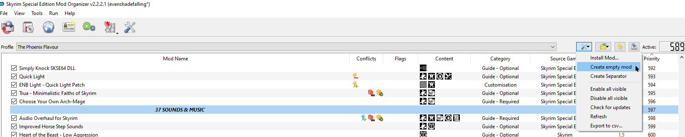
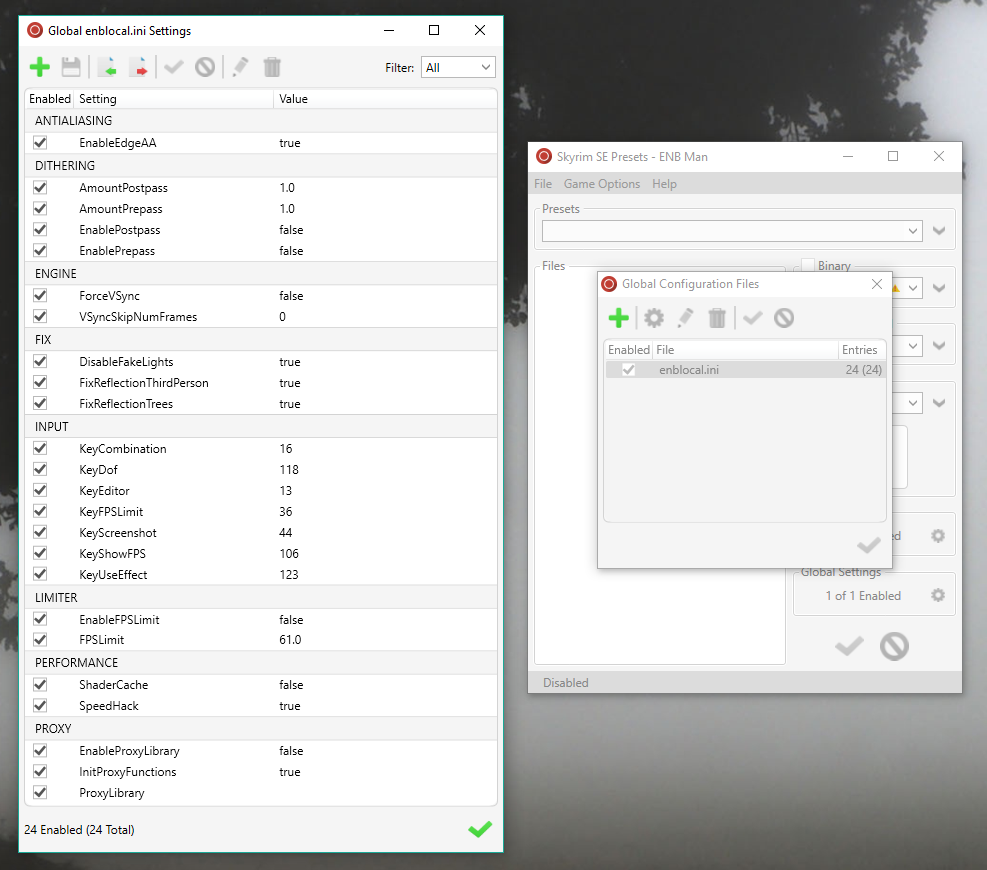

**TABLE OF CONTENTS**
- [01. Wrapping Up](#01-wrapping-up)
  - [1.1 Misc College of Winterhold Tweaks](#11-misc-college-of-winterhold-tweaks)
  - [1.2 Conflict Resolution Patch](#12-conflict-resolution-patch)
  - [1.3 Load Order TXT](#13-load-order-txt)
  - [1.4 Check for MO2 Warnings](#14-check-for-mo2-warnings)
  - [1.5 Flag Plugins as ESL](#15-flag-plugins-as-esl)
- [02. Fores New Idles](#02-fores-new-idles)
  - [2.1 Add FNIS to MO2](#21-add-fnis-to-mo2)
  - [2.2 Generate FNIS](#22-generate-fnis)
  - [2.3 FNIS Output](#23-fnis-output)
- [03. All Geared Up Derivative](#03-all-geared-up-derivative)
  - [3.1 xEdit Scripts](#31-xedit-scripts)
  - [3.2 Alternate Textures Patches](#32-alternate-textures-patches)
  - [3.3 Weapon Mesh Generator](#33-weapon-mesh-generator)
  - [3.4 Skeleton Patcher](#34-skeleton-patcher)
- [04. ENBSeries](#04-enbseries)
  - [4.1 General Notes](#41-general-notes)
  - [4.2 ENBSeries Overview](#42-enbseries-overview)
  - [4.3 ENB Man Setup](#43-enb-man-setup)
  - [4.4 ENBSeries Binaries](#44-enbseries-binaries)
  - [4.5 Global INI Settings](#45-global-ini-settings)
- [05. ENB Presets](#05-enb-presets)
  - [5.1 Preset Selection](#51-preset-selection)
  - [5.2 Create a new preset](#52-create-a-new-preset)
  - [6.3 Import the preset](#63-import-the-preset)
  - [6.4 The Truth ENB](#64-the-truth-enb)
  - [6.5 Activate the preset](#65-activate-the-preset)
- [60. DynDOLOD](#60-dyndolod)
  - [6.1 DynDOLOD and Performance](#61-dyndolod-and-performance)
  - [6.2 DynDOLOD Setup](#62-dyndolod-setup)
  - [6.3 TexGen Configuration](#63-texgen-configuration)
  - [6.4 TexGen Output](#64-texgen-output)
  - [6.5 Tweak for 3D Tree LOD](#65-tweak-for-3d-tree-lod)
  - [6.6 DynDOLOD - LOD Generation](#66-dyndolod---lod-generation)
  - [6.7 DynDOLOD Output](#67-dyndolod-output)
- [07. First Launch](#07-first-launch)
  - [7.1 The Final Step](#71-the-final-step)
  - [7.2 Start a test game](#72-start-a-test-game)
  - [7.3 Configuration](#73-configuration)
  - [7.4 Testing Suggestions](#74-testing-suggestions)
  - [7.5 Overwrite Cleanup](#75-overwrite-cleanup)
  - [7.6 What now?](#76-what-now)

# 01. Wrapping Up

## 1.1 Misc College of Winterhold Tweaks

We were previously unable to properly install **Misc College of Winterhold Tweaks** by SomethingObscure in Step 27 because the FOMOD options required the matching plugins to be available in the load order. These plugins are now in your available so we can re-install the mod.

Find **Misc College of Winterhold Tweaks** in your mod order, right-click it and select **Reinstall**.

### 1.2 FOMOD Instructions

* **Arniel's Appeals:**
  * Arniel's Appeals
* **A College Coup:**
  * A College Coup
  * Obscure's College of Winterhold Add-on
  * Immersive College NPCs Add-on
  * Interesting NPCs Add-on
* **Dead Dunmer Delivery:**
  * Dead Dunmer Delivery
* **Governable Gatekeeper:**
  * Governable Gatekeeper
* **Expedite the Expirate:**
  * Expedite the Expirate
* **Unflappable Faculty:**
  * Unflappable Faculty
* **The Early Elementalist:**
  * None
* **Inescapable Insights:**
  * Merged Version

> The **Early Elementalist** module allows you to Wait in the Hall of Elements. This is done by removing the "Can't Wait" flag in that cell and only this cell record is edited. Because this record has to be forwarded into the Conflict Resolution Patch anyway (to patch it with changes from other mods, namely Luminosity), there is no point in keeping the original ESP. In short - skip the option, it is already implemented through the CRP. 

## 1.2 Conflict Resolution Patch

* Download the [Conflict Resolution Patch](https://www.nexusmods.com/skyrimspecialedition/mods/14223) from the guide’s Nexus page.
* Install it as usual and place it last below the **PATCHES** separator.

## 1.3 Load Order TXT

The pre-made TXT will arrange your plugins exactly like the way they are sorted in my personal setup. This is much faster than adjusting the load order manually or setting up LOOT with custom rules.

* Download the [Universal Load Order TXT](https://www.nexusmods.com/skyrimspecialedition/mods/14223) from the guide’s Nexus page.
* Open the archive and extract the **loadorder.txt** to `Mod Organizer 2\profiles\The Phoenix Flavour`.
* Restart Mod Organizer 2 and the changes will be applied.

After applying the loadorder.txt and restarting MO2, there should be no plugins below **Conflict Resolution Patch.esp** in the load order (right pane). If there are plugins, you either made a mistake during the mod installation, or a mod was updated and the loadorder.txt is not accounting for it yet. If this happens, please join us on Discord and post your Modwat.ch link in the #request-support channel.

## 1.4 Check for MO2 Warnings

MO2 has inbuilt functionality that checks for plugins with Form 43 (Skyrim LE plugins that have not been re-saved in the Creation Kit). If any are detected, the **Notifications** icon in MO2 will no longer be greyed out.

* Open the **Notifications** window and check its contents.
* Any plugins that are listed must be re-saved in the Creation Kit now.

## 1.5 Flag Plugins as ESL

### 1.5.1 General Instructions

While at this point many installed plugins are already flagged as ESL (ESP-Lite) and we are not exceeding the maximum of 255 ESP+ESM plugins, there are several more plugins that may easily be flagged as ESL in order to save plugin slots. This completely removes the need to merge some plugins.

* Run **SSEEdit** through Mod Organizer 2.
* Click **OK** in the plugin selection window to load all your mods.
* Wait until SSEEdit has finished loading up your plugins and returns `Background loader: finished`.
* Right-click **UniqueBorderGates-All-PointTheWay.esp** in the left pane (near the bottom) and select **Compact FormIDs for ESL**.
* A warning window will pop up, click **Yes, I’m absolutely sure**.
* Another warning will inform you that there are indeed FormIDs to renumber. Click **Yes**.
* The process itself takes a mere second. When it’s done, switch back to the **View** tab at the bottom to see the plugin’s file header.
* Right-click the empty space to the right of **Record Flags** and select **Edit**.
* In the next window, check only **ESL** and click **OK**.
* The plugin is now successfully flagged as ESL! **Don’t close SSEEdit yet.**

> Plugins that contain no new records with new FormIDs and only edit existing records (from the official master files or other mods) do not need to have their FormIDs renumbered. When you attempt to renumber them, a window will pop up informing you that there was **Nothing to do**.

### 1.5.2 Remaining Plugins

You will now need to repeat the process for a handful of other mods, most of which will not need their FormIDs renumbered. The plugins to ESL-ify are listed below. Simply add the ESL flag to each of them and don’t forget to renumber FormIDs first for those that need it.

* QuestsAreInSkyrimUSSEP.esp
* SIDT - Special Edition.esp
* Improved Snow – Obsidian Weathers.esp
* dD-Medium Script Range.esp
* dD-Reduced Wound Size.esp
* DeadlySpellImpacts.esp
* Enhanced Vanilla Trees SSE.esp
* EVT_LightSnowTrees_Replacer (For Vurts).esp
* GQJ_DG_vampireamuletfix.esp
* CBBE.esp
* Subtle but Classless.esp
* Miscellaneous Quests…as Miscellaneous Quests.esp
* ~~UniqueBorderGates-All-PointTheWay.esp~~
* UniqueBorderGates-All-BetterDGEntrance.esp ==**compact FormIDs**==
* CFTO – Arthmoor Danwstar Patch.esp
* RDO – USSEP.esp

# 02. Fores New Idles

## 2.1 Add FNIS to MO2

In Step 38 we installed **Fores New Idles in Skyrim** (FNIS) which is a tool used to add custom animations to Skyrim. It is required by XPMSSE and needs to be run on our mod order before it is properly installed.

* Open the **Executables** window in Mod Organizer 2 (Tools > Executables or CTRL + E).
* Click the blue plus icon and select **Add from file**.
* Navigate to `Mod Organizer 2\mods\Fores New Idles in Skyrim\tools`.
* Double-click **GenerateFNISforUsers.exe**.
* Change the Title to **Generate FNIS**.
* Click **OK**.

## 2.2 Generate FNIS

- Run FNIS (the executable we just added) through Mod Organizer 2.
- In the window that comes up, check the following two patches in the bottom list:
  - `"GENDER Specific Animations"`
  - `"SKELETON Arm Fix"`
- Click **Update FNIS Behaviour** to generate the new files.
- Wait until FNIS confirms that animations were succesfully included, then close the window.
- If asked to create a Desktop shortcut, click **Cancel**.

## 2.3 FNIS Output

After running FNIS, all generated files will be located inside the MO2 ***Overwrite***.

* Right-click the ***Overwrite*** located at the bottom of your mod order.
* Select **Create Mod,** enter **FNIS Output** as the name and click **OK**.
* Check the mod in your mod order.

# 03. All Geared Up Derivative

## 3.1 xEdit Scripts

While we install the base mod already in Step 38, there is a number of additional steps to complete before the mod is fully implemented.

- Download the **AllGUD xEdit Scripts** main file from the [AllGUD](https://www.nexusmods.com/skyrimspecialedition/mods/28833?tab=files) mod page.
- Open the downloaded archive and double-click the folder inside.
- Extract all files from the **Edit Scripts** folder to `Your Modding Folder\Tools\SSEEdit\Edit Scripts`.

## 3.2 Alternate Textures Patches

### 3.2.1 Running the script

Before we can generate weapon meshes for all mods, there are three mods that use Alternate Textures for some new weapons which doesn't work with AllGUD. Thankfully, one of the AllGUD xEdit scripts was created to patch these mods.

- Run SSEEdit through Mod Organizer 2.
- In the plugin selection window, simply click **OK** to load all plugins.
- Wait until SSEEdit returns **Background loader: finished**.
- Click anywhere in the left pane (plugin list) and hit CTRL + A to select all plugins.
- Right-click the selected plugins and select **Apply Script**.
- Select the **AllGUD AlternateTextureModelsplosion** script and click **OK**.
- Enter **AllGUD - Alternate Textures Patch** as file name and click **OK**.
- Leave the next two windows blank and only click **OK** both times.
- Eventually SSEEdit will return **Done: Applying script**, and you can close the window.

> This will patch records from **Zim's Immersive Artifacts - Thane Weapons**, **Tools of Kagrenac** and the **AMB Content Addon**.

### 4.2.2 Output

- Back in Mod Organizer 2, scroll down all the way to the***Overwrite***folder which contains the new plugin and meshes.
- Right-click it and select **Create Mod**.
- Enter **AllGUD - Alternate Textures Patch** as the name and click **OK**.
- Activate the new mod in your mod order.
- The plugin will now show up at the bottom of your load order, make sure it is checked.

### 3.2.3 Clean Masters

Unfortunately the plugin was assigned half our load order as master files so we will use SSEEdit to clean out master files that are not direct dependencies. Only the relevant plugins will remain master files to the plugin.

- Run SSEEdit through Mod Organizer 2.
- In the plugin selection window, simply click **OK** to load all plugins.
- Wait until SSEEdit returns **Background loader: finished**.
- Scroll down to the bottom and right-click **AllGUD - Alternate Textures Patch.esp**.
- Select **Clean Masters** and click **Yes I'm absolutely sure** when the warning window pops up.
- Close SSEEdit and click **OK** to save the changes.

## 3.3 Weapon Mesh Generator

### 3.3.1 New Mod Folder

- In Mod Organizer 2, click the spanner icon above the mod order pane and select **Create empty mod**.
- Enter **AllGUD - Weapon Meshes** as the name and click **OK**.
- Leave the new mod at the bottom of your mod order and activate it.

### 3.3.2 Running the script

- Run SSEEdit through Mod Organizer 2.
- In the plugin selection window, simply click **OK** to load all plugins.
- Wait until SSEEdit returns **Background loader: finished**.
- Click anywhere in the left pane (plugin list) and hit CTRL + A to select all plugins.
- Right-click the selected plugins and select **Apply Script**.
- Select the **AllGUD Weapon Mesh Generator** script and click **OK**.
- Click on the empty field below **Output Meshes Folder** and navigate to `Mod Organizer 2\mods`.
- Select the **AllGUD - Weapon Meshes** folder you created in the previous step and click **OK**.
- Click **Start** to begin generating the meshes.
- Eventually SSEEdit will return **Done: Applying script**, and you can close the window.

## 3.4 Skeleton Patcher

### 3.4.1 New Mod Folder

- In Mod Organizer 2, click the spanner icon above the mod order pane and select **Create empty mod**.
- Enter **AllGUD - Skeleton Meshes** as the name and click **OK**.
- Leave the new mod at the bottom of your mod order and activate it.

### 3.4.2 Running the script

- Run SSEEdit through Mod Organizer 2.
- In the plugin selection window, simply click **OK** to load all plugins.
- Wait until SSEEdit returns **Background loader: finished**.
- Right-click anywhere in the left pane and select **Apply Script**.
- Select the **AllGUD Skeleton Patcher** script and click **OK**.
- Click on the empty field below **Output Meshes Folder** and navigate to `Mod Organizer 2\mods`.
- Select the **AllGUD - Skeleton Meshes** folder you created in the previous step and click **OK**.
- Click **Start** to begin generating the meshes.
- Eventually SSEEdit will return **Done: Applying script**, and you can close the window.

# 04. ENBSeries

## 4.1 General Notes

ENBSeries with a decent preset is the most performance-intense graphical improvement. It can also have a huge impact visually. To get stable 60FPS with an ENB preset you need a decently strong PC and quite possibly tone down some settings but it is very doable. Even if you’re not interested in all the bells and whistles, ENB ambient occlusion, complex particle lights and colour correction alone are certainly worthwhile.

With ENB Man - the preset management tool we will be using - you can easily switch between presets. ENB presets can be edited and toggled directly ingame at any time.

## 4.2 ENBSeries Overview

### 4.2.1 ENBSeries binaries

These are the core files required to run ENBSeries. They are forbidden to be shared with presets and can only be acquired from the official website. They consist of two plugins, `d3d11.dll` and `d3dcompiler_46e.dll`, that belong into your **root** folder.

### 4.2.2 enbseries.ini

The bulk of configuration changes are stored in the ==enbseries.ini== file in which you can tweak all general settings and toggle them on or  off. This INI is unique to its preset and also belongs into your **root** folder.

### 4.2.3 enbseries folder

This folder should be located in your **root** folder and it includes all additional effect files (INI files and additional folders). The included effects vary from preset to preset, depending on what the author is utilising. In rare cases, the effect INIs are outside the **enbseries** folder and kept in the **root** folder as well (this is the case for the guide’s preset, Visceral ENB).

### 4.2.4 enblocal.ini

The `enblocal.ini` stores your personal settings and it’s completely independent from your preset which is why we are going to set up a global configuration that you can easily tweak and apply at any time for any preset. Settings you can control through the INI file are hotkeys, forcing VSYNC / frame lock, preset shader cache, some fixes and additional graphical options such as antialiasing.

## 4.3 ENB Man Setup

* Download [ENB Man](https://www.nexusmods.com/skyrim/mods/57620) (the main file) manually from the Nexus.
* Extract **ENBMan.exe** to `Your Modding Folder\Tools\ENB Man`.
* **(Optional)** Add **ENBMan.exe** to your Desktop / Taskbar.
* Run **ENBMan.exe** and click the green plus to add a new game.
* Click the folder icon and point ENBMan at your **SkyrimSE.exe** (located in your root folder).
* You might want to edit the name to indicate that it’s the Special Edition (I’ve changed it to **Skyrim SE**).
* Click the green checkmark to confirm.
* Double-click the new **Skyrim SE** profile.

## 4.4 ENBSeries Binaries

* Download the latest version of [ENBSeries for Skyrim SE](http://enbdev.com/download_mod_tesskyrimse.htm).
* Open the downloaded archive and double-click the **WrapperVersion** folder.
* Back in ENB Man, click the arrow under **Binaries** and select **Add**.
* Enter **ENBSeries** and the version number as name (eg **ENBSeries 0.390**).
* Click the green checkmark to confirm.
* From the archive’s **WrapperVersion** folder, drag the following files into the emtpy **Binaries** window:
  * `d3d11.dll`
  * `d3dcompiler_46e.dll`
  * `enblocal.ini`
* Click the green checkmark to confirm.

## 4.5 Global INI Settings

### 4.5.1 Import enblocal INI

* Click the gears icon under **Global Settings**.
* A new window will come up. Click the green plus icon.
* Enter **enblocal.ini** as name. It will now appear in the list.
* Double-click your new **enblocal.ini**.
* In the new window, click **Import Settings** in the top bar.
* Navigate to `Your Modding Folder\Tools\ENBMan\Games\Skyrim SE\Binaries\ENBSeries 0.4xx`.
* Double-click the **enblocal.ini** inside to import it and check all boxes.

### 4.5.2 Save Global Configuration

* Click **Save** in the top bar (the hard drive icon) and close the window.
* Back in the **Global Configuration Files** window, check **enblocal.ini.**
* Click the green checkmark to close the window.

# 05. ENB Presets

## 5.1 Preset Selection

For the purposes of this guide we will be using my personal favourite preset – **Visceral ENB**, warm and dreamy but still natural enough and quite performance-friendly. Afterwards, we will also install a second preset, **The Truth ENB**, which is among the most presets with the least impact on performance out there for everyone with less modern hardware.

You can install any other preset the same way. The **Customisation** section includes a list of other recommended presets.

## 5.2 Create a new preset

* In ENB Man, click the arrow under **Presets** and select **Blank preset**.
* Enter a name for the new preset, e.g. **Visceral ENB – for Obsidian Weathers [1.5]**.
* Click the green checkmark to confirm.

## 6.3 Import the preset

* Download [Visceral ENB](https://www.nexusmods.com/skyrimspecialedition/mods/21779?tab=files) (Visceral ENB – Obsidian Weathers and Seasons) manually.
* Navigate to `Your Modding Folder\temp`.
* Open the downloaded ENB Preset archive.
* Double-click the folder inside, then extract all files into the **temp** folder.
* Drag-and-drop all files from the **temp** folder into ENB Man.
* Remove all files inside the **temp** folder.

> Extracting the files into **temp** before importing them into ENB Man is done because importing directly from the ZIP archive can be a little buggy at times (skipping files and such).

## 6.4 The Truth ENB

**This is optional.**

You can skip this step and simply use Visceral ENB or install a different preset later on if you have decent hardware. The Truth preset is for those that struggle to maintain 60FPS. People who prefer vanilla visuals (especially colour and lighting) over stylised ENB presets may also want to use The Truth.

- Create a new preset in ENB Man for The Truth ENB.
- Download [The Truth ENB](https://www.nexusmods.com/skyrimspecialedition/mods/9162?tab=files) (the main file) from the Nexus page.
- Extract all files (enbseries folder, enbseries.ini, enblocal.ini) to `Your Modding Folder\temp`.
- Drag the files from there into the empty **Files** field in your new ENB Man profile.
- Click **No** when asked to import palettes.
- Delete all files in the **temp** folder.

## 6.5 Activate the preset

(The screenshot shows Visceral ENB but you can activate The Truth ENB instead if you installed it).

* Select the latest version of ENBSeries under **Binary** and tick the checkbox.
* Click the green checkmark at the bottom of the window to install the preset.

# 60. DynDOLOD

## 6.1 DynDOLOD and Performance

Contrary to popular belief, DynDOLOD is not inherently performance-intense. With the **Low** or **Medium** presets and regular tree LOD, you will hardly notice any performance impact, even on weaker machines, while still drastically improving distant terrain.

More hardware-taxing is however what is typically referred to as "ultra tree LOD" or simply 3D tree LOD. This is a DynDOLOD feature which disables regular tree LOD, the two dimensional, flat "cut-outs". Instead, object LOD is generated for distant trees, utilising 3D meshes which drastically improve the visual quality of tree LOD to the point where you can barely tell fully-rendered trees and distant trees apart anymore.

3D tree LOD is not recommended for people with less than 4GB VRAM. There is a potential performance impact but it is usually negligible on most modern machines (and very much worth the visual improvement).

**You will have the option to generate either regular or 3D tree LOD.** Choose accordingly. Later on, you can always re-run DynDOLOD to generate the other type of tree LOD, depending on how well the game runs for you.

## 6.2 DynDOLOD Setup

### 6.2.1 File Download

* Download the [**DynDOLOD**](https://www.nexusmods.com/skyrimspecialedition/mods/32382) main file manually.
* Navigate to `Your Modding Folder\Tools` and create a new **DynDOLOD** folder.
* Open the downloaded **DynDOLOD** archive and move all files into your new directory.

### 6.2.2 TexGen Executable

* Switch back to Mod Organizer 2 and open the **Executables** window (Tools > Executables or CTRL + E).
* Click the blue plus icon to add a new executable and select **Add from file**.
* Navigate to `Your Modding Folder\Tools\DynDOLOD`and double-click **TexGenx64.exe**.
* Under **Arguments**, add the following:
  * -sse

### 6.2.3 DynDOLOD Executable

* Once again, click the blue plus icon to add a new executable and select **Add from file**.
* Navigate to `Your Modding Folder\Tools\DynDOLOD`and double-click **DynDOLODx64.exe**.
* Under **Arguments**, add the following:
  * -sse
* Click **OK** to save and close the **Executables** window.

## 6.3 TexGen Configuration

TexGen is a component of DynDOLOD, used to generate textures based on your mod setup.

* Launch **TexGen** through Mod Organizer 2.
* Set **LOD Texture Size** to ==512== if you have 4GB of VRAM or more.
* Hit **Start**.

> The generation will take a while (about 10 minutes for me) and I recommend you step away from your PC in the meantime.

## 6.4 TexGen Output

* Once TexGen has finished, click **Save and Exit**.
* Navigate to `Your Modding Folder\Tools\DynDOLOD`.
* Cut (CTRL + X) the **TexGen_Output** folder and paste (CTRL+V) it to `Mod Organizer 2\mods`.
* Refresh Mod Organizer 2 (F5) and it will appear at the bottom of your mod order.
* Place it right above the **WEATHER** separator and activate it.

## 6.5 Tweak for 3D Tree LOD

> Only follow these instructions if you are planning to generate 3D tree LOD.

- Navigate to `Your Modding Folder\Tools\DynDOLOD\Edit Scripts\DynDOLOD`.
- Double-click **DynDOLOD_SSE.ini**.
- Edit the following line to disable traditional tree LOD:
  * `TreeLOD=0`
- Save and close **DynDOLOD_SSE.ini**.67^{Mod}  [Karleen 2.0] [Rose]8

## 6.6 DynDOLOD - LOD Generation

* Launch **DynDOLOD** through Mod Organizer 2.
* A window will come up, click **Advanced**.
* You can see a list of all worldspaces at the top. Right-click inside and **Select all**.
* Select one preset:
  * **Low** if you already struggle with performance.
  * **Medium** as the default option plus regular tree LOD.
  * **High** for modern machines and 3D tree LOD.
* Under **Load rules for** check both **Candles** and **FXGlow**.
* Double-check with the picture below that everything is configured correctly, then click **OK**.

**Step away from your PC while DynDOLOD is working.**

## 6.7 DynDOLOD Output

* Once DynDOLOD is done, click **Save & Exit**.
* Go to `Your Modding Folder\Tools\DynDOLOD`.
* Cut (CTRL+X) the **DynDOLOD_output** folder and paste it (CTRL+V) to `Mod Organizer 2\mods`.
* Refresh Mod Organizer 2 (F5) and it will appear at the bottom of your load order.
* Rename the file and add the preset you selected, eg: `DynDOLOD (Medium)`.
* Place it last below the **PATCHER OUTPUT** separator and activate it.
* Move **DynDOLOD.esm** below your other ESMs at the top of your load order.
* Leave **DynDOLOD.esp** at the very bottom as the last plugin.

# 07. First Launch

## 7.1 The Final Step

All mods are installed. Your ENB preset is configured correctly. DynDOLOD is generated. Now comes the moment of truth.

Once arrived at this point it is important to thoroughly test your setup in order to make sure your game looks beautiful, performs well and runs stable so that you can finally start a new playthrough without a high risk for nasty surprises.

## 7.2 Start a test game

* In Mod Organizer 2, select **SKSE** in the exectuables drop-down and hit **Run**.
* In the main menu, select **New** to start your test save.
* After the initial loading screen you will find yourself in the AS LAL cell where you can customise your (testing) character.
* When you’re done, talk to the Statue of Mara and select the **I am camping in the woods** option.
* Go to the bed in the back in the cell and interact with it to "sleep".

## 7.3 Configuration

### 7.3.1 Immersive HUD

**Both of these changes are completely optional but recommended.**

Changes to MCM settings do not carry over across save games so it would be a waste of time to configure all MCMs for a test run. There are merely two changes in the Immersive HUD MCM that I recommend for now.

- Press **ESCAPE** and select the **MCM** Option.
- Scroll down and click on **Immersive HUD** to open the mod's MCM.
- In the **Activation** tab, select the following two options:
  - Key press toggles
  - Link ALL SkyUI Widgets
- You can also change the hotkey to a different one if its inconvenient for you (default is X).

> This will make it so that the clock widget from A Matter of Time is toggled along with iHUD (and therefore hidden most of the time). Pressing the hotkey once to toggle is more convenient than having to keep pressing it in my opinion.

### 7.3.2 Depth of Field

While the default Depth of Field effect is fairly ugly, you will have noticed that we specifically left it turned on while configuring INI settings way back during the Setup section. This is because the DoF effect is tied to the underwater blur effect - turn off DoF and going underwater you will be able to see as clearly as above the surface. The solution to this is leaving the effect on but turning it down all the way so that the DoF doesn't actually show up.

* Press **ESCAPE** and go into **Settings** > **Display**.
* Turn down **Depth of Field** all the way.

## 7.4 Testing Suggestions

* You will spawn near Helgen in an area you likely know well. Take some time to look around.
* Activate the ENBSeries FPS counter if you installed ENB (default hotkey: Numpad *). Otherwise use the Steam overlay or something similar.
* Travel around Skyrim and visit your favourite locations (open the console and type `tmm` to enable all map markers).
* Especially intense areas where you frame rate might drop are:
  * the southern forest, especially when looking down at Falkreath
  * the swamp surrounding Morthal
  * the bridge looking at Riverwood
  * the Rift, particularly when approaching Riften from the south

I recommend spending at least 10 to 20 minutes ingame. Enjoy the improved graphics and take some screenshots! Once you have quit the game, proceed with the next step.

## 7.5 Overwrite Cleanup

### 7.5.1 About the Overwrite

As mentioned before, the ***Overwrite*** folder in Mod Organizer 2 catches all files generated by mods or applications that would normally land in your **root** folder. After the first launch, you will find quite a few files in your ***Overwrite*** that were generated by mods.

Now if you delete these, they’ll just be regenerated when you next launch the game, but we don’t want them to clutter up the ***Overwrite*** either. The best solution is to keep these files with the mods they belong, inside their mod folders. This way they will also be removed and regenerated when the mod is updated.

### 7.5.2 Open in Explorer

* Right-click the ***Overwrite*** and select **Open in Explorer**.
* Navigate to `SKSE\Plugins` which may contain files for Simply Knock, Keyboard Shortcuts Fix, and Fuz Ro D’oh.
* Drag the window to the side or your second monitor.

### 7.5.3 Keyboard Shortcuts Fix

> Skip this step if you did not install Keyboard Shortcuts Fix.

* Find **Keyboard Shortcuts Fix** in your mod order, right-click it and select **Open in Explorer**.
* Navigate to `Keyboard Shortcuts Fix\SKSE\Plugins`.
* Drag the **KeyboardShortcutsFix.log** file from the ***Overwrite*** into that folder.
* The resulting file path should be:
  * `Mod Organizer 2\mods\Keyboard Shortcuts Fix\SKSE\Plugins\KeyboardShortcutsFix.log`

### 7.5.4 Fuz Ro D-oh

* Find **Fuz Ro D-oh** in your mod order, right-click it and select **Open in Explorer**.
* Navigate to `Fuz Ro D-oh\SKSE\Plugins`.
* Drag the **Fuz Ro D’oh.ini** file from the ***Overwrite*** into that folder.
* The resulting file path should be:
  * `Mod Organizer 2\mods\Fuz Ro D-oh\SKSE\Plugins\Fuz Ro D'oh.ini`

### 7.5.5 Simply Knock

> Skip this step if you did not install Simply Knock.

* Find **Simply Knock** in your mod order, right-click it and select **Open in Explorer**.
* Return to the root of the ***Overwrite*** – `Mod Organizer 2\overwrite`.
* Move the entire **SKSE** folder into the **Simply Knock** mod folder.
* The resulting file path should be:
  * `Mod Organizer 2\mods\Simply Knock\SKSE\`

### 7.5.6 Clean-up

* Close all Explorer windows and return to Mod Organizer 2.
* Double-click the ***Overwrite*** and delete any left-over files (there probably aren't any).

## 7.6 What now?

**Congratulations, you have completed The Phoenix Flavour!**

I hope you had a great time, found the instructions easy to follow, and didn’t run into any frustrating issues. Your game is now thoroughly overhauled and you learned plenty about modding in the meantime.

You will notice two additional sections following this one: In the **Customisation**, you may find many options to expand or tweak your current setup. This includes changes to improve performance so don’t be discouraged if you find your game running at less than 60FPS upon your first launch!

The final section, **New Game**, will help you get started with your next playthrough. It contains recommended changes to the Mod Configuration Menus.

So you see - your journey is not over yet.

**Happy modding!**