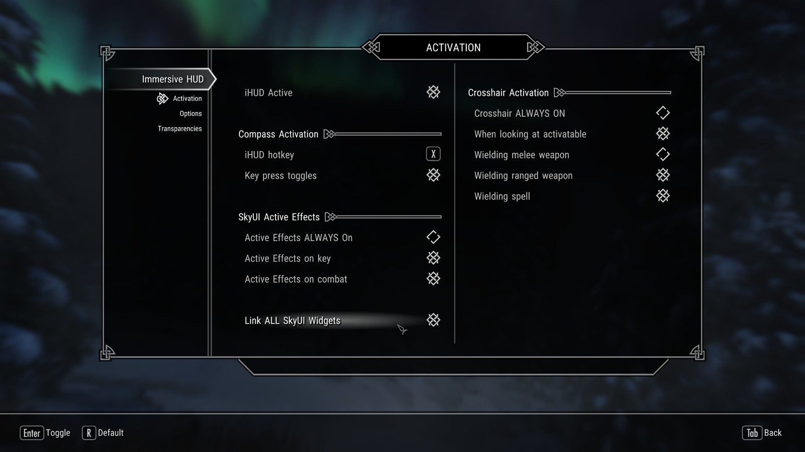
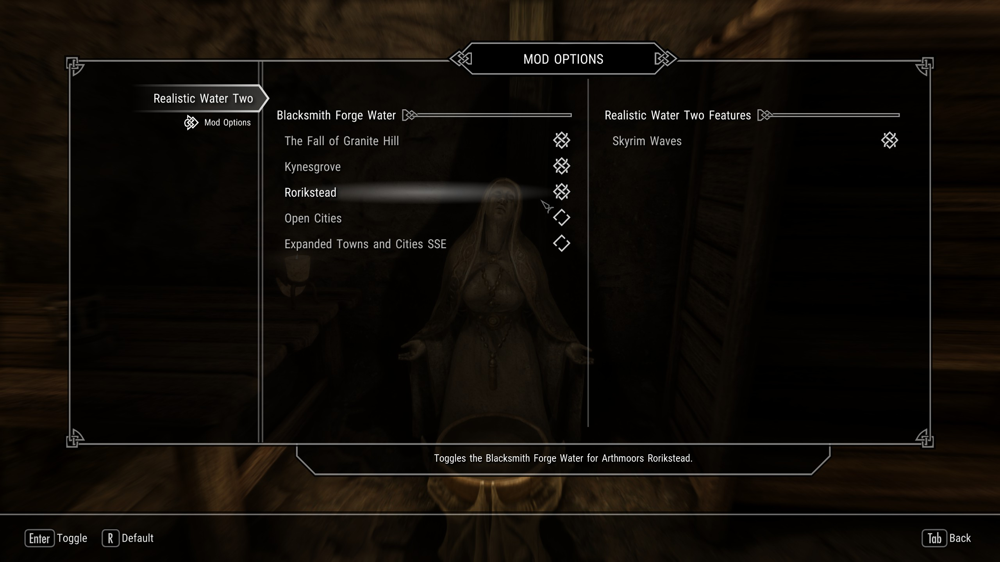
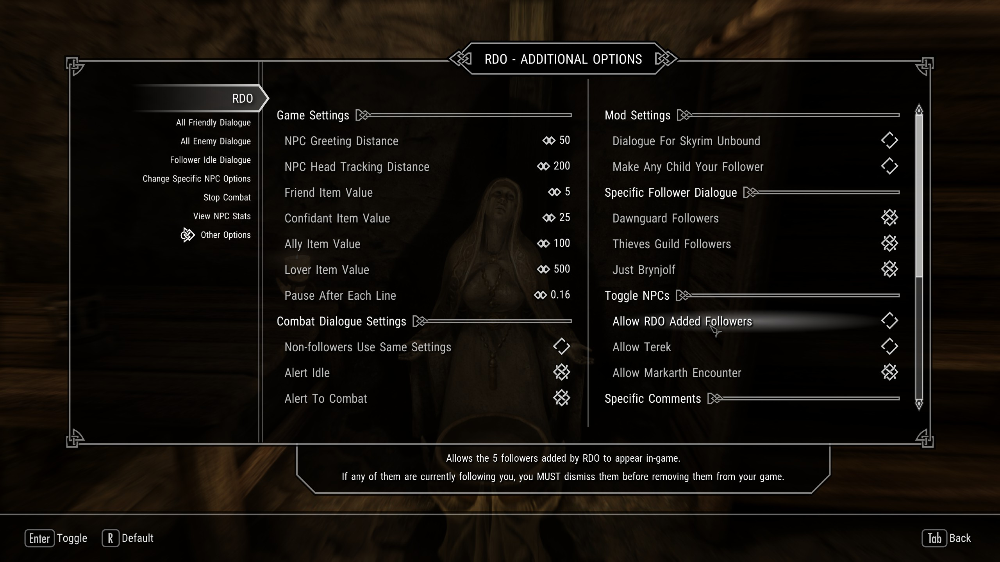

**TABLE OF CONTENTS**
- [Final Adjustments](#final-adjustments)
  - [Timing](#timing)
  - [MO2 Notifications](#mo2-notifications)
  - [New Profile](#new-profile)
  - [Optional Mods](#optional-mods)
  - [ENB Shader Cache](#enb-shader-cache)
  - [New Game](#new-game)
- [Mod Configuration](#mod-configuration)
  - [Initialisation](#initialisation)
  - [Wildcat - Configuration Power](#wildcat---configuration-power)
  - [Mod Configuration Menus](#mod-configuration-menus)
- [A Matter of Time MCM](#a-matter-of-time-mcm)
- [All Geared Up Derivative MCM](#all-geared-up-derivative-mcm)
- [Complete Crafting Overhaul Remastered MCM](#complete-crafting-overhaul-remastered-mcm)
- [Diverse Dragons Collection MCM](#diverse-dragons-collection-mcm)
- [Nether's Follower Framework MCM](#nethers-follower-framework-mcm)
- [Genuinely Intelligent Soul Traps MCM](#genuinely-intelligent-soul-traps-mcm)
- [Growl - Werebeasts of Skyrim MCM](#growl---werebeasts-of-skyrim-mcm)
- [Immersive HUD MCM](#immersive-hud-mcm)
- [moreHUD MCM](#morehud-mcm)
- [Obsidian Weathers MCM](#obsidian-weathers-mcm)
- [Realistic Water Two MCM](#realistic-water-two-mcm)
- [Relationship Dialogue Overhaul MCM](#relationship-dialogue-overhaul-mcm)
- [Timing Is Everything MCM](#timing-is-everything-mcm)
- [VioLens MCM](#violens-mcm)
- [Wildcat - Combat in Skyrim MCM](#wildcat---combat-in-skyrim-mcm)
- [Wonders of Weather MCM](#wonders-of-weather-mcm)
- [Starting the game](#starting-the-game)

# Final Adjustments

## Timing

Before starting a new playthrough, there are some considerations.

Has there been a Skyrim update recently? If so, SKSE64, the mods depending on it as well as the guide may receive an update very soon, and it may be worth it to wait a week or two for everything to catch up before diving into the game.

> Also keep an eye on my blog or our Discord server in case a major update for the guide or a mod is imminent.

## MO2 Notifications

Before jumping into the game, go through one final checkup. In Mod Organizer 2, go to **View > Notifications**. If this is greyed out, you are good to go! If not there are multiple different warnings you might encounter:

- **Missing Masters:** One of your plugins is missing a master file. It is marked with an exclamation mark in your load order. This is most likely due to skipping a mod that was not optional or selecting the wrong option in a FOMOD  installer. Go back to the mod’s instructions in the guide and double-check everything.
- **Form 43 Plugin:** You forgot to re-save one or several plugins in the Creation Kit. Re-save them now.
- **Outdated SKSE Plugin:** Check the plugin's mod page to see if there is a new version.
- **Files in your overwrite:** This one is not particularly problematic and you can probably ignore it for the time being.

## New Profile

- In Mod Organizer 2, open the **Profiles** window (Tools > Profiles or CTRL + P).
- Select your **The Phoenix Flavour** or **The Phoenix Flavour - Customised** profile and click **Copy**.
- Enter a name for the new profile. Here are some suggestions:
  - `The Phoenix Flavour - {name of the character for the playthrough}`
  - `The Phoenix Flavour - {name of the build or playstyle for the playthrough}`
  - `The Phoenix Flavour - Playthrough 1`
- Click **OK** and select your new profile in the list. Make sure both options at the bottom are checked:
  - Use profile-specific Save Games
  - Use profile-specific Game INI Files
- Close the **Profiles** window.
- Switch to your new profile in Mod Organizer 2.

## Optional Mods

In your new profile, go through your mod order again - this is your last opportunity to disable some optional mods that you'd rather not use for your upcoming playthrough. Keep in mind that some optional mods have dependencies (like patches or replacer plugins) that would need to be disabled also. Others will be masters for DynDOLOD.esp and you would have to regenerate DynDOLOD if you were to disable them.

## ENB Shader Cache

If you installed ENBSeries, you should be decently sure that your current preset is the one you want to use in your playthrough. Of course you can still switch anytime but if you are planning on sticking with the preset for a while at least, I'd recommend turning on Shader Cache in the enblocal.ini. This will speed up the game launch process as ENB won't have to reload its shaders every time.

- Open **ENBMan**.
- Double-click the **Skyrim SE** profile.
- Disable your current preset (click the checkmark to save if you changed anything).
- Click the gears icon in the **Global Settings** section.
- Double-click **enblocal.ini**.
- Scroll down to the performance area and double-click **ShaderCache**.
- Change the value to **True** and click the green checkmark to confirm.
- Close the window and click **Yes** to save your change.
- Close out of the **Global Configuration Files** window and reactivate your preset.

## New Game

- Run **SKSE** through Mod Organizer 2.
- Select **NEW** in the Skyrim main menu to start your playthrough.

# Mod Configuration

## Initialisation

After starting a new game, you will be dropped in the **Alternate Start – Live Another Life** cell where you can customise your character, then configure your mods before you actually start playing.

Stand still and wait until all messages have run through in the upper left corner (check the screenshot below). Then hit **ESCAPE** and create a manual save before you continue.

## Wildcat - Configuration Power

While  Wildcat (the main combat overhaul) does come with a fantastic MCM, it also adds a (for SkyUI users) completely redundant lesser power for configuration purposes to your character. In order to remove it, you need to click your way through all its options until the very last one (simply select all the default options) and finally you can opt to remove the power from the menu. Customise the mod later on through the MCM.

## Mod Configuration Menus

Thanks to SkyUI, it is possible to configure most mods directly through their Mod Configuration Menu – or MCM for short – which you can access through the main menu. Hit **ESCAPE** and select **MCM**. See recommended changes for most of the guide’s MCMs below.

# A Matter of Time MCM

- You can either:
  - Configure the clock widget to your liking.
  - Untick **Show** for each module in the **General** tab to hide it until you are ready to customise it.
  - If you installed my personal AMOT preset, go to **Presets** and click **Load user settings** (see screenshot).

# All Geared Up Derivative MCM

- In the **NPC** tab, check **Enable Weapons**.

# Complete Crafting Overhaul Remastered MCM

### Menu Filters (optional)

* Under **Recipe Display** > **Crafting Menu Filters**, disable:
  * Crafting Categories
  * Item Type Filters

> While I think CCOR’s crafting menu filters are a great idea, I very much dislike their implementation and prefer to disable them entirely.

### More Jewelry

* Under **Crafting Options** > **Additional Items**, disable:
  * More Jewelry

The added circlets would use vanilla models and textures, inconsistent with the vanilla cirlcets changed by JS Circlet Replacer.

### Equipment Breakdown (optional)

* Under **Crafting Options** > **Breakdown Equipment**, disable:
  * At Smelter
  * At Tanning Rack

> Equipment breakdown can throw off balancing since you get more crafting resources that way. I personally don’t like the feature at all.

### Upgrading Leveled Items

* Under **Miscellaneous** > **Leveled Items**, disable:
  * Upgrade via Crafting

# Diverse Dragons Collection MCM

By simply opening the MCM once, the mod will recognise that you have SKSE and SkyUI installed, and automatically removes its configuration tool from your Powers menu.

# Nether's Follower Framework MCM

### NPC Behaviour

* Turn on the following options under **Activity** > **Sandboxing**:
  * Ignore Special Furniture
  * Stop During Player Dialogue
  * Only Sandbox In Town

### Regard System (optional)

*  Disable the Regard system under **Gameplay** > **Regard**:
  * Allow Regard: Off

> This is completely optional. The feature works perfectly fine, I just don't like it personally.

### Additional Powers (optional)

* You can disable the **Command Followers** ability under **System** > **Casted Abilities** to further de-clutter your Powers menu.

### ConsoleUtil Support

* Under **System** > **Core**, check the **Enable ConsoleUtil** option.

# Genuinely Intelligent Soul Traps MCM

This mod - while focusing on bug fixes and soul gem multithreading - comes with some very nifty level requirement options. If you like, you can set level requirements for each of its special features as well as the for capturing of each tier of souls. Toggle and adjust this system in the **Leveling** tab.

# Growl - Werebeasts of Skyrim MCM

* Toggle on **Invulnerable During Transformation**.

# Immersive HUD MCM

### Toggle Settings (optional)

- You can change the hotkey to display the HUD here.
- I recommend turning on the **Key Press Toggles** option but that is a personal preference.

### Link Widgets (optional)

- Check **Link ALL SkyUI Widgets**.

> If you installed A Matter of Time, this will link the clock widget to the HUD so that it gets toggled alongside the other components (such as the compass). 

# moreHUD MCM

- In the **Enemy's Level** tab, uncheck the following options:
  - Show Magicky Meter
  - Show Stamina Meter

> These only clutter up the interface in my opinion. You can also disable Health numbers if you like.

# Obsidian Weathers MCM

* Click **Remove Spell** to get rid of the spell that was added for non-SkyUI users. All options can be configured through the MCM.
* Click **Enable Season FX** if you would like to have seasonal weathers (more snow in winter etc).

# Realistic Water Two MCM

* Under **Mod Options** > **Blacksmith Forge Water**, toggle the following options:
  * The Fall of Granite Hill `if you installed that mod during the Customisation section`
  * Kynesgrove
  * Rorikstead

# Relationship Dialogue Overhaul MCM

* Under **Other Options** > **Toggle NPCs**, disable:
  * Allow RDO Added Followers
  * Allow Terek

# Timing Is Everything MCM

Another large MCM, and one you should configure now, at the start of the game as it affects many quests that start very early on in Vanilla. I’ve personally increased the Dawnguard level requirements to 30+ and set Dragonborn to start only after Alduin’s defeat but this is all down to your preferences and plans for this playthrough.

Thanks to the FISSES support, it is also possible to load, save and share custom presets through the MCM (**Extra Options** tab).

# VioLens MCM

* Under **Melee**, enable **Player Killmove Immunity**.
  * Killcams against the player character often trigger and kill you even if you could have survived the hit HP-wise.
* If you like, you can also disable Killmoves entirely (Melee and/or Ranged).

# Wildcat - Combat in Skyrim MCM

* Personal recommendation: Disable **Injuries**.

# Wonders of Weather MCM

* Under **Rainsplashes**, set **Level** to **Disabled** to disable the effect (I personally think it looks odd most of the time). This is optional.

# Starting the game

Once you’re done configuring everything, save the game manually. Then talk to the Statue of Mara, select one of the options and interact with the bed in the corner to truly start your playthrough.

As for the options, going with the `vanilla start` is entirely possible but you can also choose the `I am camping in the woods` option for a faster alternative that drops you in the same region but skips the cart ride and execution sequence. It is NOT recommended that you choose the `vampire lair` option as that has been known to cause issues with Sacrosanct.

**Good luck and have fun!**

